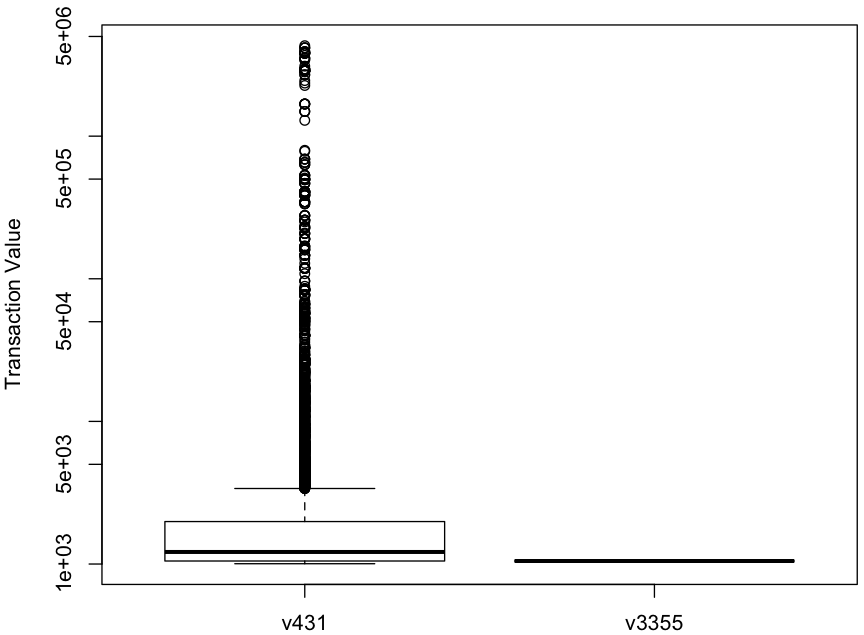

# Exploratory Data Analysis with R

## data source
~~~
> install.packages('DMwR')

> library(DMwR)

> data(sales)

> attach(sales)
~~~

## basic
~~~
> head(sales)

  ID Prod Quant   Val Insp
1 v1   p1   182  1665 unkn
2 v2   p1  3072  8780 unkn
3 v3   p1 20393 76990 unkn
4 v4   p1   112  1100 unkn
5 v3   p1  6164 20260 unkn
6 v5   p2   104  1155 unkn

> summary(sales)

       ID              Prod            Quant                Val             Insp       
 v431   : 10159   p1125  :  3923   Min.   :      100   Min.   :   1005   ok   : 14462  
 v54    :  6017   p3774  :  1824   1st Qu.:      107   1st Qu.:   1345   unkn :385414  
 v426   :  3902   p1437  :  1720   Median :      168   Median :   2675   fraud:  1270  
 v1679  :  3016   p1917  :  1702   Mean   :     8442   Mean   :  14617                 
 v1085  :  3001   p4089  :  1598   3rd Qu.:      738   3rd Qu.:   8680                 
 v1183  :  2642   p2742  :  1519   Max.   :473883883   Max.   :4642955                 
 (Other):372409   (Other):388860   NA's   :13842       NA's   :1182                    

> nlevels(ID)
[1] 6016

> nlevels(Prod)
[1] 4548

> length(which(is.na(sales$Quant) & is.na(sales$Val)))
[1] 888

> length(which(is.na(sales$Quant) & sales$Insp == 'ok'))
[1] 110

> length(which(is.na(sales$Val) & sales$Insp == 'ok'))
[1] 8

> length(which(is.na(sales$Quant) & is.na(sales$Val) & sales$Insp == 'ok'))
[1] 3

> sales[which(is.na(sales$Quant) & is.na(sales$Val) & sales$Insp == 'ok'), ]

         ID  Prod Quant Val Insp
6624   v709 p1125    NA  NA   ok
9808  v1109 p1462    NA  NA   ok
15414 v1158 p1910    NA  NA   ok

> table(sales$Insp) / nrow(sales) * 100 

       ok      unkn     fraud 
 3.605171 96.078236  0.316593 

> barplot(table(sales$ID), main="Transactions per salespeople", names.arg="", xlab="Salespeople", ylab="Amount", ylim=c(0,12000))

> barplot(table(sales$Prod), main="Transactions per product", names.arg="", xlab="Products", ylab="Amount", ylim=c(0,4000))
~~~

## unit price
~~~
> sales$Uprice <- Val/Quant

> head(sales)

  ID Prod Quant   Val Insp    Uprice
1 v1   p1   182  1665 unkn  9.148352
2 v2   p1  3072  8780 unkn  2.858073
3 v3   p1 20393 76990 unkn  3.775315
4 v4   p1   112  1100 unkn  9.821429
5 v3   p1  6164 20260 unkn  3.286827
6 v5   p2   104  1155 unkn 11.105769

> summary(sales$Uprice)

    Min.  1st Qu.   Median     Mean  3rd Qu.     Max.     NA's 
    0.00     8.46    11.89    20.30    19.11 26460.00    14136 

> MUprice <- aggregate(sales$Uprice, list(Prod), median, na.rm=TRUE)

> head(MUprice)

  Group.1         x
1      p1 11.428571
2      p2 10.877863
3      p3 10.000000
4      p4  9.911243
5      p5 11.000000
6      p6 13.270677

> head(MUprice[order(MUprice$x),])

     Group.1          x
560     p560 0.01688455
559     p559 0.01884438
4195   p4195 0.03025914
601     p601 0.05522265
563     p563 0.05576406
561     p561 0.09115803

> head(MUprice[order(MUprice$x, decreasing=TRUE),])

     Group.1         x
3689   p3689 9204.1954
2453   p2453  456.0784
2452   p2452  329.3137
2456   p2456  304.8515
2459   p2459  283.8119
2451   p2451  262.2277

> tops <- sales[Prod %in% c("p560", "p3689"), c("Prod", "Uprice")]

> tops$Prod.f <- factor(tops$Prod)
 
> boxplot(Uprice ~ Prod.f, data=tops, ylab="Uprice", log="y")
~~~

## sales people
~~~
> valueByID <- aggregate(Val, list(ID), sum, na.rm=TRUE)

> head(valueByID)

  Group.1       x
1      v1  917030
2      v2 1090375
3      v3  517490
4      v4  728880
5      v5   59050
6      v6 1164325

> head(valueByID[order(valueByID$x),])

     Group.1    x
3342   v3355 1050
6015   v6069 1080
5828   v5876 1115
6004   v6058 1115
4492   v4515 1125
4315   v4337 1130

> head(valueByID[order(valueByID$x, decreasing=TRUE),])

     Group.1         x
427     v431 211489170
54       v54 139322315
19       v19  71983200
4497   v4520  64398195
949     v955  63182215
1431   v1437  50013195

> topIDs <- sales[ID %in% c("v3355", "v431"), c("ID", "Val")]

> topIDs$ID.f <- factor(topIDs$ID)

> boxplot(Val ~ ID.f, data= topIDs, ylab="Transaction Value", log="y")

# Top 100 Sales people account for 38% income

> sum(valueByID[order(valueByID$x, decreasing=T)[1:100], 2]) / sum(Val, na.rm=T) * 100
[1] 38.33277

# Bottom 2000 Sales people account for less than 2% income

> sum(valueByID[order(valueByID $x, decreasing=F)[1:2000], 2]) / sum(Val, na.rm=T) * 100
[1] 1.988716
~~~

## quantity
~~~
> quantByProd <- aggregate(Quant, list(Prod), sum, na.rm=TRUE)

> head(quantByProd)

  Group.1      x
1      p1 159111
2      p2  89456
3      p3  38471
4      p4 238431
5      p5 285615
6      p6  17104

> head(quantByProd[order(quantByProd $x),])

     Group.1   x
2442   p2442   0
2443   p2443   0
1653   p1653 108
4101   p4101 202
3678   p3678 405
4464   p4464 408

> sales[Prod == "p3678" & !is.na(Quant),]

          ID  Prod Quant  Val Insp   Uprice
69807  v3664 p3678   100 1205 unkn 12.05000
167468 v1303 p3678   102 1925 unkn 18.87255
207387 v1303 p3678   103 2145 unkn 20.82524
405825 v3664 p3678   100 1135 unkn 11.35000

> head(quantByProd[order(quantByProd $x, decreasing=TRUE),])

     Group.1         x
2516   p2516 535301953
3599   p3599 474050752
314     p314 367166615
569     p569 107686551
319     p319  86818285
2477   p2477  42791152

> topQuants <- sales[Prod %in% c("p2516", "p3678") & !is.na(Quant), c("Prod", "Quant")]

# Top 100 products account for 75% quantity

> sum(as.double(quantByProd[order(quantByProd$x, decreasing=T)[1:100], 2])) / sum(as.double(Quant), na.rm=T) * 100
[1] 74.63478

# Bottom 3000 products account for 2.24% quantity

> sum(as.double(quantByProd[order(quantByProd$x, decreasing=F)[1:3000], 2])) / sum(as.double(Quant), na.rm=T) * 100
[1] 2.241725
~~~

