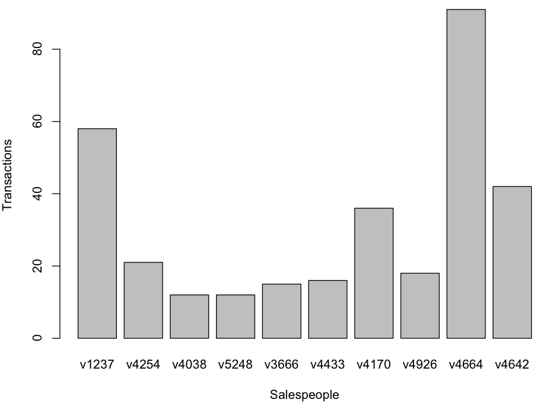
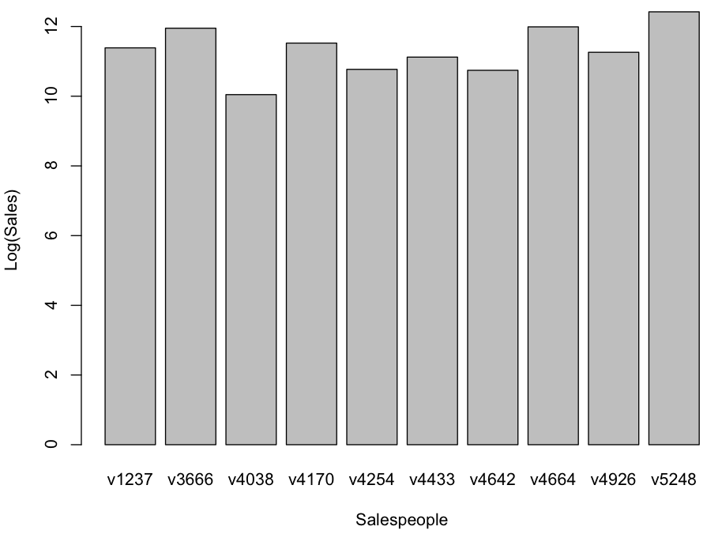
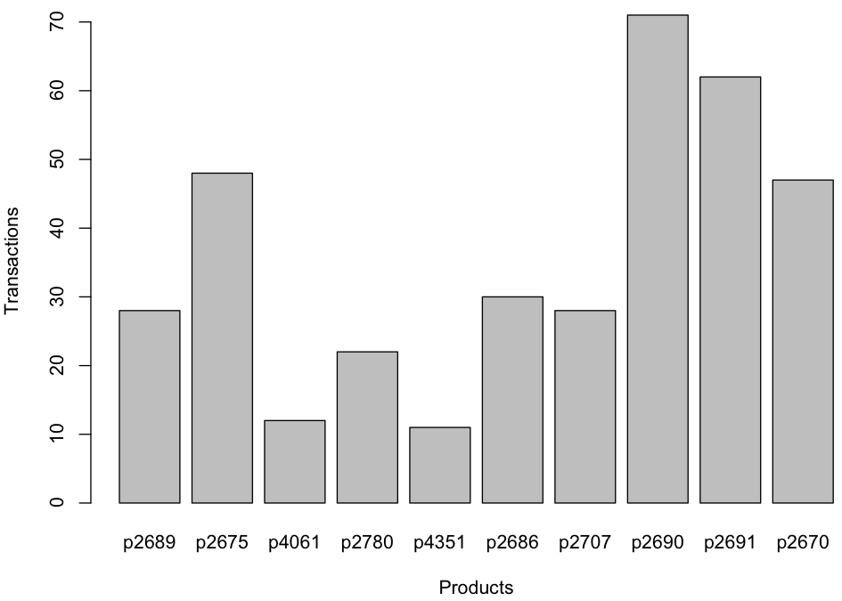
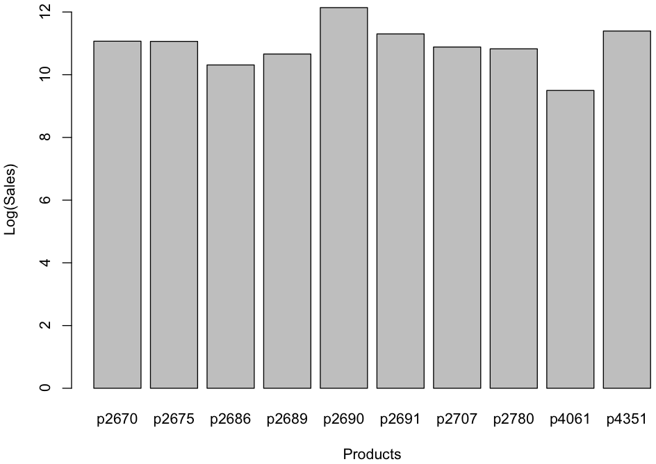

## Missing Data

### Overall
~~~
> table(sales$Insp)

    ok   unkn  fraud 
 14462 385414   1270 

> table(sales$Insp) / nrow(sales) * 100 

       ok      unkn     fraud 
 3.605171 96.078236  0.316593 
~~~

### Dual (Quantity and Value) Missing
~~~
> length(which(is.na(Quant) & is.na(Val)))
[1] 888

> head(sales[which(is.na(Quant) & is.na(Val)),])

        ID  Prod Quant Val Insp
3475   v29  p808    NA  NA unkn
4433  v453  p921    NA  NA unkn
5393  v431 p1035    NA  NA unkn
5503  v431    p1    NA  NA unkn
5505  v431    p1    NA  NA unkn
5913 v1039 p1101    NA  NA unkn

> length(which(is.na(Quant) & is.na(Val) & Insp == 'ok'))
[1] 3

> sales[which(is.na(Quant) & is.na(Val) & Insp == 'ok'),]

         ID  Prod Quant Val Insp
6624   v709 p1125    NA  NA   ok
9808  v1109 p1462    NA  NA   ok
15414 v1158 p1910    NA  NA   ok

> length(which(is.na(Quant) & is.na(Val) & Insp == 'fraud'))
[1] 0

> dualByID <- 100 * table(sales[which(is.na(Quant) & is.na(Val)),'ID']) / table(ID)

> dualByID[order(dualByID, decreasing=T)[1:10]]

    v1237     v4254     v4038     v5248     v3666     v4433     v4170     v4926     v4664     v4642 
13.793103  9.523810  8.333333  8.333333  6.666667  6.250000  5.555556  5.555556  5.494505  4.761905 

> dualID10 <- rownames(dualByID[order(dualByID, decreasing=T)[1:10]])

> dualSalesID10 <- sales[ID %in% dualID10, ]

> dualSalesID10$ID.f <- factor(dualSalesID10$ID, dualID10)

> barplot(table(dualSalesID10$ID.f), xlab="Salespeople", ylab="Transactions")
~~~

~~~
> dualValueID10 <- aggregate(dualSalesID10$Val, list(dualSalesID10$ID), sum, na.rm=TRUE)

> barplot(log(dualValueID10[,"x"]), names.arg=(dualID10), xlab="Salespeople", ylab="Log(Sales)")
~~~

~~~
> dualByProd <- 100 * table(sales[which(is.na(Quant) & is.na(Val)),'Prod']) / table(Prod)

> dualByProd[order(dualByProd, decreasing=T)[1:10]]

   p2689    p2675    p4061    p2780    p4351    p2686    p2707    p2690    p2691    p2670 
39.28571 35.41667 25.00000 22.72727 18.18182 16.66667 14.28571 14.08451 12.90323 12.76596 

> dualProd10 <- rownames(dualByProd[order(dualByProd, decreasing=T)[1:10]])

> dualSalesProd10 <- sales[Prod %in% dualProd10, ]
 
> dualSalesProd10$Prod.f <- factor(dualSalesProd10$Prod, dualProd10)
 
> barplot(table(dualSalesProd10$Prod.f), xlab="Products", ylab="Transactions")
~~~

~~~
> dualValueProd10 <- aggregate(dualSalesProd10$Val, list(dualSalesProd10$Prod), sum, na.rm=TRUE)

> barplot(log(dualValueProd10[,"x"]), names.arg=(dualProd10), xlab="Products", ylab="Log(Sales)")
~~~

### Quantity Missing
~~~
> length(which(is.na(Quant)))
[1] 13842
 
> length(which(is.na(Quant) & !is.na(Val)))
[1] 12954

> length(which(is.na(Quant) & Insp == 'ok'))
[1] 110

> head(sales[which(is.na(Quant) & Insp == 'ok'),])

        ID  Prod Quant  Val Insp
3459  v614  p807    NA 1010   ok
6450 v1295 p1125    NA 1025   ok
6516  v950 p1125    NA 1240   ok
6520 v1158 p1125    NA 1005   ok
6536   v10 p1125    NA 1445   ok
6624  v709 p1125    NA   NA   ok

> length(which(is.na(Quant) & Insp == 'fraud'))
[1] 30

> head(sales[which(is.na(Quant) & Insp == 'fraud'),])

         ID  Prod Quant  Val  Insp
9111   v731 p1405    NA 3520 fraud
32582 v2924 p4074    NA 1265 fraud
33209  v588 p4100    NA 1155 fraud
58426 v2925 p2443    NA 3610 fraud
58428 v4355 p2443    NA 1280 fraud
58435  v890 p2444    NA 2260 fraud

> naQByProd <- 100 * table(sales[which(is.na(Quant)), 'Prod']) / table(Prod)
 
> naQByProd[order(naQByProd, decreasing=T)[1:10]]

    p2442     p2443     p1653     p4101     p4243      p903     p3678     p4061     p3955     p4313 
100.00000 100.00000  90.90909  85.71429  68.42105  66.66667  66.66667  66.66667  64.28571  63.63636 

> nrow(sales[Prod == "p2442",])
[1] 38

> sum(sales[Prod == "p2442", "Val"])
[1] 1679550

> table(sales[Prod == "p2442", "Insp"])

   ok  unkn fraud 
    0    38     0 

> sales[Prod == "p2442", ]
          ID  Prod Quant    Val Insp
21259  v2921 p2442    NA   5715 unkn
21260  v2922 p2442    NA  21250 unkn
21261  v2923 p2442    NA 102210 unkn
21262  v2922 p2442    NA 213155 unkn
21263  v2924 p2442    NA   4870 unkn
58422  v2924 p2442    NA   4870 unkn
58423  v2922 p2442    NA  21250 unkn
58424  v4356 p2442    NA  53815 unkn
58425  v2922 p2442    NA 213155 unkn
102076 v2921 p2442    NA 137625 unkn
102077 v2920 p2442    NA  21310 unkn
102078 v4839 p2442    NA   5190 unkn
102079 v4356 p2442    NA  11320 unkn
102080 v2922 p2442    NA  34180 unkn
153543 v5077 p2442    NA   7720 unkn
153544 v2924 p2442    NA   9620 unkn
153545 v2920 p2442    NA  34365 unkn
195784 v5077 p2442    NA   7720 unkn
195785 v4356 p2442    NA  43705 unkn
252153 v2924 p2442    NA   4870 unkn
252154 v2921 p2442    NA 137625 unkn
252155 v5077 p2442    NA   7720 unkn
252156 v2922 p2442    NA  66820 unkn
252157 v5077 p2442    NA  12035 unkn
252158 v2920 p2442    NA  79320 unkn
325280 v2924 p2442    NA   4870 unkn
325281 v2921 p2442    NA 137625 unkn
325282 v5077 p2442    NA   7720 unkn
325283 v2922 p2442    NA  66820 unkn
325284 v5077 p2442    NA  12350 unkn
325285 v5077 p2442    NA  12035 unkn
325286 v2920 p2442    NA  43180 unkn
390840 v5077 p2442    NA  11515 unkn
390841 v4356 p2442    NA   4695 unkn
390842 v2923 p2442    NA  15580 unkn
390843 v2920 p2442    NA  27320 unkn
390844 v6044 p2442    NA  21215 unkn
390845 v4356 p2442    NA  53190 unkn

> nrow(sales[Prod == "p2443",])
[1] 16
 
> sum(sales[Prod == "p2443", "Val"])
[1] 81090

> table(sales[Prod == "p2443", "Insp"])

   ok  unkn fraud 
    1    13     2 

> sales[Prod == "p2443", ]

          ID  Prod Quant   Val  Insp
21264  v2925 p2443    NA 17155    ok
58426  v2925 p2443    NA  3610 fraud
58427  v4355 p2443    NA  5260  unkn
58428  v4355 p2443    NA  1280 fraud
102081 v2925 p2443    NA  3610  unkn
102082 v4355 p2443    NA  5260  unkn
102083 v4355 p2443    NA  1280  unkn
102084 v2925 p2443    NA  3075  unkn
153546 v2925 p2443    NA  3455  unkn
195786 v2939 p2443    NA  5465  unkn
195787 v2925 p2443    NA 14990  unkn
252159 v2925 p2443    NA  3610  unkn
325289 v2925 p2443    NA  3610  unkn
325290 v4355 p2443    NA  5260  unkn
325291 v4355 p2443    NA  1280  unkn
325292 v2925 p2443    NA  2890  unkn
~~~

### Value Missing
~~~
> length(which(is.na(sales$Val) & sales$Insp == 'ok'))
[1] 8

> sales[which(is.na(sales$Val) & sales$Insp == 'ok'),]
         ID  Prod Quant Val Insp
6365  v1039 p1125   100  NA   ok
6624   v709 p1125    NA  NA   ok
9346   v796 p1436   100  NA   ok
9475  v1043 p1437   106  NA   ok
9804  v1039 p1462   100  NA   ok
9808  v1109 p1462    NA  NA   ok
15414 v1158 p1910    NA  NA   ok
19853 v1958 p2272   101  NA   ok

~~~
