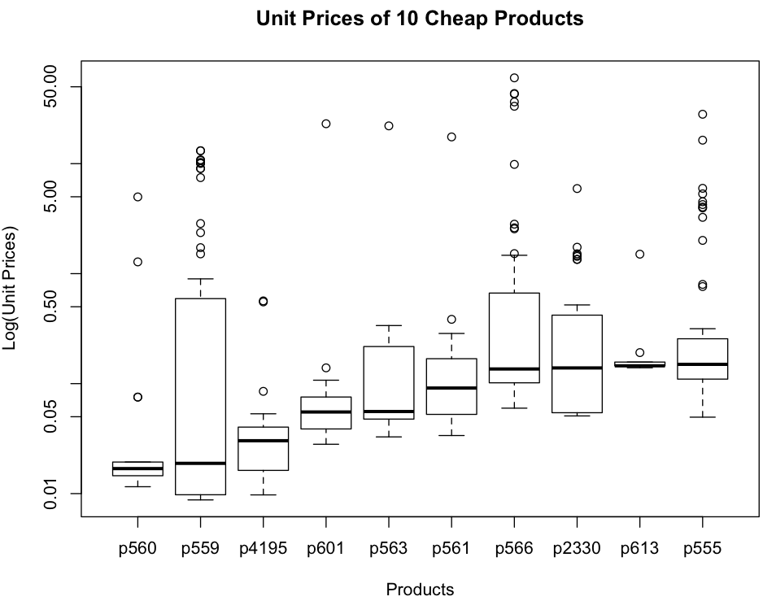

## Unit Price
~~~
> sales$Uprice <- Val/Quant

> head(sales)

  ID Prod Quant   Val Insp    Uprice
1 v1   p1   182  1665 unkn  9.148352
2 v2   p1  3072  8780 unkn  2.858073
3 v3   p1 20393 76990 unkn  3.775315
4 v4   p1   112  1100 unkn  9.821429
5 v3   p1  6164 20260 unkn  3.286827
6 v5   p2   104  1155 unkn 11.105769

> summary(sales$Uprice)

    Min.  1st Qu.   Median     Mean  3rd Qu.     Max.     NA's 
    0.00     8.46    11.89    20.30    19.11 26460.00    14136 

> tPrice <- aggregate(sales$Uprice, list(Prod), median, na.rm=TRUE)

> head(tPrice)

  Group.1         x
1      p1 11.428571
2      p2 10.877863
3      p3 10.000000
4      p4  9.911243
5      p5 11.000000
6      p6 13.270677

> plot(log(tPrice$x) ~ tPrice$Group.1, main="Typical Price per Product", names.arg="", xlab="Products", ylab="Log(Typical Price)")
~~~

~~~
> tPrice[order(tPrice$x, decreasing=TRUE)[1:10],]

     Group.1         x
3689   p3689 9204.1954
2453   p2453  456.0784
2452   p2452  329.3137
2456   p2456  304.8515
2459   p2459  283.8119
2451   p2451  262.2277
3581   p3581  183.1237
3795   p3795  179.9410
3691   p3691  171.2745
4354   p4354  158.0660

> expensives <- tPrice[order(tPrice$x, decreasing=TRUE)[1:10], "Group.1"]

> expensiveSales <- sales[Prod %in% expensives, c("ID", "Prod", "Uprice")]

> expensiveSales$Prod.f <- factor(expensiveSales$Prod, expensives)

> boxplot(Uprice ~ Prod.f, data= expensiveSales, main="Unit Prices of 10 Expensive Products", xlab="Products", ylab="Log(Unit Prices)", log="y")
~~~

~~~
> tPrice[order(tPrice$x)[1:10],]

     Group.1          x
560     p560 0.01688455
559     p559 0.01884438
4195   p4195 0.03025914
601     p601 0.05522265
563     p563 0.05576406
561     p561 0.09115803
566     p566 0.13590731
2330   p2330 0.13886771
613     p613 0.14521402
555     p555 0.14972394

> cheaps <- tPrice[order(tPrice$x)[1:10], "Group.1"]

> cheapSales <- sales[Prod %in% cheaps, c("ID", "Prod", "Uprice")]

> cheapSales$Prod.f <- factor(cheapSales$Prod, cheaps)
 
> boxplot(Uprice ~ Prod.f, data= cheapSales, main="Unit Prices of 10 Cheap Products", xlab="Products", ylab="Log(Unit Prices)", log="y")
~~~

~~~
# outliers:  > Q3 + 1.5 * IQR  or < Q1 - 1.5 * IQR

> oPrice <- tapply(sales$Uprice, list(Prod), function(x) length(boxplot.stats(x)$out))

> outs <- rownames(oPrice[order(oPrice, decreasing=T)[1:10]])

> outs
 [1] "p1125" "p1437" "p2273" "p1917" "p1918" "p4089" "p538"  "p3774" "p2742" "p3338"

> outSales <- sales[Prod %in% outs, c("ID", "Prod", "Uprice")]

> outSales$Prod.f <- factor(outSales$Prod, outs)

> boxplot(Uprice ~ Prod.f, data= outSales, main="Unit Prices of 10 Top Outliers", xlab="Products", ylab="Log(Unit Prices)", log="y")
~~~

