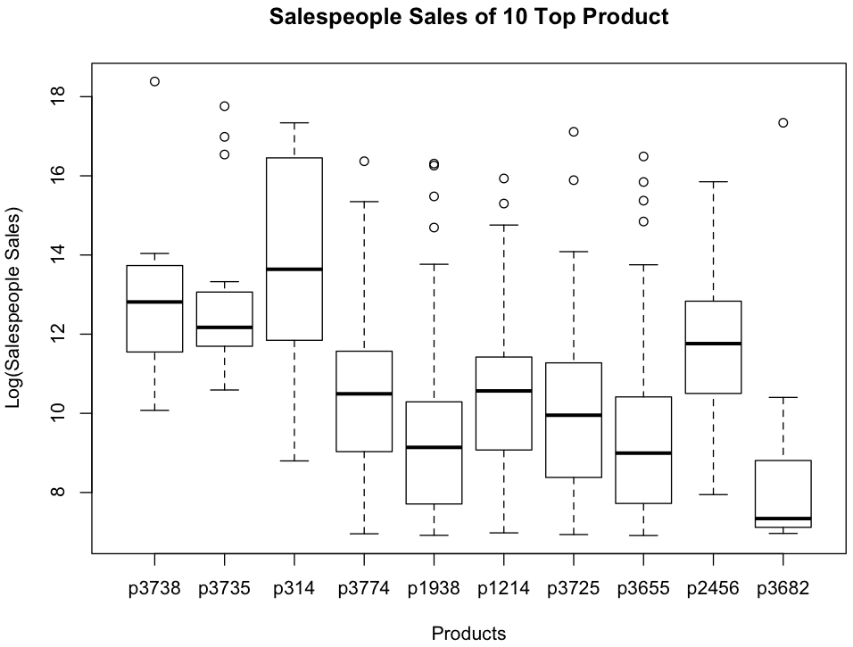
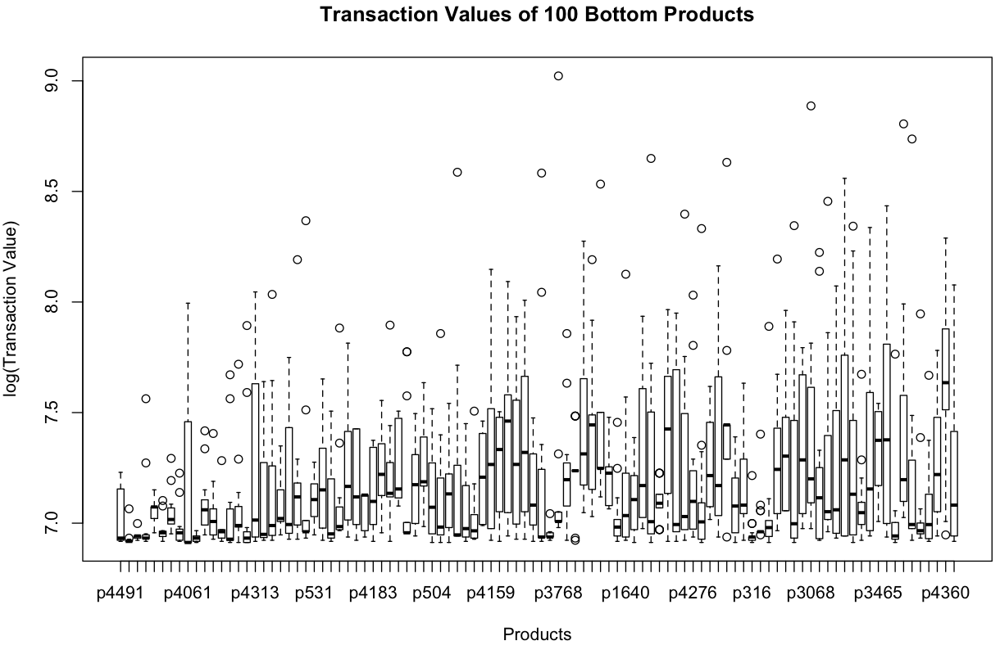

## Products
~~~
> barplot(table(sales$Prod), main="Transactions per Product", names.arg="", xlab="Products", ylab="Transactions", ylim=c(0,4000))
~~~

~~~
> valueByProd <- aggregate(Val, list(Prod), sum, na.rm=TRUE)

> head(valueByProd)

  Group.1       x
1      p1 1409340
2      p2  497195
3      p3  193005
4      p4 1816245
5      p5 2960385
6      p6  267700

> plot(log(valueByID$x) ~ valueByID$Group.1, main="Sales per Product", names.arg="", xlab="Products", ylab="Log(Sales)")
~~~

~~~
> valueByProd[order(valueByProd$x, decreasing=TRUE)[1:10],]

     Group.1         x
3738   p3738 102544065
3735   p3735  93342190
314     p314  78503390
3774   p3774  45926100
1938   p1938  41813875
1214   p1214  39212400
3725   p3725  38302795
3655   p3655  34743160
2456   p2456  34427235
3682   p3682  34016270

> topProds <- valueByProd[order(valueByProd$x, decreasing=TRUE)[1:10], "Group.1"]

> topSalesByProd <- sales[Prod %in% topProds, c("ID", "Prod", "Val")]

> topSalesByProd$Prod.f <- factor(topSalesByProd$Prod, topProds)

> boxplot(Val ~ Prod.f, data= topSalesByProd, main="Transaction Values of 10 Top Products", xlab="Products", ylab="Log(Transaction Value)", log="y")
~~~

~~~
> topSalesByProdID <- aggregate(topSalesByProd$Val, list(topSalesByProd$Prod, topSalesByProd$ID), sum, na.rm=TRUE)

> head(topSalesByProdID)

  Group.1 Group.2      x
1   p3655      v1   8810
2   p3774      v1  91785
3   p3655      v4   2675
4   p1938      v8  18100
5   p1214     v10 465405
6   p3655     v10  41560

> topSalesByProdID$Group.1 <- factor(topSalesByProdID$Group.1, topProds)

> boxplot(log(x) ~ Group.1, data=topSalesByProdID, main="Salespeople Sales of 10 Top Product", xlab="Products", ylab="Log(Salespeople Sales)")
~~~

~~~
> head(valueByProd[order(valueByProd$x),])

     Group.1     x
4491   p4491 10155
1653   p1653 11295
4436   p4436 12420
189     p189 12605
669     p669 12760
4172   p4172 12795

> bottomProds <- valueByProd[order(valueByProd$x)[1:100], "Group.1"]

> bottomSalesByProd <- sales[Prod %in% bottomProds, c("ID", "Prod", "Val")]

> bottomSalesByProd$Prod.f <- factor(bottomSalesByProd$Prod, bottomProds)

> boxplot(log(Val) ~ Prod.f, data= bottomSalesByProd, main="Transaction Values of 100 Bottom Products", xlab="Products", ylab="log(Transaction Value)")
~~~

~~~
# Top 100 products account for 75% quantity

> sum(as.double(quantByProd[order(quantByProd$x, decreasing=T)[1:100], 2])) / sum(as.double(Quant), na.rm=T) * 100
[1] 74.63478

# Bottom 3000 products account for 2.24% quantity

> sum(as.double(quantByProd[order(quantByProd$x, decreasing=F)[1:3000], 2])) / sum(as.double(Quant), na.rm=T) * 100
[1] 2.241725
~~~
