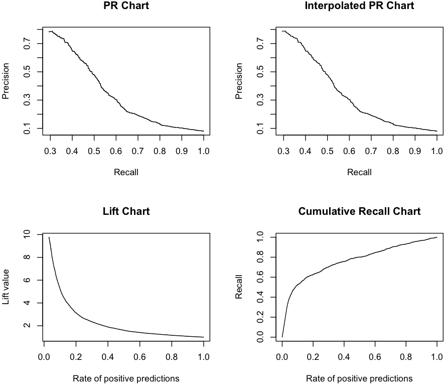

## [Local Outlier Factor](https://en.wikipedia.org/wiki/Local_outlier_factor)

### Ranking with R
~~~
> install.packages('Rlof')

> library('Rlof')

> setwd("/work/R/example")
 
> load('salesClean.rdata')
 
> attach(sales)

> prodAgg <- split(Uprice, Prod)

> lofs <- numeric()

# Testing,  for (prod in c('p1', 'p2', 'p3')) {

for (prod in levels(Prod)) {
  l <- length(prodAgg[[prod]])
  
  if (l <= 7) lofs <- c(lofs, rep(0.0, each=l))
  else lofs <- c(lofs, lof(prodAgg[[prod]], 7))

  print(prod)
}

> length(which(is.nan(lofs)))
[1] 4307

> length(which(is.infinite(lofs)))
[1] 2613

> fivenum(lofs[which(!is.infinite(lofs) & !is.nan(lofs))])
[1] 7.803117e-01 9.909313e-01 1.038009e+00 1.257241e+00 5.937395e+05

# NaN and Infinite numbers are from duplicated Uprice

> lofs <- numeric()

for (prod in levels(Prod)) {
  u <- unique(prodAgg[[prod]])
  
  l <- length(u)
  
  if (l <= 7) lofs <- c(lofs, rep(0.0, each=l))
  else lofs <- c(lofs, lof(u, 7))
   
  print(prod)
}

> length(which(is.nan(lofs) | is.infinite(lofs)))
[1] 0

> fivenum(lofs)
[1] 0.000000e+00 9.888399e-01 1.036028e+00 1.176084e+00 1.903022e+04
~~~

### Ranking with Spark
~~~
bin/spark-shell --master spark://localhost:7077 --packages com.databricks:spark-csv_2.10:1.3.0 --conf spark.serializer=org.apache.spark.serializer.KryoSerializer

import org.apache.spark.rdd.RDD
import org.apache.spark.storage.StorageLevel

val rawRDD = sc.textFile("/work/R/example/salesClean.csv")
val noHeaderRDD = rawRDD.mapPartitionsWithIndex { (idx, iter) => if (idx == 0) iter.drop(1) else iter }

val parsedRDD = noHeaderRDD.map { line =>
  val parts = line.split(',')
  (parts(2).substring(1, parts(2).length-1), parts(6).toDouble, parts(5).substring(1, parts(5).length-1), parts(1).substring(1, parts(1).length-1))
}
parsedRDD.persist(StorageLevel.MEMORY_ONLY_SER)

parsedRDD.take(10).foreach(println)

(p1,9.14835164835165,unkn,v1)
(p1,2.85807291666667,unkn,v2)
(p1,3.7753150590889,unkn,v3)
(p1,9.82142857142857,unkn,v4)
(p1,3.28682673588579,unkn,v3)
(p2,11.1057692307692,unkn,v5)
(p2,16.2285714285714,unkn,v6)
(p2,20.05,unkn,v7)
(p2,12.2532188841202,unkn,v8)
(p2,9.95762711864407,unkn,v9)

// val nfRDD = parsedRDD.filter(t => t._4 != "fraud")
// val uPriceRDD = parsedRDD.map(t => (t._1, (t._2, t._3, t._4)))

import java.lang.Math._

object Neighbor3 {
  def lof3(xs: Seq[Double], k: Int):  Array[Double] = {
    val lofs = new Array[Double](xs.size)
    
    if (xs.size <= k) {
      for (i <- 0 until xs.size) lofs(i) = 0.0
      return lofs
    }
    
    val ds = Array.ofDim[(Int, Double)](xs.size, xs.size)
    
    for (i <- 0 until xs.size; j<- 0 until xs.size) {
      ds(i)(j) = (j, abs(xs(i) - xs(j)))
    }
    
    val knn = Array.ofDim[(Int, Double)](xs.size, k)
    
    for (i <- 0 until xs.size) {
      val sm = ds(i).sortBy(t => t._2)
      
      /*
      for (j <- 0 until k) {
        knn(i)(j) = sm(j)
      }*/    
      
      var z0 = 0;
      while (sm(z0)._2 == 0 & z0 < xs.size) z0 = z0 + 1
      
      for (j <- 0 until k) {
        if ((z0+j) < xs.size) knn(i)(j) = sm(z0+j)
        else knn(i)(j) = (i, 0.0)
      }
    }
    
    val lrds = new Array[Double](xs.size)
    
    for (i <- 0 until xs.size) {
      var rd = 0.0
      var count = 0
      
      for (j <- 0 until k) {
        if (knn(i)(j)._1 != i) {
          count = count + 1
          if (knn(knn(i)(j)._1)(k-1)._2 > ds(i)(knn(i)(j)._1)._2) rd += knn(knn(i)(j)._1)(k-1)._2
          else rd += ds(i)(knn(i)(j)._1)._2
        }
      }
      
      if (count == 0 || rd == 0.0) lrds(i) = 0.0
      else lrds(i) = count / rd
    }
    
    var minLof = 0.0; var maxLof = 0.0
    
    for (i <- 0 until xs.size) {
      var ls = 0.0
      
      for (j <- 0 until k) {
        ls += lrds(knn(i)(j)._1)
      }
      
      lofs(i) = ls / k / lrds(i)
      
      if (lofs(i) < minLof) minLof = lofs(i)
      else if (lofs(i) > maxLof) maxLof = lofs(i)
    }
    
    if (maxLof == minLof) {
      for (i <- 0 until xs.size) {
        lofs(i) = 0.0
      }
    } else {
      for (i <- 0 until xs.size) {
        lofs(i) = lofs(i) / (maxLof - minLof)
      }
    }
    
    lofs
  }
}

import Neighbor3._

case class LofScore(Prod: String, Uprice: Double, Insp: String, ID: String, LOF: Double)

val resDF = parsedRDD.groupBy(x => x._1).flatMap {t =>
  val lf3 = lof3(t._2.map(t => t._2).toSeq, 7)

  val m = t._2 zip lf3

  m.map(t => LofScore(t._1._1, t._1._2, t._1._3, t._1._4, t._2))
}.toDF

resDF.show()

+----+----------------+----+----+-------------------+                           
|Prod|          Uprice|Insp|  ID|                LOF|
+----+----------------+----+----+-------------------+
|p888|14.0107913669065|  ok|v805| 0.0799618002391534|
|p888|10.8677685950413|  ok|v474|0.06393978381666413|
|p888|4.37123169681309|  ok|v806|0.06130590562258435|
|p888|5.85714285714286|  ok|v654| 0.0534227143914696|
|p888|7.51766784452297|  ok|v807|0.06133848286741182|
|p888|3.61889961645285|  ok|v808| 0.0633444194494576|
|p888|14.5907928388747|  ok|v809|0.06809963785372683|
|p888|13.2857142857143|  ok|v810|0.06641289330032102|
|p888|2.76946786329435|  ok|v811|0.06809502846642153|
|p888|10.6954887218045|  ok|v671|0.06646367494209844|
|p888|10.8208955223881|  ok| v15|0.05604060828937512|
|p888|5.35310394610202|  ok|v423| 0.0631527214269167|
|p888|6.92920681986657|  ok|v333| 0.0662872524534364|
|p888|           9.725|  ok|v333|0.05293307210924732|
|p888|27.6111111111111|  ok| v19|0.06133282289735954|
|p888|22.2839506172839|  ok|v528|0.06291924711034087|
|p888|8.87387387387387|  ok|v596|0.06262595396634076|
|p888|11.1818181818182|  ok|v506|0.07141401104495247|
|p888|4.69059405940594|  ok|v538|0.06460966811707683|
|p888|3.28777777777778|  ok|v538|0.05821124413482868|
+----+----------------+----+----+-------------------+

resDF.coalesce(1).write.format("com.databricks.spark.csv").option("header", "true").save("/work/R/example/lofData.csv")
~~~

### PR charts with R
~~~
> setwd("/work/R/example")
 
> sales <- read.csv('lofData.csv', header=TRUE)
> 
> head(sales)

  Prod    Uprice Insp   ID        LOF
1 p888 14.010791   ok v805 0.07996180
2 p888 10.867769   ok v474 0.06393978
3 p888  4.371232   ok v806 0.06130591
4 p888  5.857143   ok v654 0.05342271
5 p888  7.517668   ok v807 0.06133848
6 p888  3.618900   ok v808 0.06334442

> attach(sales)

> library(ROCR)

> knownSales <- sales[insp == 'fraud' | insp == 'ok',]

> knownSales$Label <- 0

> knownSales[knownSales$insp == 'fraud', 'Label'] <- 1

> par(mfrow= c(2,2))

> pred <- prediction(knownSales$LOF, knownSales$Label)

> perf <- performance(pred, "prec", "rec")

> plot(perf, main = "PR Chart")

IPRcurve <- function(preds, trues, ...) {
  require(ROCR, quietly = T)
  
  pd <- prediction(preds, trues)
  pf <- performance(pd, "prec", "rec")
  pf@y.values <- lapply(pf@y.values, function(x) rev(cummax(rev(x))))

  plot(pf, ...)
}

> IPRcurve(knownSales$LOF, knownSales$Label, main = "Interpolated PR Chart")

> perf <- performance(pred, "lift", "rpp")

> plot(perf, main = "Lift Chart")

CRchart <- function(preds, trues, ...) {
  require(ROCR, quietly = T)

  pd <- prediction(preds, trues)
  pf <- performance(pd, "rec", "rpp")
 
  plot(pf, ...)
}

> CRchart(knownSales$LOF, knownSales$Label, main = "Cumulative Recall Chart")
~~~

