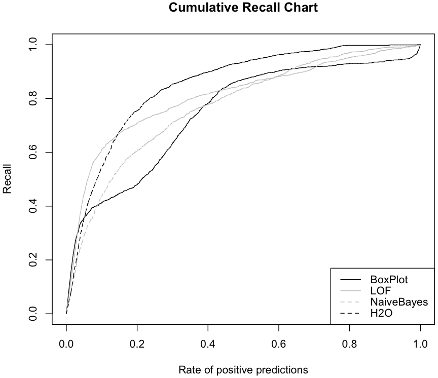

# Sales

Transactions reported by salespeople of some company. These salespeople sell a set of products of the company, are free to set the selling price according their own policy and market, report their sales back to the company at the end of each month.

## Goal

The goal is to help in the task of verifying the veracity of these reports given past experience of the company that has detected error and fraud attempts in these transaction reports. The help we provide will take the form of a ranking of the reports according to their probability of being fraudulent. This ranking will allow to allocate the limited inspection resources of the company to the reports that our system signals as being more suspicious.

## Data Source
~~~
> install.packages('DMwR')

> library(DMwR)

> data(sales)
~~~

## Conclusion

Deep Learning with H2O outperforms others (Box Plot with R, Local Outlier Factor with Spark and Naive Bayes with R) and achieves 80% Recall fastest.

## Reference

(1) [Data Mining with R] (http://www.amazon.com/Data-Mining-Learning-Knowledge-Discovery/dp/1439810184)
