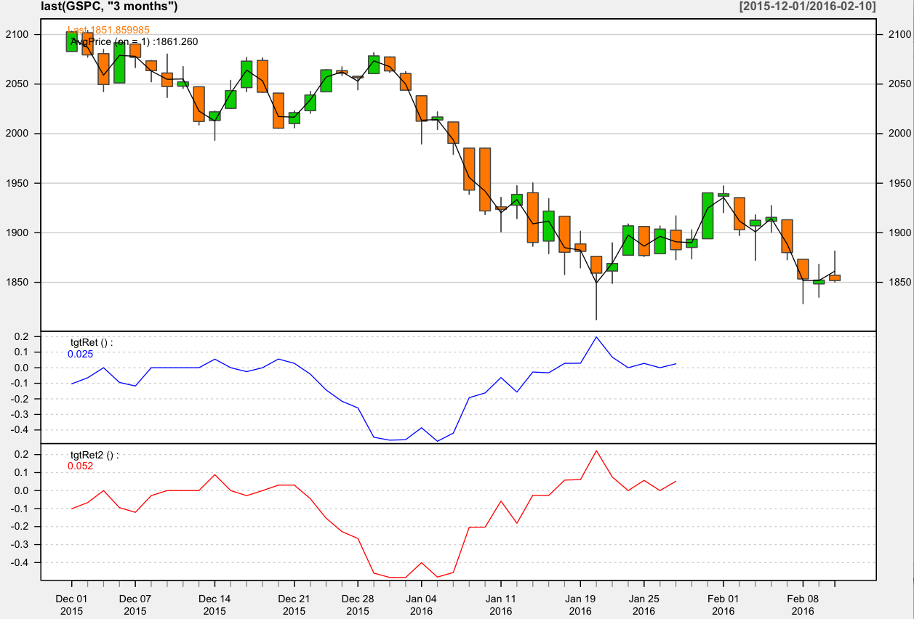

## Exploratory Data Analysis with R

### Basic
~~~
> head(GSPC)

            Open  High   Low Close   Volume AdjClose
1970-01-02 92.06 93.54 91.79 93.00  8050000    93.00
1970-01-05 93.00 94.25 92.53 93.46 11490000    93.46
1970-01-06 93.46 93.81 92.13 92.82 11460000    92.82
1970-01-07 92.82 93.38 91.93 92.63 10010000    92.63
1970-01-08 92.63 93.47 91.99 92.68 10670000    92.68
1970-01-09 92.68 93.25 91.82 92.40  9380000    92.40

> tail(GSPC)

              Open    High     Low   Close     Volume AdjClose
2016-02-03 1907.07 1918.01 1872.23 1912.53 5172950000  1912.53
2016-02-04 1911.67 1927.35 1900.52 1915.45 5193320000  1915.45
2016-02-05 1913.07 1913.07 1872.65 1880.05 4929940000  1880.05
2016-02-08 1873.25 1873.25 1828.46 1853.44 5636460000  1853.44
2016-02-09 1848.46 1868.25 1834.94 1852.21 5183220000  1852.21
2016-02-10 1857.10 1881.60 1850.32 1851.86 4471170000  1851.86

> nrow(GSPC)
[1] 11634

> avgPrice <- function(p) apply(p[,c("High","Low","Close")], 1, mean)

> GSPC$HLC <- avgPrice(GSPC)

> tail(GSPC)

              Open    High     Low   Close     Volume AdjClose      HLC
2016-02-03 1907.07 1918.01 1872.23 1912.53 5172950000  1912.53 1900.923
2016-02-04 1911.67 1927.35 1900.52 1915.45 5193320000  1915.45 1914.440
2016-02-05 1913.07 1913.07 1872.65 1880.05 4929940000  1880.05 1888.590
2016-02-08 1873.25 1873.25 1828.46 1853.44 5636460000  1853.44 1851.717
2016-02-09 1848.46 1868.25 1834.94 1852.21 5183220000  1852.21 1851.800
2016-02-10 1857.10 1881.60 1850.32 1851.86 4471170000  1851.86 1861.260

T.ind <- function(quotes, tgt.margin = 0.025, n.days = 10) {
  r <- matrix(NA, ncol = n.days, nrow = NROW(quotes))
  for (x in 1:n.days) r[, x] <- Next(Delt(avgPrice(quotes), k = x), x)
  x <- apply(r, 1, function(x) sum(x[x > tgt.margin | x < -tgt.margin]))
  if (is.xts(quotes)) xts(x, time(quotes))
  else x
}

> candleChart(last(GSPC, "3 months"), theme = "white", TA = NULL)

> addAvgPrice <- newTA(FUN = avgPrice, col = 1, legend = "AvgPrice")

> addT.ind <- newTA(FUN = T.ind, col = "red", legend = "tgtRet")

> addAvgPrice(on = 1)

> addT.ind()
~~~

