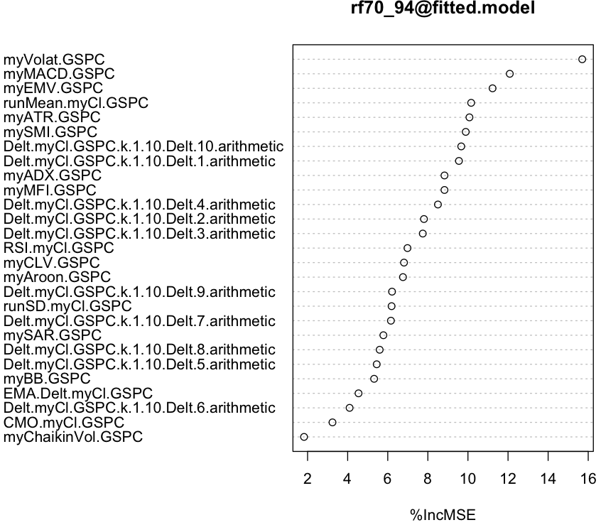
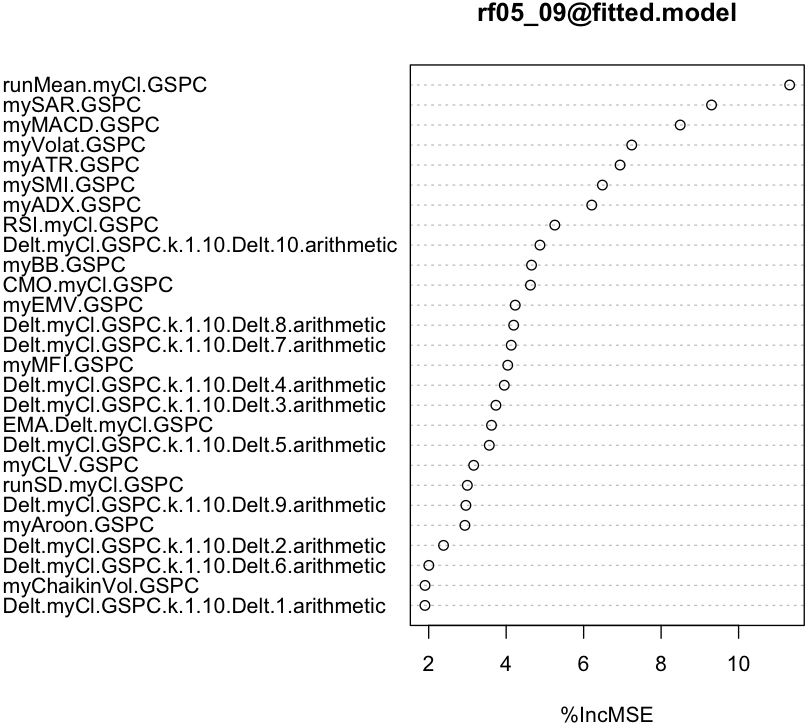
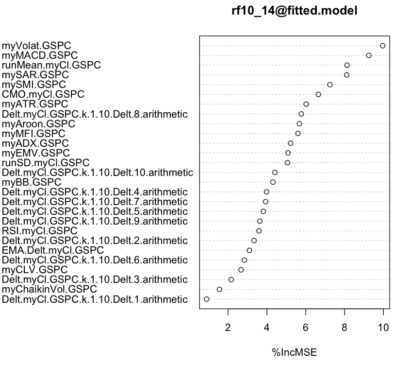

### Using TTR package
~~~
> library(TTR)

myATR <- function(x) ATR(x[,c("High","Low","Close")])[, "atr"]
 
mySMI <- function(x) SMI(x[,c("High","Low","Close")])[, "SMI"]
 
myADX <- function(x) ADX(x[,c("High","Low","Close")])[, "ADX"]
 
myAroon <- function(x) aroon(x[,c("High", "Low")])$oscillator
 
myBB <- function(x) BBands(x[,c("High","Low","Close")])[, "pctB"]
 
myChaikinVol <- function(x) Delt(chaikinVolatility(x[,c("High","Low")]))[, 1]

myCLV <- function(x) EMA(CLV(x[,c("High","Low","Close")]))[, 1]
 
myEMV <- function(x) EMV(x[,c("High","Low")],x[,"Volume"])[, 2]
 
myMACD <- function(x) MACD(x[,c("Close")])[, 2]
 
myMFI <- function(x) MFI(x[,c("High","Low","Close")],x[,"Volume"])
 
mySAR <- function(x) SAR(x[,c("High","Close")])[, 1]
 
myVolat <- function(x) volatility(x[,c("Open","High","Low","Close")], calc = "garman")[, 1]

myCl <- function(x) x[,c("Close")]
~~~

### Feature Filtering with Random Forest
~~~
> library(randomForest)

> model <- specifyModel(T.ind2(GSPC) ~ Delt(myCl(GSPC),k=1:10) + myATR(GSPC) + mySMI(GSPC) + myADX(GSPC) + myAroon(GSPC) +
  myBB(GSPC) + myChaikinVol(GSPC) + myCLV(GSPC) + CMO(myCl(GSPC)) + EMA(Delt(myCl(GSPC))) + myEMV(GSPC) +
  myVolat(GSPC) + myMACD(GSPC) + myMFI(GSPC) + RSI(myCl(GSPC)) + mySAR(GSPC) + runMean(myCl(GSPC)) + runSD(myCl(GSPC)))
 
> set.seed(1234)

> rf70_94 <- buildModel(model, method='randomForest', training.per=c('1970-01-01','1994-12-31'), ntree=50, importance=T)

> imp70_94 <- importance(rf70_94@fitted.model, type = 1)
> df70_94 <- data.frame(as.numeric(imp70_94))
> df70_94$feature <- rownames(imp70_94)
> colnames(df70_94) <- c("importance", "feature")

> df70_94[order(df70_94$importance, decreasing=T)[1:10],c("feature","importance")]

                                    feature importance
21                             myVolat.GSPC  15.701049
22                              myMACD.GSPC  12.087076
20                               myEMV.GSPC  11.227810
26                        runMean.myCl.GSPC  10.160595
11                               myATR.GSPC  10.074549
12                               mySMI.GSPC   9.890472
10 Delt.myCl.GSPC.k.1.10.Delt.10.arithmetic   9.665874
1   Delt.myCl.GSPC.k.1.10.Delt.1.arithmetic   9.550633
13                               myADX.GSPC   8.829990
23                               myMFI.GSPC   8.829491

> varImpPlot(rf70_94@fitted.model, type = 1)
~~~

~~~
> rf95_04 <- buildModel(model, method='randomForest', training.per=c('1995-01-01','2004-12-31'), ntree=50, importance=T)

> imp95_04 <- importance(rf95_04@fitted.model, type = 1)
> df95_04 <- data.frame(as.numeric(imp95_04))
> df95_04$feature <- rownames(imp95_04)
> colnames(df95_04) <- c("importance", "feature")

> df95_04[order(df95_04$importance, decreasing=T)[1:10],c("feature","importance")]

             feature importance
22       myMACD.GSPC  12.892665
21      myVolat.GSPC  12.602926
26 runMean.myCl.GSPC  12.581297
11        myATR.GSPC  12.190333
25        mySAR.GSPC  10.727503
13        myADX.GSPC   8.630410
20        myEMV.GSPC   8.488823
12        mySMI.GSPC   8.485702
27   runSD.myCl.GSPC   8.172743
14      myAroon.GSPC   8.092307

> varImpPlot(rf95_04@fitted.model, type = 1)
~~~

~~~
> rf05_09 <- buildModel(model, method='randomForest', training.per=c('2005-01-01','2009-12-31'), ntree=50, importance=T)

> imp05_09 <- importance(rf05_09@fitted.model, type = 1)
> df05_09 <- data.frame(as.numeric(imp05_09))
> df05_09$feature <- rownames(imp05_09)
> colnames(df05_09) <- c("importance", "feature")

> df05_09[order(df05_09$importance, decreasing=T)[1:10],c("feature","importance")]

                                    feature importance
26                        runMean.myCl.GSPC  11.318132
25                               mySAR.GSPC   9.301695
22                              myMACD.GSPC   8.493119
21                             myVolat.GSPC   7.241340
11                               myATR.GSPC   6.940402
12                               mySMI.GSPC   6.484521
13                               myADX.GSPC   6.209085
24                            RSI.myCl.GSPC   5.255817
10 Delt.myCl.GSPC.k.1.10.Delt.10.arithmetic   4.872608
15                                myBB.GSPC   4.655083

> varImpPlot(rf05_09@fitted.model, type = 1)
~~~

~~~
> rf10_14 <- buildModel(model, method='randomForest', training.per=c('2010-01-01','2014-12-31'), ntree=50, importance=T)

> imp10_14 <- importance(rf10_14@fitted.model, type = 1)
> df10_14 <- data.frame(as.numeric(imp10_14))
> df10_14$feature <- rownames(imp10_14)
> colnames(df10_14) <- c("importance", "feature")

> df10_14[order(df10_14$importance, decreasing=T)[1:10],c("feature","importance")]

                                   feature importance
21                            myVolat.GSPC   9.960385
22                             myMACD.GSPC   9.247430
26                       runMean.myCl.GSPC   8.127219
25                              mySAR.GSPC   8.108243
12                              mySMI.GSPC   7.244285
18                           CMO.myCl.GSPC   6.648096
11                              myATR.GSPC   6.020759
8  Delt.myCl.GSPC.k.1.10.Delt.8.arithmetic   5.769271
14                            myAroon.GSPC   5.671220
23                              myMFI.GSPC   5.597945

> varImpPlot(rf10_14@fitted.model, type = 1)
~~~

