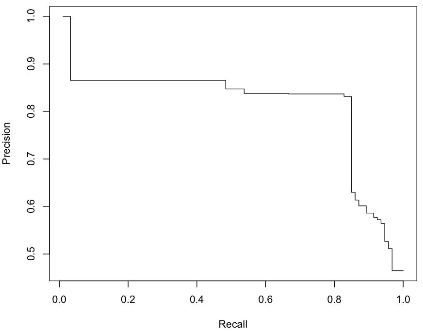
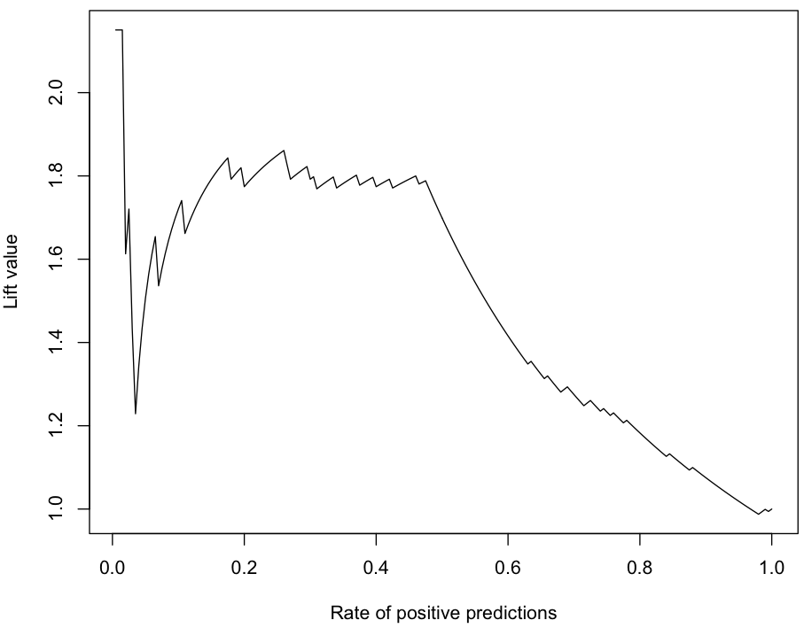

# [ROCR](https://cran.r-project.org/web/packages/ROCR/index.html)

## R package

~~~
library(ROCR)
~~~

## Test Data

~~~
data(ROCR.simple)
~~~

## Basic PR curve

~~~
pred <- prediction(ROCR.simple$predictions, ROCR.simple$labels)
perf <- performance(pred, "prec", "rec")

plot(perf)
~~~

## Interpolated PR curve

PR curves produced by the ROCR package have a sawtooth shape and this is usually considered not too clear. We can calculate the interpolated precision for a
certain recall level r as the highest precision value found for any recall level greater than or equal to r.

~~~
IPRcurve <- function(preds, trues, ...) {
  require(ROCR, quietly = T)
  
  pd <- prediction(preds, trues)
  pf <- performance(pd, "prec", "rec")
  pf@y.values <- lapply(pf@y.values, function(x) rev(cummax(rev(x))))
  plot(pf, ...)
}

IPRcurve(ROCR.simple$predictions, ROCR.simple$labels)
~~~

## Lift chart

RPP means Rate of Positive Predictions. RPP is the probability that the model predicts a positive class, estimated by the proportion of positive class predictions divided by the total number of test cases.

Lift is recall divided by RPP.

~~~
pred <- prediction(ROCR.simple$predictions, ROCR.simple$labels)
perf <- performance(pred, "lift", "rpp")

plot(perf, main = "Lift Chart")
~~~

## Reference

(1) Section 4.3.2.1 of [Data Mining with R] (http://www.amazon.com/Data-Mining-Learning-Knowledge-Discovery/dp/1439810184)