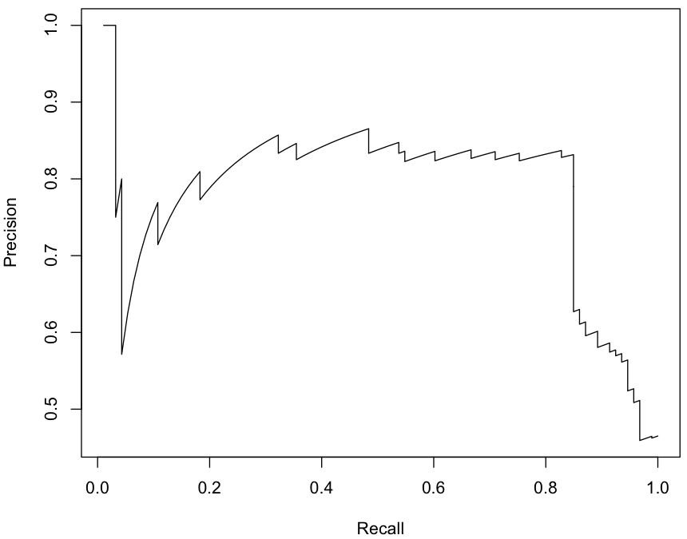

# [ROCR](https://cran.r-project.org/web/packages/ROCR/index.html)

## R package

library(ROCR)

## PR-curve example

~~~
data(ROCR.simple)

pred <- prediction(ROCR.simple$predictions, ROCR.simple$labels)
perf <- performance(pred, "prec", "rec")

plot(perf)
~~~

