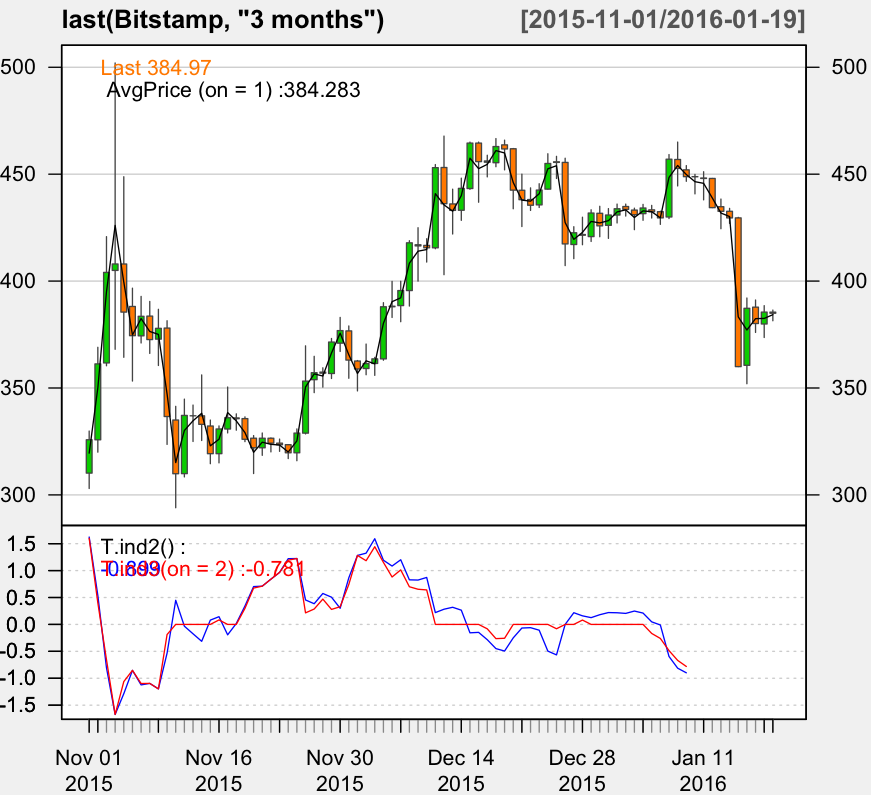

## Using R and xts

~~~
> library(xts)

> Bitstamp <- as.xts(read.zoo("/work/R/example/stocks/bitstamp-daily.csv", sep=",", header=T))

> dim(Bitstamp)
[1] 1569    5

> head(Bitstamp)

           Open High  Low Close    Volume
2011-09-13 5.80 6.00 5.65  5.97  58.37138
2011-09-14 5.58 5.72 5.52  5.53  61.14598
2011-09-15 5.12 5.24 5.00  5.13  80.14080
2011-09-16 4.82 4.87 4.80  4.85  39.91401
2011-09-17 4.87 4.87 4.87  4.87   0.30000
2011-09-18 4.87 4.92 4.81  4.92 119.81280

> tail(Bitstamp)

             Open   High    Low  Close    Volume
2016-01-14 432.64 434.00 427.00 429.55  4420.911
2016-01-15 429.55 429.80 360.00 360.00 37326.330
2016-01-16 360.62 392.07 352.00 387.27 25019.184
2016-01-17 387.80 391.14 376.00 380.16  8416.945
2016-01-18 379.94 388.50 373.63 385.49  7015.523
2016-01-19 385.47 386.43 381.45 384.97  1747.512

> max(Bitstamp[,"High"])
[1] 1163

> Bitstamp[Bitstamp$High == 1163,]

              Open High  Low   Close   Volume
2013-11-30 1131.99 1163 1080 1119.52 12907.61

> max(Bitstamp[,"Close"])
[1] 1132.01

> Bitstamp[Bitstamp$Close == 1132.01,]
           Open    High    Low   Close   Volume
2013-12-04 1055 1153.27 1052.1 1132.01 14433.48

> avgPrice <- function(p) apply(p[,c("High","Low","Close")], 1, mean)

> library(quantmod)

> fivenum(as.numeric(abs(Next(Delt(Bitstamp[,"Close"], Bitstamp[,"Close"], k = 1)))))
[1] 0.000000000 0.006656432 0.016431211 0.036590258 0.561338290

T.ind2 <- function(quotes, tgt.margin = 0.025, n.days = 10) {
  v <- avgPrice(quotes)
  r <- matrix(NA, ncol = n.days, nrow = NROW(quotes))
  for (x in 1:n.days) r[, x] <- Next(Delt(v, quotes[, "Close"], k = x), x)
  x <- apply(r, 1, function(x) sum(x[x > tgt.margin | x < -tgt.margin]))
  if (is.xts(quotes)) xts(x, time(quotes))
  else x
}

> candleChart(last(Bitstamp, "3 months"), theme = "white", TA = NULL)

> addAvgPrice <- newTA(FUN = avgPrice, col = 1, legend = "AvgPrice")
> addAvgPrice(on = 1)

> addT.ind2 <- newTA(FUN = T.ind2, col = "red", legend = "tgtRet")
> addT.ind2()
~~~

