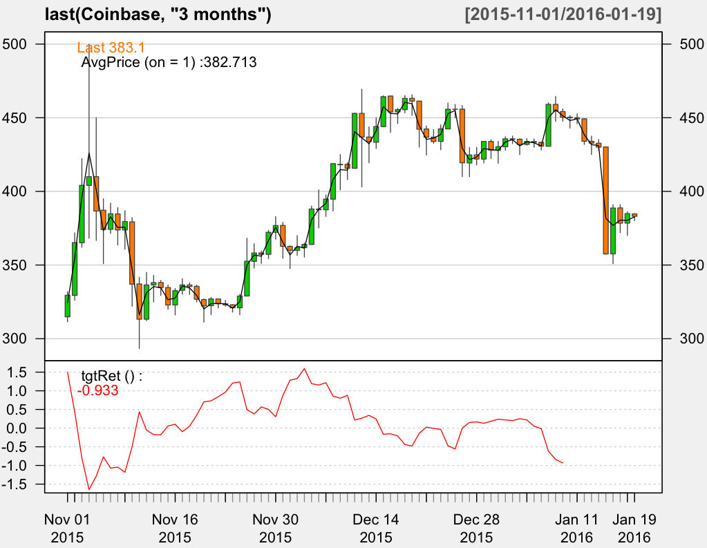

## Using R and xts

~~~
> library(xts)

> Coinbase <- as.xts(read.zoo("/work/R/example/stocks/coinbase-daily.csv", sep=",", header=T))

> dim(Coinbase)
[1] 381   5

> head(Coinbase)

             Open   High    Low Close      Volume
2014-12-01 300.00 370.00 300.00 370.0  0.05655554
2014-12-02 377.00 378.00 377.00 378.0 15.01360000
2014-12-03 377.90 378.00 377.01 378.0  0.54660840
2014-12-04 377.10 377.10 377.10 377.1  0.01000000
2014-12-06 378.00 378.00 378.00 378.0  0.01500000
2014-12-08 375.01 375.01 375.00 375.0  0.23500000

> tail(Coinbase)

             Open   High    Low  Close    Volume
2016-01-14 432.70 435.27 428.00 430.03  5673.449
2016-01-15 430.15 430.29 357.30 357.53 28637.117
2016-01-16 357.59 391.00 350.92 388.70 17983.262
2016-01-17 388.78 391.00 372.00 378.46  8277.896
2016-01-18 378.47 386.10 370.10 384.89  8710.776
2016-01-19 384.70 384.99 380.05 383.10  2334.571

> max(Coinbase[,"High"])
[1] 499.99

> Coinbase[Coinbase$High == 499.99,]

             Open   High    Low  Close   Volume
2015-11-04 404.06 499.99 368.15 409.99 50598.58

> max(Coinbase[,"Close"])
[1] 464.28

> Coinbase[Coinbase$Close == 464.28,]

             Open   High    Low  Close   Volume
2015-12-15 444.02 464.95 443.76 464.28 11006.73

> avgPrice <- function(p) apply(p[,c("High","Low","Close")], 1, mean)

> library(quantmod)

> fivenum(as.numeric(abs(Next(Delt(Coinbase["2014-12-01/2016-01-10","Close"], Coinbase["2014-12-01/2016-01-10","Close"], k = 1)))))
[1] 0.000000000 0.005372185 0.012660642 0.027697463 0.701833333

> margin <- 0.012660642 / 0.005175095 * 0.025
> margin
[1] 0.0611614

T.ind2 <- function(quotes, tgt.margin = 0.025, n.days = 10) {
  v <- avgPrice(quotes)
  r <- matrix(NA, ncol = n.days, nrow = NROW(quotes))
  for (x in 1:n.days) r[, x] <- Next(Delt(v, quotes[, "Close"], k = x), x)
  x <- apply(r, 1, function(x) sum(x[x > tgt.margin | x < -tgt.margin]))
  if (is.xts(quotes)) xts(x, time(quotes))
  else x
}

T.ind3 <- function(quotes, tgt.margin = 0.06, n.days = 10) {
  v <- avgPrice(quotes)
  r <- matrix(NA, ncol = n.days, nrow = NROW(quotes))
  for (x in 1:n.days) r[, x] <- Next(Delt(v, quotes[, "Close"], k = x), x)
  x <- apply(r, 1, function(x) sum(x[x > tgt.margin | x < -tgt.margin]))
  if (is.xts(quotes)) xts(x, time(quotes))
  else x
}

> candleChart(last(Coinbase, "3 months"), theme = "white", TA = NULL)

addAvgPrice <- newTA(FUN = avgPrice, col = 1, legend = "AvgPrice")
addAvgPrice(on = 1)

addT.ind2 <- newTA(FUN = T.ind2, col = "blue")
addT.ind2()

addT.ind3 <- newTA(FUN = T.ind3, col = "red")
addT.ind3(on = 2)
~~~

