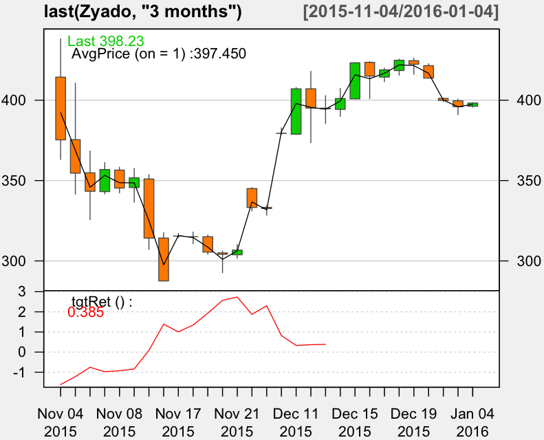

### Using R and xts

~~~
> library(xts)

> Zyado <- as.xts(read.zoo("/work/R/example/stocks/zyado-daily.csv", sep=",", header=T))

> dim(Zyado)
[1] 500   5

> head(Zyado)

             Open   High    Low  Close   Volume
2014-04-24 341.74 341.75 341.74 341.75 0.350000
2014-04-25 341.77 344.21 341.74 344.21 0.624000
2014-04-26 344.21 344.23 341.52 341.52 0.399000
2014-04-27 342.00 346.21 339.11 340.30 3.099000
2014-04-28 339.95 339.95 322.89 322.89 0.100000
2014-04-29 322.85 350.00 322.71 322.81 6.156615

> tail(Zyado)

            Open   High    Low  Close    Volume
2015-12-18 418.46 425.55 415.59 424.88 1748.2114
2015-12-19 424.57 426.09 416.10 422.40 1298.6146
2015-12-20 421.51 422.72 413.75 413.75  966.7861
2016-01-02 401.15 401.25 399.19 399.88  197.2165
2016-01-03 399.63 400.72 390.94 395.94 1962.8680
2016-01-04 396.27 398.49 395.63 398.23 1064.4648

> max(Zyado[,"High"])
[1] 497.77

> Zyado[Zyado$High == 497.77,]

             Open   High    Low  Close   Volume
2014-06-03 477.56 497.77 477.56 494.15 51.76682

> max(Zyado[,"Close"])
[1] 494.15

> Zyado[Zyado$Close == 494.15,]

             Open   High    Low  Close   Volume
2014-06-03 477.56 497.77 477.56 494.15 51.76682

> avgPrice <- function(p) apply(p[,c("High","Low","Close")], 1, mean)

T.ind2 <- function(quotes, tgt.margin = 0.025, n.days = 10) {
  v <- avgPrice(quotes)
  r <- matrix(NA, ncol = n.days, nrow = NROW(quotes))
  for (x in 1:n.days) r[, x] <- Next(Delt(v, quotes[, "Close"], k = x), x)
  x <- apply(r, 1, function(x) sum(x[x > tgt.margin | x < -tgt.margin]))
  if (is.xts(quotes)) xts(x, time(quotes))
  else x
}

> library(quantmod)

> candleChart(last(Zyado, "3 months"), theme = "white", TA = NULL)

> addAvgPrice <- newTA(FUN = avgPrice, col = 1, legend = "AvgPrice")
> addAvgPrice(on = 1)

> addT.ind2 <- newTA(FUN = T.ind2, col = "red", legend = "tgtRet")
> addT.ind2()
~~~

