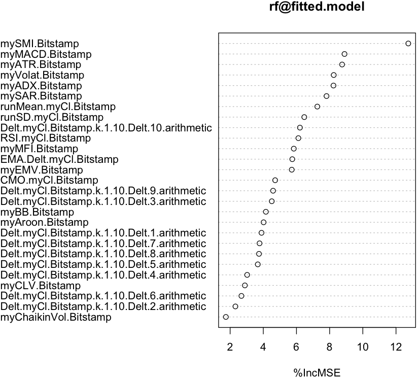
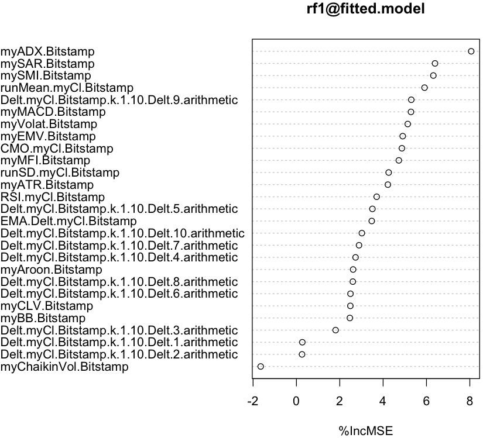
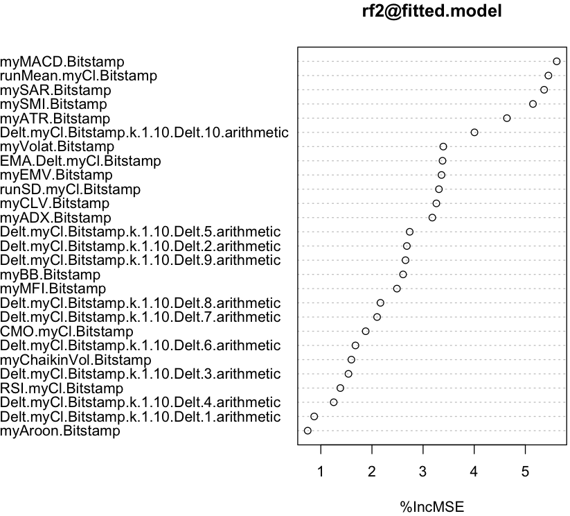
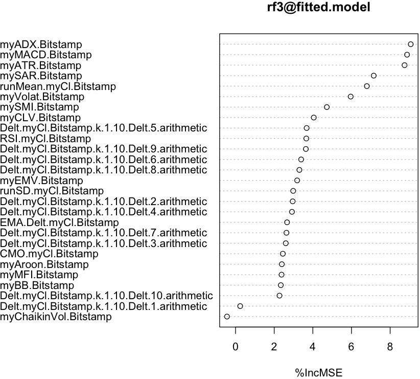
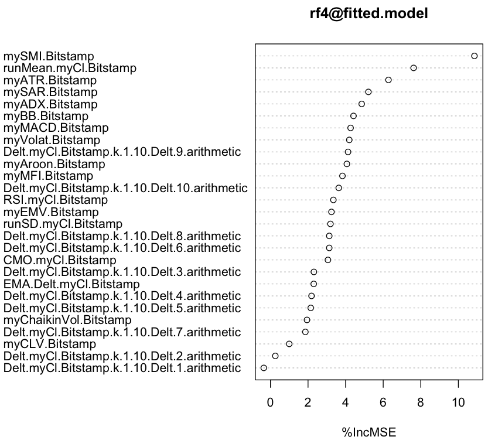

### Feature Filtering with Random Forest
~~~
> library(xts)

> Bitstamp <- as.xts(read.zoo("/work/R/example/stocks/bitstamp-daily.csv", sep=",", header=T))

> avgPrice <- function(p) apply(p[,c("High","Low","Close")], 1, mean)

> library(quantmod)

> fivenum(as.numeric(abs(Next(Delt(Bitstamp["2011-09-13/2016-01-10","Close"], Bitstamp["2011-09-13/2016-01-10","Close"], k = 1)))))
[1] 0.00000000 0.00667796 0.01643532 0.03659026 0.56133829

> margin <- 0.01643532 / 0.005175095 * 0.025
> margin
[1] 0.07939622

T.ind <- function(quotes, tgt.margin = 0.08, n.days = 10) {
  v <- avgPrice(quotes)
  r <- matrix(NA, ncol = n.days, nrow = NROW(quotes))
  for (x in 1:n.days) r[, x] <- Next(Delt(v, quotes[, "Close"], k = x), x)
  x <- apply(r, 1, function(x) sum(x[x > tgt.margin | x < -tgt.margin]))
  if (is.xts(quotes)) xts(x, time(quotes))
  else x
}

> library(randomForest)

> model <- specifyModel(T.ind(Bitstamp,tgt.margin=0.08) ~ Delt(myCl(Bitstamp),k=1:10) + myATR(Bitstamp) + mySMI(Bitstamp) + myADX(Bitstamp) + myAroon(Bitstamp) +
  myBB(Bitstamp) + myChaikinVol(Bitstamp) + myCLV(Bitstamp) + CMO(myCl(Bitstamp)) + EMA(Delt(myCl(Bitstamp))) + myEMV(Bitstamp) +
  myVolat(Bitstamp) + myMACD(Bitstamp) + myMFI(Bitstamp) + RSI(myCl(Bitstamp)) + mySAR(Bitstamp) + runMean(myCl(Bitstamp)) + runSD(myCl(Bitstamp)))
 
> set.seed(1234)

> rf <- buildModel(model, method='randomForest', training.per=c('2011-09-13','2016-01-10'), ntree=50, importance=T)

imp <- importance(rf@fitted.model, type = 1)
df <- data.frame(as.numeric(imp))
df$feature <- rownames(imp)
colnames(df) <- c("importance", "feature")

> df[order(df$importance, decreasing=T)[1:10],c("feature","importance")]

                                        feature importance
12                               mySMI.Bitstamp  11.785743
13                               myADX.Bitstamp  11.173307
25                               mySAR.Bitstamp   8.666906
22                              myMACD.Bitstamp   8.262782
26                        runMean.myCl.Bitstamp   8.034231
11                               myATR.Bitstamp   7.826723
21                             myVolat.Bitstamp   6.912960
10 Delt.myCl.Bitstamp.k.1.10.Delt.10.arithmetic   6.522096
20                               myEMV.Bitstamp   6.285862
23                               myMFI.Bitstamp   6.147083

> varImpPlot(rf@fitted.model, type = 1)
~~~

~~~
> fivenum(as.numeric(abs(Next(Delt(Bitstamp["2011-09-13/2013-04-09","Close"], Bitstamp["2011-09-13/2013-04-09","Close"], k = 1)))))
[1] 0.000000000 0.005944275 0.016149305 0.036872647 0.561338290

> margin1 <- 0.016149305 / 0.005175095 * 0.025
> margin1
[1] 0.07801453

> model1 <- specifyModel(T.ind(Bitstamp,tgt.margin=0.078) ~ Delt(myCl(Bitstamp),k=1:10) + myATR(Bitstamp) + mySMI(Bitstamp) + myADX(Bitstamp) + myAroon(Bitstamp) +
  myBB(Bitstamp) + myChaikinVol(Bitstamp) + myCLV(Bitstamp) + CMO(myCl(Bitstamp)) + EMA(Delt(myCl(Bitstamp))) + myEMV(Bitstamp) +
  myVolat(Bitstamp) + myMACD(Bitstamp) + myMFI(Bitstamp) + RSI(myCl(Bitstamp)) + mySAR(Bitstamp) + runMean(myCl(Bitstamp)) + runSD(myCl(Bitstamp)))
 
> set.seed(1234)

> rf1 <- buildModel(model1, method='randomForest', training.per=c('2011-09-13','2013-04-09'), ntree=50, importance=T)

imp1 <- importance(rf1@fitted.model, type = 1)
df1 <- data.frame(as.numeric(imp1))
df1$feature <- rownames(imp1)
colnames(df1) <- c("importance", "feature")

> df1[order(df1$importance, decreasing=T)[1:10],c("feature","importance")]

                  feature importance
12         mySMI.Bitstamp   8.231096
13         myADX.Bitstamp   7.466146
21       myVolat.Bitstamp   6.123658
26  runMean.myCl.Bitstamp   6.056439
25         mySAR.Bitstamp   5.850159
22        myMACD.Bitstamp   5.362569
19 EMA.Delt.myCl.Bitstamp   5.213797
23         myMFI.Bitstamp   4.770567
11         myATR.Bitstamp   4.416935
18      CMO.myCl.Bitstamp   4.044729

> varImpPlot(rf1@fitted.model, type = 1)
~~~

~~~
> fivenum(as.numeric(abs(Next(Delt(Bitstamp["2013-04-10/2013-12-04","Close"], Bitstamp["2013-04-10/2013-12-04","Close"], k = 1)))))
[1] 0.0006303183 0.0088151800 0.0236978952 0.0534042015 0.4851851852

> margin2 <- 0.0236978952 / 0.005175095 * 0.025
> margin2
[1] 0.1144805

> model2 <- specifyModel(T.ind(Bitstamp,tgt.margin=0.114) ~ Delt(myCl(Bitstamp),k=1:10) + myATR(Bitstamp) + mySMI(Bitstamp) + myADX(Bitstamp) + myAroon(Bitstamp) +
  myBB(Bitstamp) + myChaikinVol(Bitstamp) + myCLV(Bitstamp) + CMO(myCl(Bitstamp)) + EMA(Delt(myCl(Bitstamp))) + myEMV(Bitstamp) +
  myVolat(Bitstamp) + myMACD(Bitstamp) + myMFI(Bitstamp) + RSI(myCl(Bitstamp)) + mySAR(Bitstamp) + runMean(myCl(Bitstamp)) + runSD(myCl(Bitstamp)))
 
> set.seed(1234)

> rf2 <- buildModel(model2, method='randomForest', training.per=c('2013-04-10','2013-12-04'), ntree=50, importance=T)

imp2 <- importance(rf2@fitted.model, type = 1)
df2 <- data.frame(as.numeric(imp2))
df2$feature <- rownames(imp2)
colnames(df2) <- c("importance", "feature")

> df2[order(df2$importance, decreasing=T)[1:10],c("feature","importance")]

                                       feature importance
22                              myMACD.Bitstamp   5.613955
26                        runMean.myCl.Bitstamp   5.451067
25                               mySAR.Bitstamp   5.367055
12                               mySMI.Bitstamp   5.148999
11                               myATR.Bitstamp   4.639467
10 Delt.myCl.Bitstamp.k.1.10.Delt.10.arithmetic   4.005300
21                             myVolat.Bitstamp   3.395030
19                       EMA.Delt.myCl.Bitstamp   3.380004
20                               myEMV.Bitstamp   3.360337
27                          runSD.myCl.Bitstamp   3.309949

> varImpPlot(rf2@fitted.model, type = 1)
~~~

~~~
> fivenum(as.numeric(abs(Next(Delt(Bitstamp["2013-12-05/2014-12-31","Close"], Bitstamp["2013-12-05/2014-12-31","Close"], k = 1)))))
[1] 0.000000000 0.007567191 0.017274472 0.034894355 0.317307692

> margin3 <- 0.017274472 / 0.005175095 * 0.025
> margin3
[1] 0.08345002

> model3 <- specifyModel(T.ind(Bitstamp,tgt.margin=0.083) ~ Delt(myCl(Bitstamp),k=1:10) + myATR(Bitstamp) + mySMI(Bitstamp) + myADX(Bitstamp) + myAroon(Bitstamp) +
  myBB(Bitstamp) + myChaikinVol(Bitstamp) + myCLV(Bitstamp) + CMO(myCl(Bitstamp)) + EMA(Delt(myCl(Bitstamp))) + myEMV(Bitstamp) +
  myVolat(Bitstamp) + myMACD(Bitstamp) + myMFI(Bitstamp) + RSI(myCl(Bitstamp)) + mySAR(Bitstamp) + runMean(myCl(Bitstamp)) + runSD(myCl(Bitstamp)))
 
> set.seed(1234)

> rf3 <- buildModel(model3, method='randomForest', training.per=c('2013-12-05','2014-12-31'), ntree=50, importance=T)

imp3 <- importance(rf3@fitted.model, type = 1)
df3 <- data.frame(as.numeric(imp3))
df3$feature <- rownames(imp3)
colnames(df3) <- c("importance", "feature")

> df3[order(df3$importance, decreasing=T)[1:10],c("feature","importance")]

                                       feature importance
13                              myADX.Bitstamp   9.065192
22                             myMACD.Bitstamp   8.875004
11                              myATR.Bitstamp   8.747019
25                              mySAR.Bitstamp   7.150026
26                       runMean.myCl.Bitstamp   6.793453
21                            myVolat.Bitstamp   5.958792
12                              mySMI.Bitstamp   4.722668
17                              myCLV.Bitstamp   4.047606
5  Delt.myCl.Bitstamp.k.1.10.Delt.5.arithmetic   3.679520
24                           RSI.myCl.Bitstamp   3.662043

> varImpPlot(rf3@fitted.model, type = 1)
~~~

~~~
> rf4 <- buildModel(model, method='randomForest', training.per=c('2015-01-01','2016-01-10'), ntree=50, importance=T)

imp4 <- importance(rf4@fitted.model, type = 1)
df4 <- data.frame(as.numeric(imp4))
df4$feature <- rownames(imp4)
colnames(df4) <- c("importance", "feature")

> df4[order(df4$importance, decreasing=T)[1:10],c("feature","importance")]

                                        feature importance
12                               mySMI.Bitstamp   9.625574
26                        runMean.myCl.Bitstamp   8.263062
25                               mySAR.Bitstamp   6.141645
21                             myVolat.Bitstamp   5.876912
11                               myATR.Bitstamp   5.698511
10 Delt.myCl.Bitstamp.k.1.10.Delt.10.arithmetic   5.368802
13                               myADX.Bitstamp   5.147859
22                              myMACD.Bitstamp   5.079470
23                               myMFI.Bitstamp   4.495699
18                            CMO.myCl.Bitstamp   3.735109

> varImpPlot(rf4@fitted.model, type = 1)
~~~

