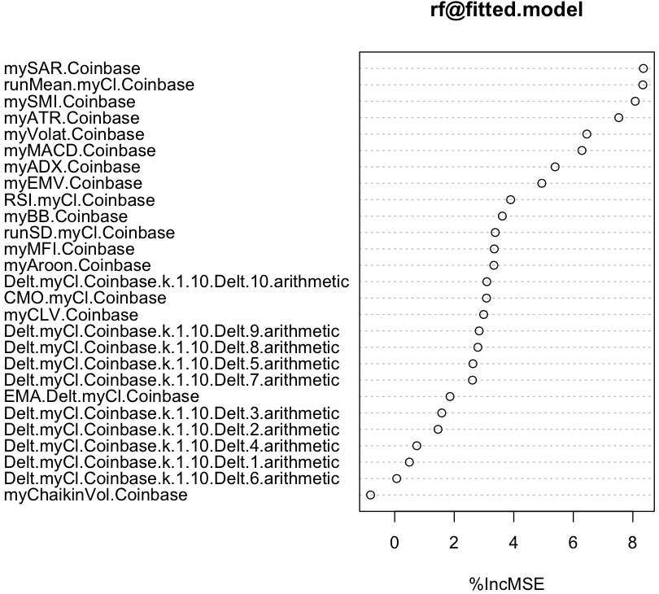

### Feature Filtering with Random Forest
~~~
> library(xts)

> Coinbase <- as.xts(read.zoo("/work/R/example/stocks/coinbase-daily.csv", sep=",", header=T))

> avgPrice <- function(p) apply(p[,c("High","Low","Close")], 1, mean)

T.ind2 <- function(quotes, tgt.margin = 0.025, n.days = 10) {
  v <- avgPrice(quotes)
  r <- matrix(NA, ncol = n.days, nrow = NROW(quotes))
  for (x in 1:n.days) r[, x] <- Next(Delt(v, quotes[, "Close"], k = x), x)
  x <- apply(r, 1, function(x) sum(x[x > tgt.margin | x < -tgt.margin]))
  if (is.xts(quotes)) xts(x, time(quotes))
  else x
}

> library(quantmod)

> library(randomForest)

> model <- specifyModel(T.ind2(Coinbase) ~ Delt(myCl(Coinbase),k=1:10) + myATR(Coinbase) + mySMI(Coinbase) + 
  myADX(Coinbase) + myAroon(Coinbase) + myBB(Coinbase) + myChaikinVol(Coinbase) + myCLV(Coinbase) + CMO(myCl(Coinbase)) +
  EMA(Delt(myCl(Coinbase))) + myEMV(Coinbase) + myVolat(Coinbase) + myMACD(Coinbase) + myMFI(Coinbase) + 
  RSI(myCl(Coinbase)) + mySAR(Coinbase) + runMean(myCl(Coinbase)) + runSD(myCl(Coinbase)))
 
> set.seed(1234)

> rf <- buildModel(model, method='randomForest', training.per=c('2014-12-01','2016-01-10'), ntree=50, importance=T)

imp <- importance(rf@fitted.model, type = 1)
df <- data.frame(as.numeric(imp))
df$feature <- rownames(imp)
colnames(df) <- c("importance", "feature")

> df[order(df$importance, decreasing=T)[1:10],c("feature","importance")]

                 feature importance
25        mySAR.Coinbase   8.354448
26 runMean.myCl.Coinbase   8.336091
12        mySMI.Coinbase   8.080081
11        myATR.Coinbase   7.527678
21      myVolat.Coinbase   6.454690
22       myMACD.Coinbase   6.289784
13        myADX.Coinbase   5.388430
20        myEMV.Coinbase   4.941876
24     RSI.myCl.Coinbase   3.894988
15         myBB.Coinbase   3.614792

> varImpPlot(rf@fitted.model, type = 1)
~~~

