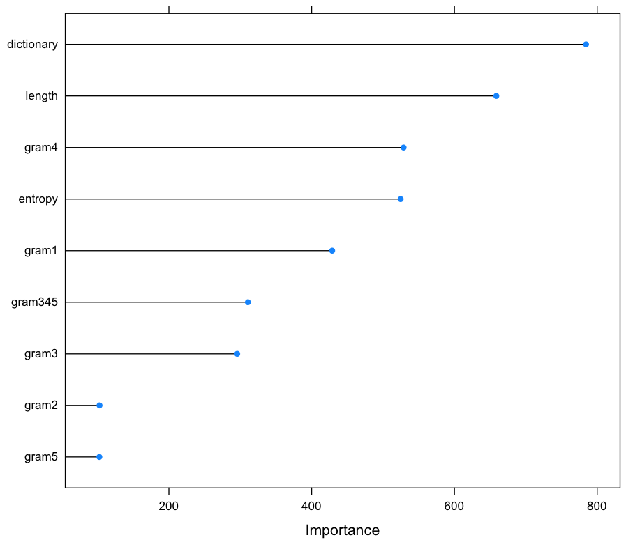
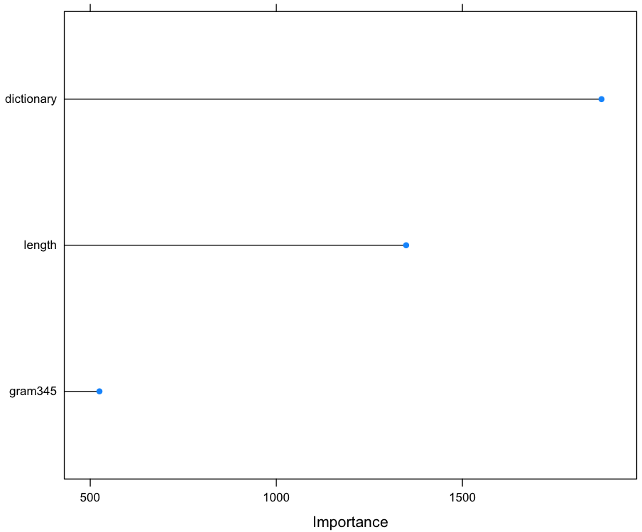

## Feature Selection using Random Forest with R

~~~
> install.packages('caret')

> library('caret')

> set.seed(1492)

> ctrl <- trainControl(method = "repeatedcv", repeats = 5, summaryFunction = twoClassSummary, classProbs = TRUE)

> install.packages('pROC')

> library('pROC')

> rfFit <- train(class ~ ., data = train, metric = "ROC", method = "rf", trControl = ctrl)

> importance <- varImp(rfFit, scale=F)

> plot(importance)
~~~

~~~
> rfFit2 <- train(class ~ ., data = train2, metric = "ROC", method = "rf", trControl = ctrl)

> importance2 <- varImp(rfFit2, scale=F)

> plot(importance2)
~~~

