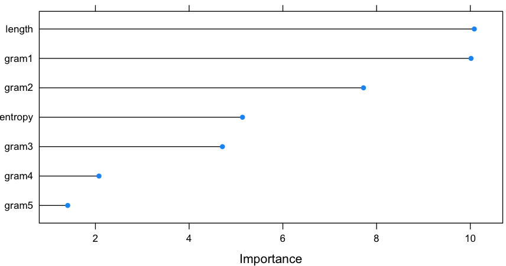

## Feature Selection using Random Forest with R

~~~
> library('caret')

> set.seed(1492)

> ctrl <- trainControl(method = "repeatedcv", repeats = 5, summaryFunction = twoClassSummary, classProbs = TRUE)

> lrFit <- train(class ~ ., data = traindga, metric = "ROC", method = "glm", family = "binomial", tuneLength = 10, trControl = ctrl)

> lrImp <- varImp(lrFit, scale = F)

> plot(lrImp)
~~~

~~~
> lrFields2 <- c("class", "length", "entropy", "gram1", "gram2", "gram3", "gram4", "gram5")

> lrTraindga2 <- sampledga[trainindex, lrFields2]

> levels(lrTraindga2$class) <- c("dga", "legit")

> lrFit2 <- train(class ~ ., data = lrTraindga2, metric = "ROC", method = "glm", family = "binomial", tuneLength = 10, trControl = ctrl)

> lrImp2 <- varImp(lrFit2, scale = F)

> plot(lrImp2)
~~~

~~~
> lrResamples12 <- resamples(list(lr1 = lrFit, lr2 = lrFit2))

> lrDiff12 <- diff(lrResamples12)
 
> print(lrDiff12$statistics$ROC$lr1.diff.lr2)

	One Sample t-test

data:  x
t = -1.2093, df = 49, p-value = 0.2324
alternative hypothesis: true mean is not equal to 0
95 percent confidence interval:
 -0.0004696462  0.0001167672
sample estimates:
    mean of x 
-0.0001764395 
~~~ 

~~~
> library(rpart)

> rpFit <- train(class ~ ., data = traindga, metric = "ROC", method = "rpart", tuneLength = 10, trControl = ctrl)

> rpImp <- varImp(rpFit, scale = F)

> plot(rpImp)
~~~

~~~
> rpFields2 <- c("class", "length", "entropy", "dictionary", "gram4", "gram345", "gram1")

> rpTraindga2 <- sampledga[trainindex, rpFields2]

> levels(rpTraindga2$class) <- c("dga", "legit")

> rpFit2 <- train(class ~ ., data = rpTraindga2, metric = "ROC", method = "rpart", tuneLength = 10, trControl = ctrl)

> rpImp2 <- varImp(rpFit2, scale = F)

> plot(rpImp2)
~~~

~~~
> rpResamples12 <- resamples(list(rp1 = rpFit, rp2 = rpFit2))

> rpDiff12 <- diff(rpResamples12)
 
> print(rpDiff12$statistics$ROC$rp1.diff.rp2)

	One Sample t-test

data:  x
t = -0.22352, df = 49, p-value = 0.8241
alternative hypothesis: true mean is not equal to 0
95 percent confidence interval:
 -0.0011135578  0.0008906403
sample estimates:
    mean of x 
-0.0001114587 
~~~

~~~
> library('kernlab')

> svmFit <- train(class ~ ., data = traindga, method = "svmRadial", preProc = c("center", "scale"), metric = "ROC", tuneLength = 10, trControl = ctrl)

> svmImp <- varImp(svmFit, scale=F)

> plot(svmImp)
~~~

~~~
> svmFields2 <- c("class", "entropy", "dictionary", "length", "gram1")

> svmTraindga2 <- sampledga[trainindex, svmFields2]

> levels(svmTraindga2$class) <- c("dga", "legit")

> svmFit2 <- train(class ~ ., data = svmTraindga2, method = "svmRadial", preProc = c("center", "scale"), metric = "ROC", tuneLength = 10, trControl = ctrl)

> svmImp2 <- varImp(svmFit2, scale = F)

> plot(svmImp2)
~~~

~~~
> svmResamples12 <- resamples(list(svm1 = svmFit, svm2 = svmFit2))

> svmDiff12 <- diff(svmResamples12)
 
> print(svmDiff12$statistics$ROC$svm1.diff.svm2)

	One Sample t-test

data:  x
t = 11.897, df = 49, p-value = 4.645e-16
alternative hypothesis: true mean is not equal to 0
95 percent confidence interval:
 0.002350348 0.003305779
sample estimates:
  mean of x 
0.002828064 
~~~

~~~
> install.packages('pROC')

> library('pROC')

> rfFit <- train(class ~ ., data = traindga, metric = "ROC", method = "rf", trControl = ctrl)

> rfImp <- varImp(rfFit, scale=F)

> plot(rfImp)
~~~

~~~
> rfFields2 <- c("class", "dictionary", "length", "gram4", "entropy")

# fields <- c("class", "entropy", "length",  "dictionary", "gram1", "gram2", "gram3", "gram4", "gram5", "gram345")

> rfTraindga2 <- sampledga[trainindex, rfFields2]

> levels(rfTraindga2$class) <- c("dga", "legit")

> rfFit2 <- train(class ~ ., data = rfTraindga2, metric = "ROC", method = "rf", trControl = ctrl)

> rfImp2 <- varImp(rfFit2, scale = F)

> plot(rfImp2)
~~~

~~~
> rfResamples12 <- resamples(list(rf1 = rfFit, rf2 = rfFit2))

> rfDiff12 <- diff(rfResamples12)
 
> print(rfDiff12$statistics$ROC$rf1.diff.rf2)

	One Sample t-test

data:  x
t = 3.6362, df = 49, p-value = 0.0006634
alternative hypothesis: true mean is not equal to 0
95 percent confidence interval:
 0.0002551631 0.0008856377
sample estimates:
   mean of x 
0.0005704004 
~~~
