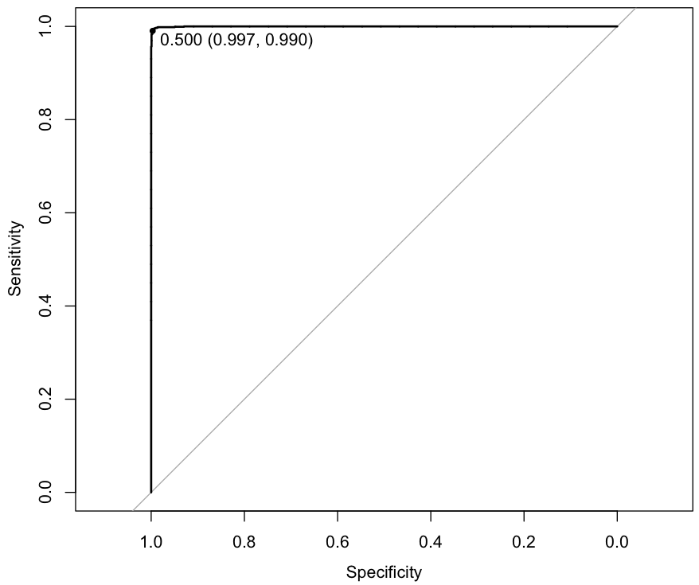
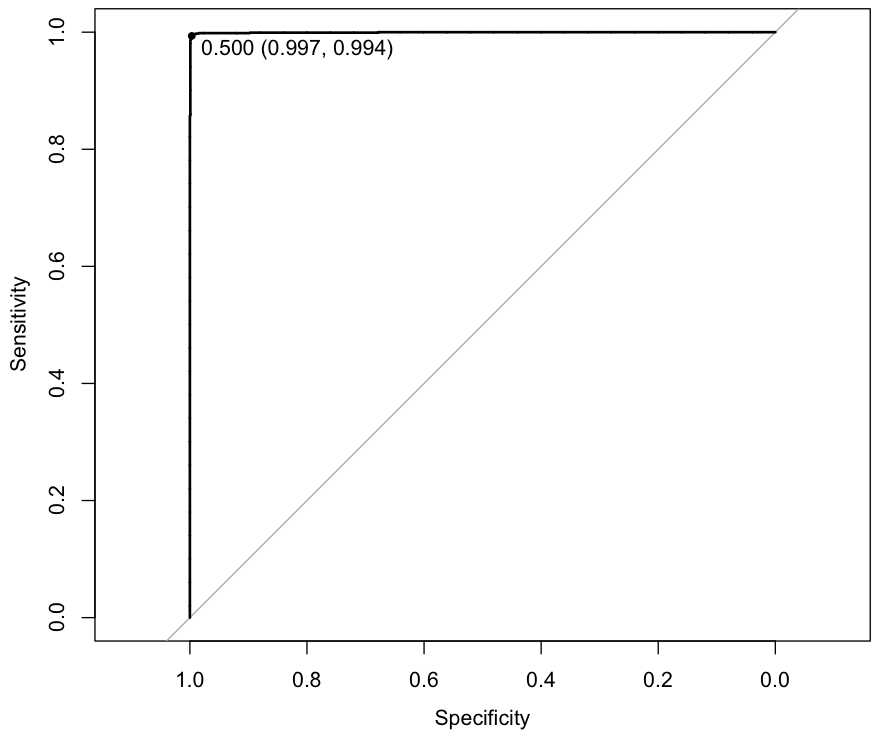

## Model Selection using R

~~~
> library('caret')

> set.seed(1492)

> ctrl <- trainControl(method = "repeatedcv", repeats = 5, summaryFunction = twoClassSummary, classProbs = TRUE)

> library('pROC')

> lrFit <- train(class ~ ., data = traindga, metric = "ROC", method = "glm", family = "binomial", tuneLength = 10, trControl = ctrl)

> lrFit

7502 samples
   9 predictor
   2 classes: 'dga', 'legit' 

No pre-processing
Resampling: Cross-Validated (10 fold, repeated 5 times) 
Summary of sample sizes: 6752, 6752, 6752, 6751, 6751, 6752, ... 
Resampling results

  ROC        Sens     Spec       ROC SD       Sens SD      Spec SD    
  0.9992655  0.99552  0.9940838  0.002205468  0.003115436  0.004247934

> lrPred <- predict(lrFit, testdga)

> confusionMatrix(lrPred, testdga$class)

Confusion Matrix and Statistics

          Reference
Prediction  dga legit
     dga   1246    12
     legit    4  1236
                                          
               Accuracy : 0.9936          
                 95% CI : (0.9896, 0.9963)
    No Information Rate : 0.5004          
    P-Value [Acc > NIR] : < 2e-16         
                                          
                  Kappa : 0.9872          
 Mcnemar's Test P-Value : 0.08012         
                                          
            Sensitivity : 0.9968          
            Specificity : 0.9904          
         Pos Pred Value : 0.9905          
         Neg Pred Value : 0.9968          
             Prevalence : 0.5004          
         Detection Rate : 0.4988          
   Detection Prevalence : 0.5036          
      Balanced Accuracy : 0.9936          
                                          
       'Positive' Class : dga             

> lrProb <- predict(lrFit, testdga, type = "prob")

> head(lrProb)

         dga        legit
3  0.9999991 8.708440e-07
5  0.9997794 2.205659e-04
7  1.0000000 4.534178e-12
10 1.0000000 1.575337e-10
18 0.9999989 1.095028e-06
20 0.9999982 1.754745e-06

> summary(lrProb)

      dga             legit          
 Min.   :0.0000   Min.   :0.0000000  
 1st Qu.:0.0000   1st Qu.:0.0000026  
 Median :0.8008   Median :0.1991626  
 Mean   :0.5024   Mean   :0.4975904  
 3rd Qu.:1.0000   3rd Qu.:1.0000000  
 Max.   :1.0000   Max.   :1.0000000  

> lrROC <- roc(testdga$class, lrProb[, "dga"])

> plot(lrROC, type = "S", print.thres = .5)

Data: lrProb[, "dga"] in 1250 controls (testdga$class dga) > 1248 cases (testdga$class legit).
Area under the curve: 0.9998
~~~

~~~
> library(rpart)

> rpFit <- train(class ~ ., data = traindga, metric = "ROC", method = "rpart", tuneLength = 10, trControl = ctrl)

> rpFit

7502 samples
   9 predictor
   2 classes: 'dga', 'legit' 

No pre-processing
Resampling: Cross-Validated (10 fold, repeated 5 times) 
Summary of sample sizes: 6752, 6751, 6752, 6752, 6752, 6752, ... 
Resampling results across tuning parameters:

  cp            ROC        Sens       Spec       ROC SD       Sens SD      Spec SD    
  0.0000000000  0.9968530  0.9915733  0.9928043  0.002355562  0.004738533  0.006423238
  0.0002666667  0.9966385  0.9919467  0.9927513  0.002545329  0.004292777  0.005570218
  0.0006222222  0.9959458  0.9919467  0.9910450  0.002702068  0.004586958  0.006502037
  0.0008000000  0.9958785  0.9918933  0.9910980  0.002508261  0.004664450  0.006363932
  0.0009777778  0.9955988  0.9922133  0.9906719  0.002615989  0.004813888  0.006193028
  0.0030222222  0.9944756  0.9915200  0.9888583  0.003147831  0.004839445  0.008075244
  0.0083555556  0.9896473  0.9931200  0.9783067  0.007186621  0.004574285  0.016362575
  0.0104000000  0.9811309  0.9856533  0.9711091  0.008039449  0.009360737  0.018640337
  0.1344000000  0.9371145  0.9142400  0.9570887  0.039300761  0.077537352  0.009992878
  0.8069333333  0.6735267  0.3670400  0.9800133  0.197812472  0.418444851  0.023620995

ROC was used to select the optimal model using  the largest value.

> rpPred <- predict(rpFit, testdga)

> confusionMatrix(rpPred, testdga$class)

Confusion Matrix and Statistics

          Reference
Prediction  dga legit
     dga   1243     8
     legit    7  1240
                                          
               Accuracy : 0.994           
                 95% CI : (0.9901, 0.9966)
    No Information Rate : 0.5004          
    P-Value [Acc > NIR] : <2e-16          
                                          
                  Kappa : 0.988           
 Mcnemar's Test P-Value : 1               
                                          
            Sensitivity : 0.9944          
            Specificity : 0.9936          
         Pos Pred Value : 0.9936          
         Neg Pred Value : 0.9944          
             Prevalence : 0.5004          
         Detection Rate : 0.4976          
   Detection Prevalence : 0.5008          
      Balanced Accuracy : 0.9940          
                                          
       'Positive' Class : dga             

> rpProb <- predict(rpFit, testdga, type = "prob")

> head(rpProb)

   legit dga
3      1   0
5      1   0
7      1   0
10     1   0
18     1   0
20     1   0

> summary(rpProb)
 
     dga               legit        
 Min.   :0.000000   Min.   :0.00000  
 1st Qu.:0.001693   1st Qu.:0.00000  
 Median :0.928571   Median :0.07143  
 Mean   :0.501811   Mean   :0.49819  
 3rd Qu.:1.000000   3rd Qu.:0.99831  
 Max.   :1.000000   Max.   :1.00000  

> rpROC <- roc(testdga$class, rpProb[, "dga"])

> plot(rpROC, type = "S", print.thres = .5)

Data: rpProb[, "dga"] in 1250 controls (testdga$class dga) > 1248 cases (testdga$class legit).
Area under the curve: 0.9965
~~~

~~~
> rfFit <- train(class ~ ., data = traindga, metric = "ROC", method = "rf", tuneLength = 10, trControl = ctrl)

> rfFit

7502 samples
   9 predictor
   2 classes: 'dga', 'legit' 

No pre-processing
Resampling: Cross-Validated (10 fold, repeated 5 times) 
Summary of sample sizes: 6752, 6752, 6752, 6752, 6752, 6752, ... 
Resampling results across tuning parameters:

  mtry  ROC        Sens       Spec       ROC SD        Sens SD      Spec SD    
  2     0.9997594  0.9953067  0.9958956  0.0003228760  0.003074170  0.003496752
  3     0.9997012  0.9953067  0.9959491  0.0004739956  0.003121021  0.003456059
  4     0.9997419  0.9953600  0.9958426  0.0003648074  0.003223947  0.003452837
  5     0.9995715  0.9952533  0.9955227  0.0006008573  0.003245482  0.003627935
  6     0.9995188  0.9949867  0.9956294  0.0006267543  0.003348916  0.003796736
  7     0.9995681  0.9949333  0.9954694  0.0005810998  0.003331973  0.003890862
  8     0.9995079  0.9947200  0.9956294  0.0006168327  0.003470223  0.003872429
  9     0.9992523  0.9944533  0.9957359  0.0009360204  0.003357572  0.003881873

ROC was used to select the optimal model using  the largest value.
The final value used for the model was mtry = 2. 

> rfPred <- predict(rfFit, testdga)

> confusionMatrix(rfPred, testdga$class)

Confusion Matrix and Statistics

          Reference
Prediction  dga legit
     dga   1244     9
     legit    6  1239
                                          
               Accuracy : 0.994           
                 95% CI : (0.9901, 0.9966)
    No Information Rate : 0.5004          
    P-Value [Acc > NIR] : <2e-16          
                                          
                  Kappa : 0.988           
 Mcnemar's Test P-Value : 0.6056          
                                          
            Sensitivity : 0.9952          
            Specificity : 0.9928          
         Pos Pred Value : 0.9928          
         Neg Pred Value : 0.9952          
             Prevalence : 0.5004          
         Detection Rate : 0.4980          
   Detection Prevalence : 0.5016          
      Balanced Accuracy : 0.9940          
                                          
       'Positive' Class : dga             

> rfProb <- predict(rfFit, testdga, type = "prob")

> head(rfProb)
 
     dga legit
3  1.000 0.000
5  0.998 0.002
7  0.994 0.006
10 1.000 0.000
18 1.000 0.000
20 1.000 0.000

> summary(rfProb)

      dga             legit       
 Min.   :0.0000   Min.   :0.0000  
 1st Qu.:0.0000   1st Qu.:0.0000  
 Median :0.5590   Median :0.4410  
 Mean   :0.5018   Mean   :0.4982  
 3rd Qu.:1.0000   3rd Qu.:1.0000  
 Max.   :1.0000   Max.   :1.0000  

> rfROC <- roc(testdga$class, rfProb[, "dga"])

> plot(rfROC, type = "S", print.thres = .5)

Data: rfProb[, "dga"] in 1250 controls (testdga$class dga) > 1248 cases (testdga$class legit).
Area under the curve: 0.9999
~~~

~~~
> install.packages('kernlab')

> library('kernlab')

> svmFit <- train(class ~ ., data = traindga, method = "svmRadial", preProc = c("center", "scale"), metric = "ROC", tuneLength = 10, trControl = ctrl)

> svmFit

7502 samples
   9 predictor
   2 classes: 'dga', 'legit' 

Pre-processing: centered (9), scaled (9) 
Resampling: Cross-Validated (10 fold, repeated 5 times) 
Summary of sample sizes: 6752, 6752, 6752, 6752, 6751, 6751, ... 
Resampling results across tuning parameters:

  C       ROC        Sens       Spec       ROC SD        Sens SD      Spec SD    
    0.25  0.9996203  0.9958933  0.9949904  0.0006865053  0.003458494  0.004523187
    0.50  0.9995494  0.9961067  0.9951504  0.0007266053  0.003286363  0.004556281
    1.00  0.9994345  0.9962133  0.9958431  0.0008004339  0.003368360  0.003997448
    2.00  0.9992645  0.9966400  0.9959499  0.0009660001  0.003399240  0.003737752
    4.00  0.9991129  0.9962667  0.9959496  0.0011293965  0.003693470  0.003539708
    8.00  0.9989207  0.9962667  0.9957363  0.0012763879  0.003449671  0.003651290
   16.00  0.9988973  0.9964800  0.9954698  0.0013026108  0.003296504  0.003853593
   32.00  0.9989266  0.9964267  0.9949899  0.0012105474  0.003638444  0.004051577
   64.00  0.9990125  0.9963200  0.9949365  0.0011004687  0.003649595  0.004001436
  128.00  0.9991429  0.9954667  0.9948824  0.0009385691  0.004040610  0.004166231

Tuning parameter 'sigma' was held constant at a value of 0.279101
ROC was used to select the optimal model using  the largest value.
The final values used for the model were sigma = 0.279101 and C = 0.25. 

> svmPred <- predict(svmFit, testdga)

> confusionMatrix(svmPred, testdga$class)

Confusion Matrix and Statistics

          Reference
Prediction  dga legit
     dga   1246     8
     legit    4  1240
                                          
               Accuracy : 0.9952          
                 95% CI : (0.9916, 0.9975)
    No Information Rate : 0.5004          
    P-Value [Acc > NIR] : <2e-16          
                                          
                  Kappa : 0.9904          
 Mcnemar's Test P-Value : 0.3865          
                                          
            Sensitivity : 0.9968          
            Specificity : 0.9936          
         Pos Pred Value : 0.9936          
         Neg Pred Value : 0.9968          
             Prevalence : 0.5004          
         Detection Rate : 0.4988          
   Detection Prevalence : 0.5020          
      Balanced Accuracy : 0.9952          
                                          
       'Positive' Class : dga             

> svmProb <- predict(svmFit, testdga, type = "prob")

> head(svmProb)

        dga        legit
1 0.9999709 2.910524e-05
2 0.9998049 1.950968e-04
3 0.9941531 5.846903e-03
4 0.9975890 2.410970e-03
5 0.9995465 4.534824e-04
6 0.9995588 4.412243e-04

> summary(svmProb)

     dga                legit          
 Min.   :0.0000007   Min.   :0.0000072  
 1st Qu.:0.0004546   1st Qu.:0.0004531  
 Median :0.7767112   Median :0.2232888  
 Mean   :0.5015888   Mean   :0.4984112  
 3rd Qu.:0.9995469   3rd Qu.:0.9995454  
 Max.   :0.9999928   Max.   :0.9999993  

> svmROC <- roc(testdga$class, svmProb[, "dga"])

> plot(svmROC, type = "S", print.thres = .5)

Data: svmProb[, "dga"] in 1250 controls (testdga$class dga) > 1248 cases (testdga$class legit).
Area under the curve: 0.9995
~~~

~~~
> install.packages('deepnet')

> library('deepnet')

grid <- expand.grid(layer1 = 1:5, layer2 = 0:3, layer3 = 0:3)
grid$hidden_dropout <- 0
grid$visible_dropout <- 0

> dnnFit <- train(class ~ ., data = traindga, method = "dnn", metric = "ROC", tuneGrid = grid, numepochs = 10, trControl = ctrl)

# Error in { : 
#  task 80 failed - "arguments imply differing number of rows: 0, 750"
# In addition: There were 50 or more warnings (use warnings() to see the first 50)

# dnnFit <- train(class ~ ., data = traindga, method = "dnn", preProc = c("center", "scale"), metric = "ROC", tuneGrid = grid, numepochs = 500, trControl = ctrl)

# sudo ln -s $(/usr/libexec/java_home)/jre/lib/server/libjvm.dylib /usr/local/lib, re-start R, still does not work so far

> install.packages('RWeka')

> library('RWeka')

> c45Fit <- train(class ~ ., data = traindga, method = "J48", metric="ROC", trControl = ctrl)

> resamp <- resamples(list(lr = lrFit, rp = rpFit, svm = svmFit, rf = rfFit))

> print(summary(resamp))

Call:
summary.resamples(object = resamp)

Models: lr, rp, svm, rf 
Number of resamples: 50 

ROC 
      Min. 1st Qu. Median   Mean 3rd Qu. Max. NA's
lr  0.9867  0.9996 0.9999 0.9993  0.9999    1    0
rp  0.9902  0.9957 0.9971 0.9969  0.9986    1    0
svm 0.9967  0.9998 0.9999 0.9996  1.0000    1    0
rf  0.9981  0.9997 0.9998 0.9998  1.0000    1    0

Sens 
      Min. 1st Qu. Median   Mean 3rd Qu. Max. NA's
lr  0.9893  0.9927 0.9947 0.9955  0.9973    1    0
rp  0.9813  0.9893 0.9920 0.9916  0.9947    1    0
svm 0.9867  0.9947 0.9973 0.9959  0.9973    1    0
rf  0.9867  0.9920 0.9947 0.9953  0.9973    1    0

Spec 
      Min. 1st Qu. Median   Mean 3rd Qu. Max. NA's
lr  0.9813  0.9920 0.9947 0.9941  0.9973    1    0
rp  0.9627  0.9900 0.9947 0.9928  0.9973    1    0
svm 0.9787  0.9947 0.9973 0.9950  0.9973    1    0
rf  0.9867  0.9927 0.9973 0.9959  0.9973    1    0

> resamp2 <- resamples(list(rf2 = rfFit2, svm2 = svmFit2))

> print(summary(resamp2))

Call:
summary.resamples(object = resamp2)

Models: rf2, svm2 
Number of resamples: 50 

ROC 
       Min. 1st Qu. Median   Mean 3rd Qu.   Max. NA's
rf2  0.9954  0.9984 0.9997 0.9992  0.9999 1.0000    0
svm2 0.9927  0.9956 0.9971 0.9968  0.9982 0.9995    0

Sens 
       Min. 1st Qu. Median   Mean 3rd Qu.   Max. NA's
rf2  0.9787  0.9867 0.9893 0.9899  0.9947 1.0000    0
svm2 0.9680  0.9813 0.9867 0.9852  0.9893 0.9973    0

Spec 
      Min. 1st Qu. Median   Mean 3rd Qu.   Max. NA's
rf2  0.984  0.9893  0.992 0.9923  0.9947 1.0000    0
svm2 0.960  0.9767  0.984 0.9819  0.9867 0.9947    0

> rfPred2 <- predict(rfFit2, testdga)

> print(confusionMatrix(rfPred2, testdga$class))

Confusion Matrix and Statistics

          Reference
Prediction  dga legit
     dga   1239    13
     legit   11  1235
                                          
               Accuracy : 0.9904          
                 95% CI : (0.9857, 0.9938)
    No Information Rate : 0.5004          
    P-Value [Acc > NIR] : <2e-16          
                                          
                  Kappa : 0.9808          
 Mcnemar's Test P-Value : 0.8383          
                                          
            Sensitivity : 0.9912          
            Specificity : 0.9896          
         Pos Pred Value : 0.9896          
         Neg Pred Value : 0.9912          
             Prevalence : 0.5004          
         Detection Rate : 0.4960          
   Detection Prevalence : 0.5012          
      Balanced Accuracy : 0.9904          
                                          
       'Positive' Class : dga             

> svmPred2 <- predict(svmFit2, testdga)

> print(confusionMatrix(svmPred2, testdga$class))

Confusion Matrix and Statistics

          Reference
Prediction  dga legit
     dga   1234    32
     legit   16  1216
                                          
               Accuracy : 0.9808          
                 95% CI : (0.9746, 0.9858)
    No Information Rate : 0.5004          
    P-Value [Acc > NIR] : < 2e-16         
                                          
                  Kappa : 0.9616          
 Mcnemar's Test P-Value : 0.03038         
                                          
            Sensitivity : 0.9872          
            Specificity : 0.9744          
         Pos Pred Value : 0.9747          
         Neg Pred Value : 0.9870          
             Prevalence : 0.5004          
         Detection Rate : 0.4940          
   Detection Prevalence : 0.5068          
      Balanced Accuracy : 0.9808          
                                          
       'Positive' Class : dga             
~~~
