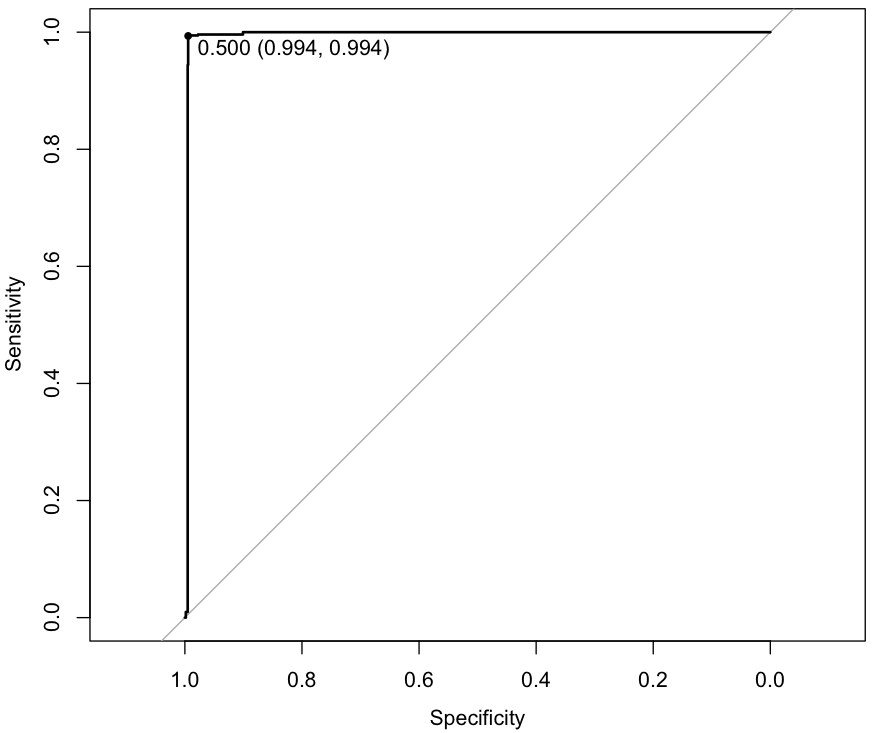

## Model Selection using R

~~~
> library('caret')

> set.seed(1492)

> ctrl <- trainControl(method = "repeatedcv", repeats = 5, summaryFunction = twoClassSummary, classProbs = TRUE)

> library('pROC')

> library(rpart)

> rpFit <- train(class ~ ., data = traindga, metric = "ROC", method = "rpart", tuneLength = 10, trControl = ctrl)

> rpFit

7502 samples
   9 predictor
   2 classes: 'legit', 'dga' 

No pre-processing
Resampling: Cross-Validated (10 fold, repeated 5 times) 
Summary of sample sizes: 6752, 6752, 6752, 6751, 6752, 6752, ... 
Resampling results across tuning parameters:

  cp            ROC        Sens       Spec       ROC SD       Sens SD      Spec SD    
  0.0000000000  0.9971525  0.9917867  0.9934957  0.002212055  0.004660715  0.004576550
  0.0002666667  0.9969247  0.9923733  0.9930692  0.002382251  0.004442957  0.004848959
  0.0006222222  0.9961066  0.9917333  0.9921634  0.002444771  0.004111816  0.005397416
  0.0008000000  0.9959514  0.9916267  0.9920569  0.002419395  0.004208101  0.005610530
  0.0009777778  0.9956633  0.9921600  0.9909909  0.002288933  0.003937286  0.005134984
  0.0030222222  0.9940510  0.9920533  0.9878462  0.003389121  0.003940234  0.008295180
  0.0083555556  0.9887115  0.9938133  0.9762826  0.007913414  0.003631657  0.017826706
  0.0104000000  0.9799661  0.9861867  0.9675384  0.008718752  0.009617671  0.018616878
  0.1344000000  0.9322103  0.9049067  0.9570882  0.038597960  0.074722253  0.010867058
  0.8069333333  0.7056319  0.4358933  0.9753705  0.199635315  0.423177643  0.024866960

ROC was used to select the optimal model using  the largest value.
The final value used for the model was cp = 0. 

> rpPred <- predict(rpFit, testdga)

> confusionMatrix(rpPred, testdga$class, positive = 'dga')

Confusion Matrix and Statistics

          Reference
Prediction legit  dga
     legit  1243    8
     dga       7 1240
                                          
               Accuracy : 0.994           
                 95% CI : (0.9901, 0.9966)
    No Information Rate : 0.5004          
    P-Value [Acc > NIR] : <2e-16          
                                          
                  Kappa : 0.988           
 Mcnemar's Test P-Value : 1               
                                          
            Sensitivity : 0.9936          
            Specificity : 0.9944          
         Pos Pred Value : 0.9944          
         Neg Pred Value : 0.9936          
             Prevalence : 0.4996          
         Detection Rate : 0.4964          
   Detection Prevalence : 0.4992          
      Balanced Accuracy : 0.9940          
                                          
       'Positive' Class : dga             

> rpProb <- predict(rpFit, testdga, type = "prob")

> head(rpProb)

   legit dga
3      1   0
5      1   0
7      1   0
10     1   0
18     1   0
20     1   0

> summary(rpProb)
 
     legit               dga         
 Min.   :0.000000   Min.   :0.00000  
 1st Qu.:0.001693   1st Qu.:0.00000  
 Median :0.928571   Median :0.07143  
 Mean   :0.501811   Mean   :0.49819  
 3rd Qu.:1.000000   3rd Qu.:0.99831  
 Max.   :1.000000   Max.   :1.00000  

> rpROC <- roc(testdga$class, rpProb[, "dga"])

> plot(rpROC, type = "S", print.thres = .5)

Data: rpProb[, "dga"] in 1250 controls (testdga$class legit) < 1248 cases (testdga$class dga).
Area under the curve: 0.9965
~~~

~~~
> rfFit <- train(class ~ ., data = traindga, metric = "ROC", method = "rf", trControl = ctrl)

> install.packages('kernlab')

> library('kernlab')

> svmFit <- train(class ~ ., data = traindga, method = "svmRadial", preProc = c("center", "scale"), metric = "ROC", tuneLength = 10, trControl = ctrl)

> install.packages('deepnet')

> library('deepnet')

grid <- expand.grid(layer1 = 1:5, layer2 = 0:3, layer3 = 0:3)
grid$hidden_dropout <- 0
grid$visible_dropout <- 0

> dnnFit <- train(class ~ ., data = traindga, method = "dnn", metric = "ROC", tuneGrid = grid, numepochs = 10, trControl = ctrl)

# Error in { : 
#  task 80 failed - "arguments imply differing number of rows: 0, 750"
# In addition: There were 50 or more warnings (use warnings() to see the first 50)

# dnnFit <- train(class ~ ., data = traindga, method = "dnn", preProc = c("center", "scale"), metric = "ROC", tuneGrid = grid, numepochs = 500, trControl = ctrl)

# sudo ln -s $(/usr/libexec/java_home)/jre/lib/server/libjvm.dylib /usr/local/lib, re-start R, still does not work so far

> install.packages('RWeka')

> library('RWeka')

> c45Fit <- train(class ~ ., data = traindga, method = "J48", metric="ROC", trControl = ctrl)

> resamp <- resamples(list(rp = rpFit, rf = rfFit, svm = svmFit))

> print(summary(resamp))

Call:
summary.resamples(object = resamp)

Models: rp, rf, svm 
Number of resamples: 50 

ROC 
      Min. 1st Qu. Median   Mean 3rd Qu.   Max. NA's
rp  0.9607  0.9733 0.9790 0.9799  0.9874 0.9974    0
rf  0.9978  0.9997 0.9999 0.9997  1.0000 1.0000    0
svm 0.9981  0.9998 0.9999 0.9996  1.0000 1.0000    0

Sens 
      Min. 1st Qu. Median   Mean 3rd Qu. Max. NA's
rp  0.9680  0.9813 0.9867 0.9865  0.9920    1    0
rf  0.9867  0.9947 0.9960 0.9955  0.9973    1    0
svm 0.9787  0.9947 0.9973 0.9959  0.9973    1    0

Spec 
      Min. 1st Qu. Median   Mean 3rd Qu.   Max. NA's
rp  0.9413  0.9495 0.9613 0.9668  0.9860 0.9973    0
rf  0.9867  0.9947 0.9973 0.9960  0.9973 1.0000    0
svm 0.9813  0.9920 0.9947 0.9950  0.9973 1.0000    0

> resamp2 <- resamples(list(rp2 = rpFit2, rf2 = rfFit2, svm2 = svmFit2))

> print(summary(resamp2))

Call:
summary.resamples(object = resamp2)

Models: rp2, rf2, svm2 
Number of resamples: 50 

ROC 
       Min. 1st Qu. Median   Mean 3rd Qu.   Max. NA's
rp2  0.9635  0.9808 0.9864 0.9840  0.9898 0.9962    0
rf2  0.9966  0.9983 0.9997 0.9991  0.9999 1.0000    0
svm2 0.9916  0.9955 0.9965 0.9964  0.9976 0.9997    0

Sens 
       Min. 1st Qu. Median   Mean 3rd Qu.   Max. NA's
rp2  0.9653  0.9787 0.9813 0.9819  0.9867 0.9973    0
rf2  0.9733  0.9893 0.9893 0.9905  0.9940 1.0000    0
svm2 0.9707  0.9813 0.9867 0.9849  0.9893 0.9973    0

Spec 
       Min. 1st Qu. Median   Mean 3rd Qu.   Max. NA's
rp2  0.9387  0.9787 0.9840 0.9805  0.9913 0.9973    0
rf2  0.9813  0.9900 0.9947 0.9930  0.9973 1.0000    0
svm2 0.9707  0.9767 0.9813 0.9819  0.9860 0.9973    0

> rpPred2 <- predict(rpFit2, testdga)

> print(confusionMatrix(rpPred2, testdga$class, positive = 'dga'))

Confusion Matrix and Statistics

          Reference
Prediction legit  dga
     legit  1238   64
     dga      12 1184
                                         
               Accuracy : 0.9696         
                 95% CI : (0.9621, 0.976)
    No Information Rate : 0.5004         
    P-Value [Acc > NIR] : < 2.2e-16      
                                         
                  Kappa : 0.9391         
 Mcnemar's Test P-Value : 4.913e-09      
                                         
            Sensitivity : 0.9487         
            Specificity : 0.9904         
         Pos Pred Value : 0.9900         
         Neg Pred Value : 0.9508         
             Prevalence : 0.4996         
         Detection Rate : 0.4740         
   Detection Prevalence : 0.4788         
      Balanced Accuracy : 0.9696         
                                         
       'Positive' Class : dga            

> rpProb2 <- predict(rpFit2, testdga, type = "prob")

> head(rpProb2)

       legit        dga
3  0.9519116 0.04808841
5  0.9519116 0.04808841
7  1.0000000 0.00000000
10 0.9519116 0.04808841
18 0.9519116 0.04808841

> rpROC2 <- roc(testdga$class, rpProb2[, "dga"], levels = rev(testdga$class))

> plot(rpROC2, type = "S", print.thres = .5)

> rfPred2 <- predict(rfFit2, testdga)

> print(confusionMatrix(rfPred2, testdga$class, positive = 'dga'))

Confusion Matrix and Statistics

          Reference
Prediction legit  dga
     legit  1241   13
     dga       9 1235
                                          
               Accuracy : 0.9912          
                 95% CI : (0.9867, 0.9945)
    No Information Rate : 0.5004          
    P-Value [Acc > NIR] : <2e-16          
                                          
                  Kappa : 0.9824          
 Mcnemar's Test P-Value : 0.5224          
                                          
            Sensitivity : 0.9896          
            Specificity : 0.9928          
         Pos Pred Value : 0.9928          
         Neg Pred Value : 0.9896          
             Prevalence : 0.4996          
         Detection Rate : 0.4944          
   Detection Prevalence : 0.4980          
      Balanced Accuracy : 0.9912          
                                          
       'Positive' Class : dga             

# rfSelectedIndices2 <- rfFit2$pred$mtry == 2

# plot.roc(rfFit2$pred$obs[rfSelectedIndices2], rfFit2$pred$M[rfSelectedIndices2])

> svmPred2 <- predict(svmFit2, testdga)

> print(confusionMatrix(svmPred2, testdga$class, positive = 'dga'))

Confusion Matrix and Statistics

          Reference
Prediction legit  dga
     legit  1234   29
     dga      16 1219
                                         
               Accuracy : 0.982          
                 95% CI : (0.976, 0.9868)
    No Information Rate : 0.5004         
    P-Value [Acc > NIR] : < 2e-16        
                                         
                  Kappa : 0.964          
 Mcnemar's Test P-Value : 0.07364        
                                         
            Sensitivity : 0.9768         
            Specificity : 0.9872         
         Pos Pred Value : 0.9870         
         Neg Pred Value : 0.9770         
             Prevalence : 0.4996         
         Detection Rate : 0.4880         
   Detection Prevalence : 0.4944         
      Balanced Accuracy : 0.9820         
                                         
       'Positive' Class : dga            
~~~
