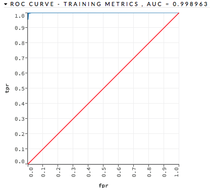
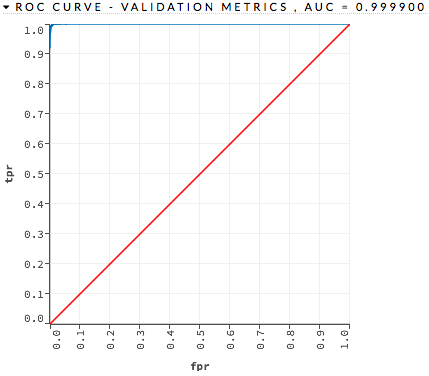
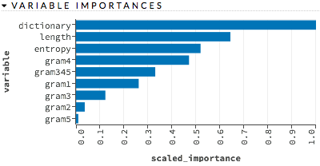
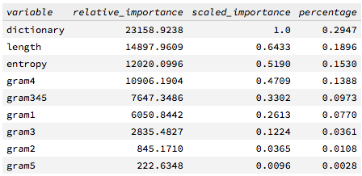
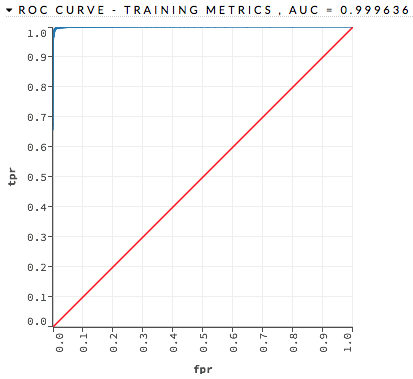
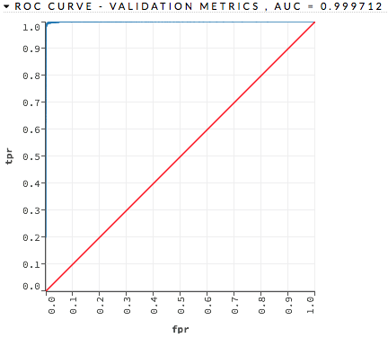
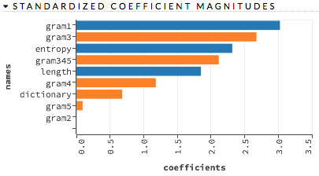
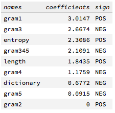
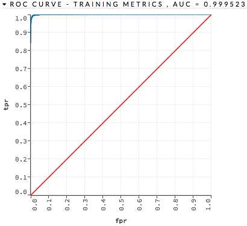

## Model Selection using H2O with R

### Starting with R
~~~
> trainH2O <- as.h2o(traindga)

> testH2O <- as.h2o(testdga)
~~~

### Random Forest with H2O
~~~
(1) Goto http://127.0.0.1:54321/flow/index.html

(2) Click "getFrames" under "Assistance"

(3) Choose the frame "traindga" and click "Build Model"

(4) Select an algorithm: "Distributed Random Forest"

(5) validation_frame: "testdga"; response_column: "class"; ntrees: 50; mtries: -1; stopping_rounds: 10; stopping_metric: "AUC"; stopping_tolerance: 0.001; seed: 1000000

(6) Click "Build Model"

(7) Click "View" and "Predict"
~~~

~~~
# go back to R

# using AUC as stopping metric

> h2o.confusionMatrix(h2o.getModel("drf-8c9592db-1500-4092-bdc6-1e2bc2911fda"), h2o.getFrame("testdga"))

Confusion Matrix for max f1 @ threshold = 0.454545454545455:
        dga legit    Error      Rate
dga    1244     6 0.004800   =6/1250
legit     4  1244 0.003205   =4/1248
Totals 1248  1250 0.004003  =10/2498

> h2o.confusionMatrix(h2o.getModel("drf-8c9592db-1500-4092-bdc6-1e2bc2911fda"), h2o.getFrame("traindga"))

Confusion Matrix for max f1 @ threshold = 0.545454545454545:
        dga legit    Error     Rate
dga    3750     0 0.000000  =0/3750
legit     0  3752 0.000000  =0/3752
Totals 3750  3752 0.000000  =0/7502

# using logloss as stopping metric

> h2o.confusionMatrix(h2o.getModel("drf-8c9592db-1500-4092-bdc6-1e2bc2911fda"), h2o.getFrame("testdga"))

Confusion Matrix for max f1 @ threshold = 0.42:
        dga legit    Error      Rate
dga    1242     8 0.006400   =8/1250
legit     4  1244 0.003205   =4/1248
Totals 1246  1252 0.004804  =12/2498

> h2o.confusionMatrix(h2o.getModel("drf-8c9592db-1500-4092-bdc6-1e2bc2911fda"), h2o.getFrame("traindga"))

Confusion Matrix for max f1 @ threshold = 0.64:
        dga legit    Error     Rate
dga    3750     0 0.000000  =0/3750
legit     0  3752 0.000000  =0/3752
Totals 3750  3752 0.000000  =0/7502
~~~

### Logistic Regression with H2O
~~~
(1) Choose the frame "traindga" and click "Build Model"

(2) Select an algorithm: "Generalized Linear Modeling"

(3) validation_frame: "testdga"; response_column: "class"; family: binomial

(4) Click "Build Model"

(5) Click "View" and "Predict"
~~~

~~~
# go back to R

> h2o.confusionMatrix(h2o.getModel("glm-f477a602-8a31-4da7-8f58-80d3d65653eb"), h2o.getFrame("testdga"))
Confusion Matrix for max f1 @ threshold = 0.417488962038092:
        dga legit    Error      Rate
dga    1246     4 0.003200   =4/1250
legit    11  1237 0.008814  =11/1248
Totals 1257  1241 0.006005  =15/2498
~~~

### Deep Learning with H2O
~~~
(1) Choose the frame "traindga" and click "Build Model"

(2) Select an algorithm: "Deep Learning"

(3) validation_frame: "testdga"; response_column: "class"; activation: RectifierWithDropout; hidden: 100,100; epochs: 10; stopping_metric: AUC

(4) Click "Build Model"

(5) Click "View" and "Predict"
~~~

~~~
# go back to R

# using AUC as stopping metric

> h2o.confusionMatrix(h2o.getModel("deeplearning-470eb660-bcab-4598-8bfd-2795de8e65c5"), h2o.getFrame("testdga"))

Confusion Matrix for max f1 @ threshold = 0.976170330303615:
        dga legit    Error      Rate
dga    1247     3 0.002400   =3/1250
legit    18  1230 0.014423  =18/1248
Totals 1265  1233 0.008407  =21/2498

> h2o.confusionMatrix(h2o.getModel("deeplearning-470eb660-bcab-4598-8bfd-2795de8e65c5"), h2o.getFrame("traindga"))

Confusion Matrix for max f1 @ threshold = 0.957816293636941:
        dga legit    Error      Rate
dga    3708    42 0.011200  =42/3750
legit    27  3725 0.007196  =27/3752
Totals 3735  3767 0.009198  =69/7502

# using logloss as stopping metric

> h2o.confusionMatrix(h2o.getModel("deeplearning-470eb660-bcab-4598-8bfd-2795de8e65c5"), h2o.getFrame("testdga"))

Confusion Matrix for max f1 @ threshold = 0.837299244789879:
        dga legit    Error      Rate
dga    1240    10 0.008000  =10/1250
legit    13  1235 0.010417  =13/1248
Totals 1253  1245 0.009207  =23/2498

> h2o.confusionMatrix(h2o.getModel("deeplearning-470eb660-bcab-4598-8bfd-2795de8e65c5"), h2o.getFrame("traindga"))

Confusion Matrix for max f1 @ threshold = 0.881617625564135:
        dga legit    Error      Rate
dga    3712    38 0.010133  =38/3750
legit    30  3722 0.007996  =30/3752
Totals 3742  3760 0.009064  =68/7502
~~~
