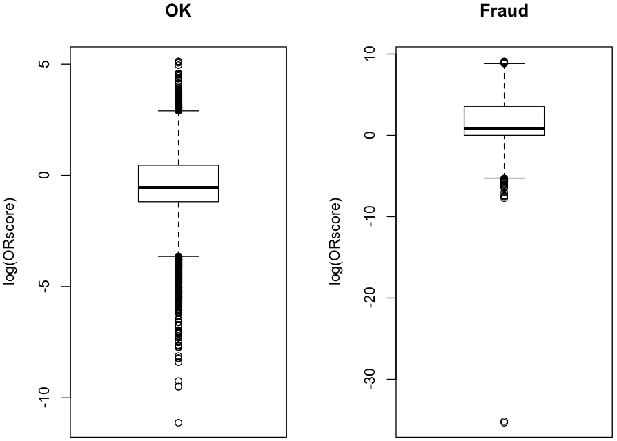

## Box Plot

### Ranking
~~~
> setwd("/work/R/example")

> load('salesClean.rdata')

> attach(sales)

> notF <- which(Insp != 'fraud')

> mi <- function(x) { 
+   bp <- boxplot.stats(x)$stats 
+   c(median = bp[3], iqr = bp[4]-bp[2])
+ }

> ms <- tapply(Uprice[notF], list(Prod=Prod[notF]), mi)

> m <- matrix(unlist(ms),length(ms),2,byrow=T,dimnames=list(names(ms),c('median','iqr')))

> m[which(m[,'iqr']==0),'iqr'] <- m[which(m[,'iqr']==0),'median']

> ORscore <- abs(Uprice - m[Prod,'median']) / m[Prod,'iqr']
~~~

### Result Analysis
~~~
> detach(sales)

> sales$Tprice <- m[sales$Prod, 'median']

> sales <- cbind(sales, ORscore)

> attach(sales)

> sales[order(sales$ORscore,decreasing=T)[1:30],]

          ID  Prod Quant     Val  Insp      Uprice     Tprice  ORscore
231400 v5772 p4246   168   32385 fraud   192.76786  0.5013091 9088.870
196319 v5457 p2511   236   69220 fraud   293.30508  0.5949375 8482.464
215485  v216  p315   494  105090 fraud   212.73279  0.2799265 7706.768
280163  v216  p315   346   66060 fraud   190.92486  0.2799265 6915.681
252657 v4063 p2477   626  388125 fraud   620.00799  0.6615831 6846.693
125048 v4998  p771   827  148535 fraud   179.60701  0.2331696 6519.096
280162  v216  p315   269   45055 fraud   167.49071  0.2799265 6065.603
176284 v4998 p4513  1083  154210 fraud   142.39151  0.1626376 4922.030
125056 v4998 p4513  2949  419390 fraud   142.21431  0.1626376 4915.898
219972 v4998 p4513   983  138480 fraud   140.87487  0.1626376 4869.545
325980 v2993 p2477   106   43695 fraud   412.21698  0.6615831 4549.625
280160 v4997  p315   213   26525 fraud   124.53052  0.2799265 4507.214
75422   v242  p314  1766  537985 fraud   304.63477  0.2859967 4438.204
198293 v3196 p2784   303  611280 fraud  2017.42574  3.1556956 4231.942
60894  v3196 p2784   266  531635 fraud  1998.62782  3.1556956 4192.448
123471  v327  p512   352  217280  unkn   617.27273  0.8710710 4111.243
84950  v1789 p1299   662  382890 fraud   578.38369  0.6997438 4079.608
133754 v1789 p1299   470  270320 fraud   575.14894  0.6997438 4056.764
358369 v5718  p644   122  130465 fraud  1069.38525  1.1300511 3464.881
176283 v4998 p4513   231   23090 fraud    99.95671  0.1626376 3453.514
391426 v5942 p4302   113   12535 fraud   110.92920  0.4766680 3294.239
132026 v1255 p1199   101  518625 fraud  5134.90099 10.4459866 3269.991
174342  v241  p314   933  209435 fraud   224.47481  0.2859967 3269.262
196327 v2989 p2512   221   56010 fraud   253.43891  0.4862292 3248.483
21802  v3048 p2560   247  420990 fraud  1704.41296  2.8209563 3182.337
99087  v4577 p2203   153 2041000 fraud 13339.86928 10.4081633 3135.982
196578 v3048 p2560   260  420350 fraud  1616.73077  2.8209563 3018.353
369385 v5772 p1365   180   41760 fraud   232.00000  0.5001473 2946.035
175267  v327  p512   192   79695 fraud   415.07812  0.8710710 2762.656
131539  v884 p1159   350 3953985 fraud 11297.10000 13.9583333 2564.078

> fraudSales <- sales[Insp == 'fraud',]

> fraudSales[order(fraudSales$ORscore)[1:10],]

          ID  Prod Quant        Val  Insp    Uprice    Tprice ORscore
37198   v397  p785   200   2158.859 fraud 10.794296 10.794296       0
86376   v260 p1451   107   1056.164 fraud  9.870690  9.870690       0
106062 v3149 p2870   155   1588.750 fraud 10.250000 10.250000       0
151474 v2753 p2272   308   3145.968 fraud 10.214181 10.214181       0
176365  v564  p777   136   2018.418 fraud 14.841306 14.841306       0
184524 v5290 p1533 17034 112479.865 fraud  6.603256  6.603256       0
186585 v5290 p1678   650   5867.732 fraud  9.027281  9.027281       0
186762 v2445 p1691   127   2177.571 fraud 17.146226 17.146226       0
202610 v5677 p4471   127   3543.412 fraud 27.900878 27.900878       0
202612 v5677 p3180   343  11484.165 fraud 33.481531 33.481531       0

> okSales <- sales[Insp == 'ok',]

> okSales[order(okSales$ORscore,decreasing=T)[1:10],]

          ID  Prod Quant    Val Insp     Uprice     Tprice   ORscore
25049  v1226 p3007   119 177855   ok 1494.57983 13.6061230 169.26417
197512  v819 p2696   172  64945   ok  377.58721 11.0824742 167.53374
202776 v2371 p3197   175 377370   ok 2156.40000 19.0855228 158.54838
79154   v910  p889   238 195415   ok  821.07143  8.7391304 142.49612
159679 v3338 p3033   191 169245   ok  886.09948 14.0476190  98.76784
162988 v5532 p3297   156 231180   ok 1481.92308 16.7903930  97.02280
178562  v661  p980   155  46375   ok  299.19355  3.9094495  94.95472
66648  v3558 p3338   212 278070   ok 1311.65094 16.2500000  94.02039
253022 v1070 p2520   594   9765   ok   16.43939  0.9577064  93.06522
71274  v1660 p3842   138  70385   ok  510.03623 12.1600000  87.70056

> par(mfrow= c(1,2))

> boxplot(log(okSales[,"ORscore"]), main="OK", ylab="log(ORscore)")

> boxplot(log(fraudSales[,"ORscore"]), main="Fraud", ylab="log(ORscore)")
~~~

### PR charts
~~~
> library(ROCR)

> knownSales <- sales[Insp == 'fraud' | Insp == 'ok',]

> knownSales$Label <- 0

> knownSales[knownSales$Insp == 'fraud', 'Label'] <- 1

> par(mfrow= c(2,2))

> pred <- prediction(knownSales$ORscore, knownSales$Label)

> perf <- performance(pred, "prec", "rec")
 
> plot(perf, main = "PR Chart")

> IPRcurve <- function(preds, trues, ...) {
+   require(ROCR, quietly = T)
+ 
+   pd <- prediction(preds, trues)
+   pf <- performance(pd, "prec", "rec")
+   pf@y.values <- lapply(pf@y.values, function(x) rev(cummax(rev(x))))
+ 
+   plot(pf, ...)
+ }

> IPRcurve(knownSales$ORscore, knownSales$Label, main = "Interpolated PR Chart")

> perf <- performance(pred, "lift", "rpp")

> plot(perf, main = "Lift Chart")

> CRchart <- function(preds, trues, ...) {
+   require(ROCR, quietly = T)
+ 
+   pd <- prediction(preds, trues)
+   pf <- performance(pd, "rec", "rpp")
+ 
+   plot(pf, ...)
+ }

> CRchart(knownSales$ORscore, knownSales$Label, main = "Cumulative Recall Chart")
~~~

### Conclusion

We can observe that the method obtains around 40% of recall with a very low inspection eort. However, to achieve values around 80%, we already need to inspect roughly 25% to 30% of the reports.

