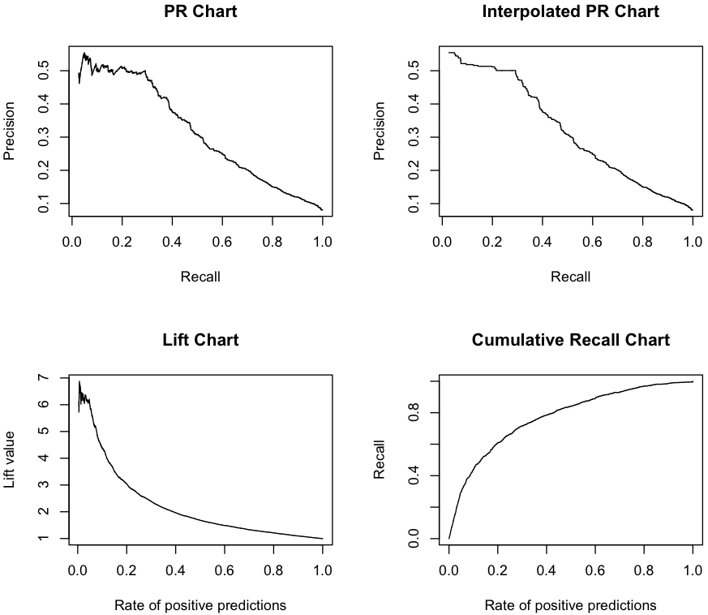

## [Naive Bayes](https://en.wikipedia.org/wiki/Naive_Bayes_classifier)

### Ranking with R
~~~
> setwd("/work/R/example")

> load('salesClean.rdata')
 
> knownSales <- sales[sales$Insp == 'fraud' | sales$Insp == 'ok',]
 
> nrow(sales)
[1] 400204
 
> nrow(knownSales)
[1] 15726

> data <- knownSales[, c("ID", "Prod", "Uprice", "Insp")]

> data$Insp <- factor(data$Insp, levels = c("ok", "fraud"))

# SMOTE for sampling

library(DMwR)

> sData <- SMOTE(Insp ~ ., data, perc.over = 700)

> nrow(sData)
[1] 27896

> length(which(sData$Insp == 'ok'))
[1] 17752

> length(which(sData$Insp == 'fraud'))
[1] 10144

# Naive Baye classification

> require(e1071, quietly = T)

> model <- naiveBayes(Insp ~ ., sData)

> preds <- predict(model, data, type = "raw")

> data <- cbind(data, preds)

> head(data)

    ID Prod   Uprice Insp        ok       fraud
53 v42  p11 6.082157   ok 0.9380009 0.061999051
56 v45  p11 7.403846   ok 0.9866933 0.013306737
68 v42  p11 5.436020   ok 0.9379530 0.062047036
77 v50  p11 6.001428   ok 0.9905115 0.009488481
82 v46  p12 5.473684   ok 0.7091893 0.290810717
84 v48  p12 7.840647   ok 0.7338046 0.266195399
~~~

### PR charts with R
~~~
> library(ROCR)

> data$Label <- 0

> data[data$Insp == 'fraud', 'Label'] <- 1

> head(data)

    ID Prod   Uprice Insp        ok       fraud Label
53 v42  p11 6.082157   ok 0.9380009 0.061999051     0
56 v45  p11 7.403846   ok 0.9866933 0.013306737     0
68 v42  p11 5.436020   ok 0.9379530 0.062047036     0
77 v50  p11 6.001428   ok 0.9905115 0.009488481     0
82 v46  p12 5.473684   ok 0.7091893 0.290810717     0
84 v48  p12 7.840647   ok 0.7338046 0.266195399     0

> par(mfrow= c(2,2))

> pred <- prediction(data$fraud, data$Label)

> perf <- performance(pred, "prec", "rec")

> plot(perf, main = "PR Chart")

IPRcurve <- function(preds, trues, ...) {
  require(ROCR, quietly = T)

  pd <- prediction(preds, trues)
  pf <- performance(pd, "prec", "rec")
  pf@y.values <- lapply(pf@y.values, function(x) rev(cummax(rev(x))))

  plot(pf, ...)
}

> IPRcurve(data$fraud, data$Label, main = "Interpolated PR Chart")

> perf <- performance(pred, "lift", "rpp")

> plot(perf, main = "Lift Chart")

CRchart <- function(preds, trues, ...) {
  require(ROCR, quietly = T)

  pd <- prediction(preds, trues)
  pf <- performance(pd, "rec", "rpp")

  plot(pf, ...)
}

> CRchart(data$fraud, data$Label, main = "Cumulative Recall Chart")
~~~

### Conclusion

The Naive Bayes scores are very far from the best results of the unsupervised models. Despite the oversampling of the 
minority class carried out by SMOTE, Naive Bayes is still not able to correctly predict which are the fraudulent reports.
