## Using R and xts

~~~
> library(xts)

> Bitcoin <- as.xts(read.zoo("/work/R/example/Wikipedia/Bitcoin/Bitcoin-2014-daily.csv", sep=",", header=T))

> dim(Bitcoin)
[1] 364   1

> colnames(Bitcoin) <- c("Volume")

> head(Bitcoin)

           Volume
2014-01-01  39410
2014-01-02  49019
2014-01-03  51499
2014-01-04  41665
2014-01-05   7177
2014-01-06  25219

> plot(x=log(Bitcoin), ylab = "log(Volume)", main = "Bitcoin")
~~~
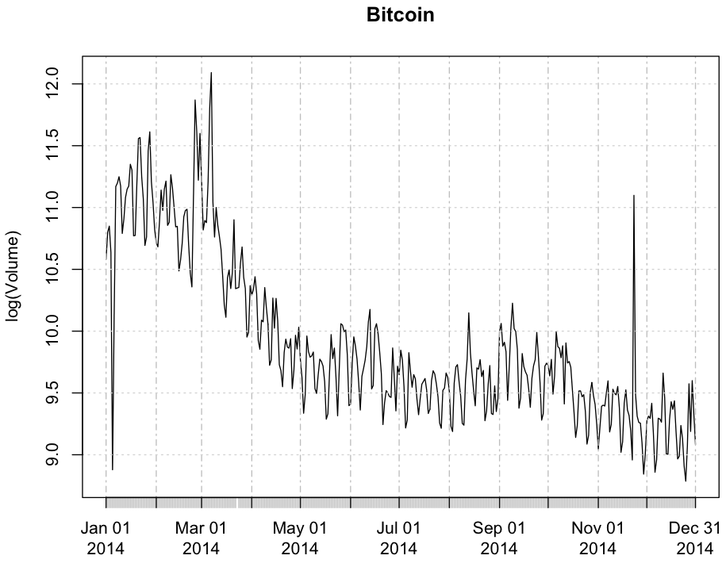

~~~
> Cryptocurrency <- as.xts(read.zoo("/work/R/example/Wikipedia/Bitcoin/Cryptocurrency-2014-daily.csv", sep=",", header=T))

> dim(Cryptocurrency)
[1] 364   1

> colnames(Cryptocurrency) <- c("Volume")

> head(Cryptocurrency)

           Volume
2014-01-01   1616
2014-01-02   2394
2014-01-03   2549
2014-01-04   2499
2014-01-05    449
2014-01-06   1055

> plot(x=log(Cryptocurrency), ylab = "log(Volume)", main = "Cryptocurrency")
~~~
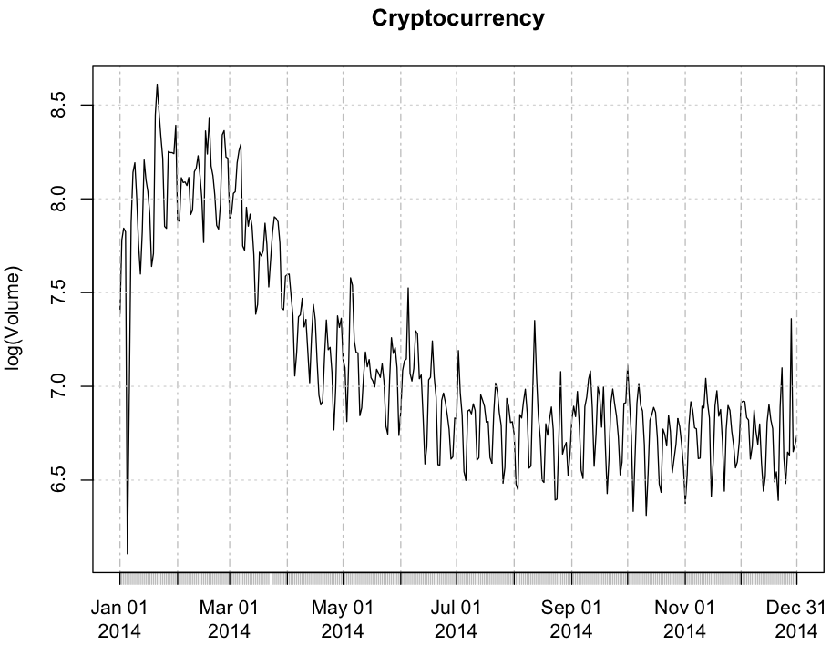

~~~
> History_of_Bitcoin <- as.xts(read.zoo("/work/R/example/Wikipedia/Bitcoin/History_of_Bitcoin-2014-daily.csv", sep=",", header=T))

> dim(History_of_Bitcoin)
[1] 364   1

> colnames(History_of_Bitcoin) <- c("Volume")

> head(History_of_Bitcoin)

           Volume
2014-01-01    483
2014-01-02    548
2014-01-03    555
2014-01-04    526
2014-01-05    105
2014-01-06    333

> plot(x=log(History_of_Bitcoin), ylab = "log(Volume)", main = "History_of_Bitcoin")
~~~
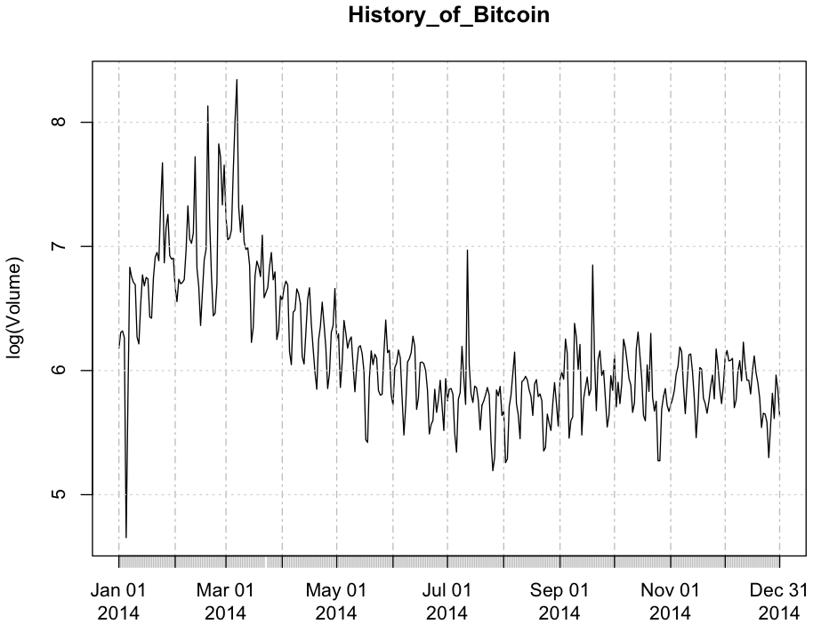

~~~
> Digital_currency <- as.xts(read.zoo("/work/R/example/Wikipedia/Bitcoin/Digital_currency-2014-daily.csv", sep=",", header=T))

> dim(Digital_currency)
[1] 364   1

> colnames(Digital_currency) <- c("Volume")

> head(Digital_currency)

           Volume
2014-01-01    518
2014-01-02    643
2014-01-03    643
2014-01-04    732
2014-01-05    107
2014-01-06    340

> plot(x=log(Digital_currency), ylab = "log(Volume)", main = "Digital_currency")
~~~
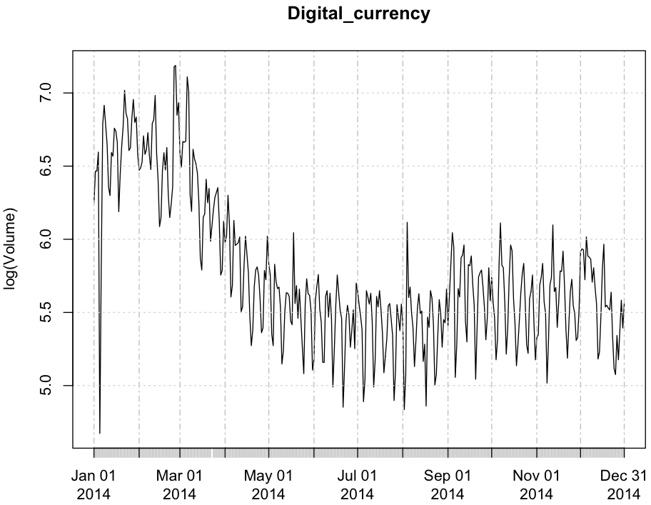

~~~
> Bitcoin_protocol <- as.xts(read.zoo("/work/R/example/Wikipedia/Bitcoin/Bitcoin_protocol-2014-daily.csv", sep=",", header=T))

> dim(Bitcoin_protocol)
[1] 364   1

> colnames(Bitcoin_protocol) <- c("Volume")

> head(Bitcoin_protocol)

           Volume
2014-01-01    774
2014-01-02   1279
2014-01-03   1471
2014-01-04   1153
2014-01-05    259
2014-01-06    808

> plot(x=log(Bitcoin_protocol), ylab = "log(Volume)", main = "Bitcoin_protocol")
~~~
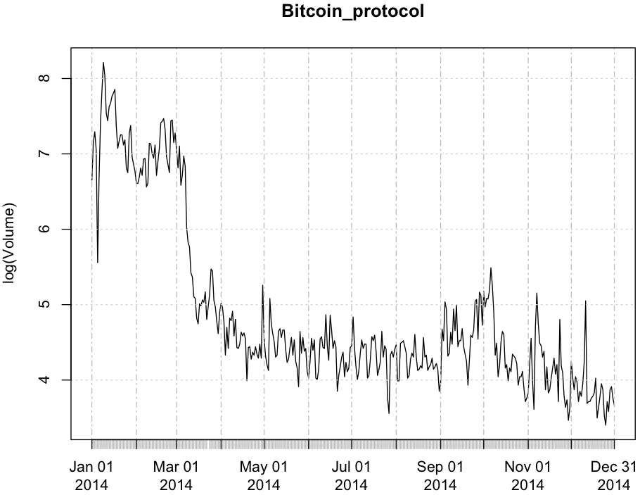

~~~
> Bitcoin_network <- as.xts(read.zoo("/work/R/example/Wikipedia/Bitcoin/Bitcoin_network-2014-daily.csv", sep=",", header=T))

> dim(Bitcoin_network)
[1] 305   1

> colnames(Bitcoin_network) <- c("Volume")

> head(Bitcoin_network)

           Volume
2014-01-14      1
2014-03-02     61
2014-03-03    148
2014-03-04    173
2014-03-05    223
2014-03-06    214

> plot(x=log(Bitcoin_network), ylab = "log(Volume)", main = "Bitcoin_network")
~~~
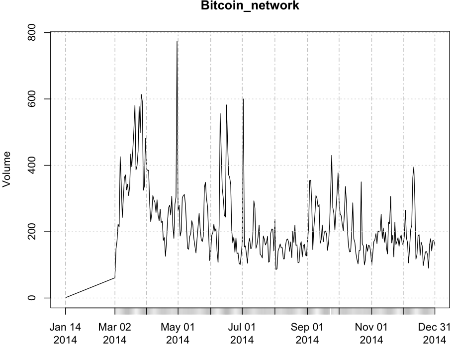

~~~
> Coinbase <- as.xts(read.zoo("/work/R/example/Wikipedia/Bitcoin/Coinbase-2014-daily.csv", sep=",", header=T))

> dim(Coinbase)
[1] 364   1

> colnames(Coinbase) <- c("Volume")

> head(Coinbase)

           Volume
2014-01-01    117
2014-01-02    190
2014-01-03    213
2014-01-04    164
2014-01-05     42
2014-01-06    129

> plot(x=log(Coinbase), ylab = "log(Volume)", main = "Coinbase")
~~~
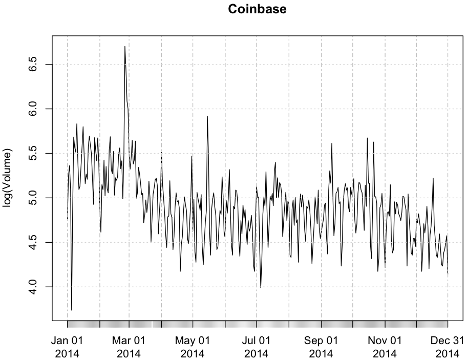

~~~
> Legality_of_Bitcoin_by_country <- as.xts(read.zoo("/work/R/example/Wikipedia/Bitcoin/Legality_of_Bitcoin_by_country-2014-daily.csv", sep=",", header=T))

> dim(Legality_of_Bitcoin_by_country)
[1] 308   1

> colnames(Legality_of_Bitcoin_by_country) <- c("Volume")

> head(Legality_of_Bitcoin_by_country)

           Volume
2014-02-26      9
2014-02-27     54
2014-02-28    332
2014-03-01    214
2014-03-02    212
2014-03-03    779

> plot(x=log(Legality_of_Bitcoin_by_country), ylab = "log(Volume)", main = "Legality_of_Bitcoin_by_country")
~~~
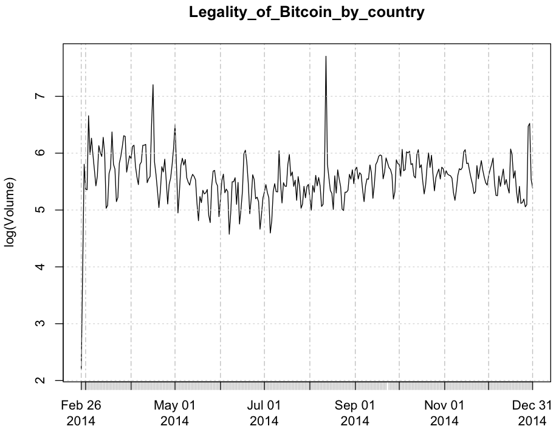

~~~
> Bitcoin_mining <- as.xts(read.zoo("/work/R/example/Wikipedia/Bitcoin/Bitcoin_mining-2014-daily.csv", sep=",", header=T))

> dim(Bitcoin_mining)
[1] 364   1

> colnames(Bitcoin_mining) <- c("Volume")

> head(Bitcoin_mining)

           Volume
2014-01-01    381
2014-01-02    463
2014-01-03    414
2014-01-04    359
2014-01-05     79
2014-01-06     58

> plot(x=log(Bitcoin_mining), ylab = "log(Volume)", main = "Bitcoin_mining")
~~~
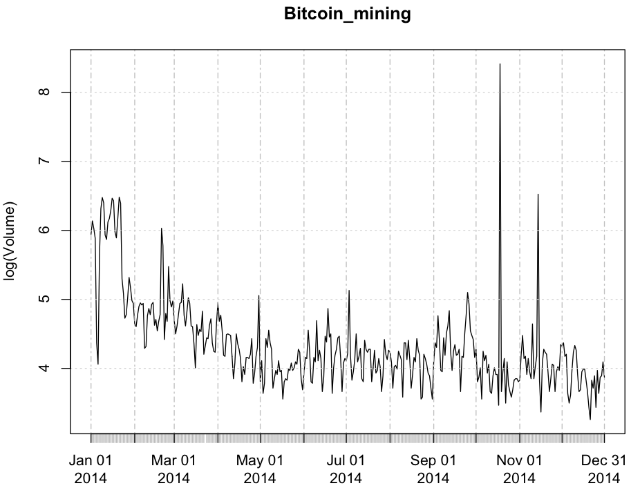

~~~
> Bitcoin_ATM <- as.xts(read.zoo("/work/R/example/Wikipedia/Bitcoin/Bitcoin_ATM-2014-daily.csv", sep=",", header=T))

> dim(Bitcoin_ATM)
[1] 362   1

> colnames(Bitcoin_ATM) <- c("Volume")

> head(Bitcoin_ATM)

           Volume
2014-01-01      1
2014-01-02      1
2014-01-03      6
2014-01-04      7
2014-01-05      2
2014-01-06      1

> plot(x=log(Bitcoin_ATM), ylab = "log(Volume)", main = "Bitcoin_ATM")
~~~
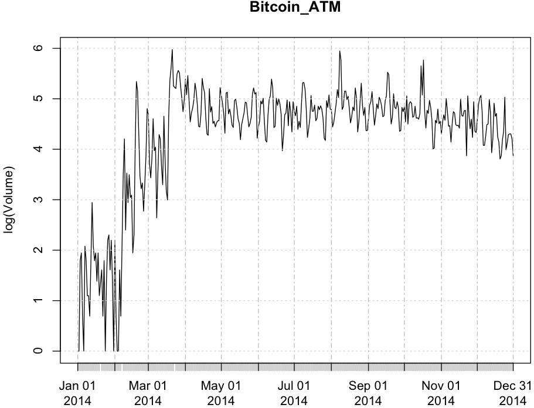

~~~
> Digital_currency_exchanger <- as.xts(read.zoo("/work/R/example/Wikipedia/Bitcoin/Digital_currency_exchanger-2014-daily.csv", sep=",", header=T))

> dim(Digital_currency_exchanger)
[1] 364   1

> colnames(Digital_currency_exchanger) <- c("Volume")

> head(Digital_currency_exchanger)

           Volume
2014-01-01    145
2014-01-02    184
2014-01-03    144
2014-01-04    142
2014-01-05     27
2014-01-06     79

> plot(x=log(Digital_currency_exchanger), ylab = "log(Volume)", main = "Digital_currency_exchanger")
~~~
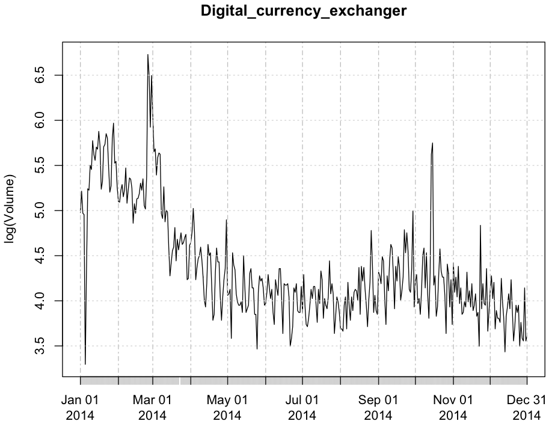

~~~
> Bitstamp <- as.xts(read.zoo("/work/R/example/Wikipedia/Bitcoin/Bitstamp-2014-daily.csv", sep=",", header=T))

> dim(Bitstamp)
[1] 364   1

> colnames(Bitstamp) <- c("Volume")

> head(Bitstamp)

           Volume
2014-01-01     72
2014-01-02     80
2014-01-03     89
2014-01-04     70
2014-01-05     20
2014-01-06     39

> plot(x=log(Bitstamp), ylab = "log(Volume)", main = "Bitstamp")
~~~
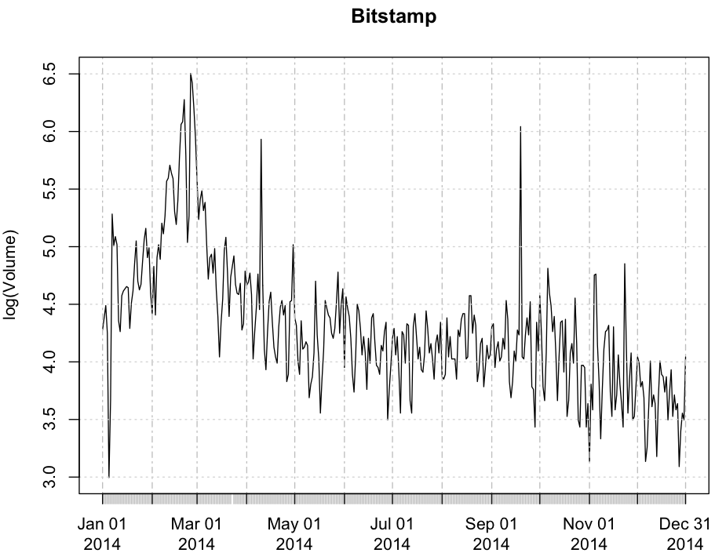

~~~
> Bitcoin_Foundation <- as.xts(read.zoo("/work/R/example/Wikipedia/Bitcoin/Bitcoin_Foundation-2014-daily.csv", sep=",", header=T))

> dim(Bitcoin_Foundation)
[1] 364   1

> colnames(Bitcoin_Foundation) <- c("Volume")

> head(Bitcoin_Foundation)

           Volume
2014-01-01     81
2014-01-02    112
2014-01-03    109
2014-01-04     85
2014-01-05     15
2014-01-06     51

> plot(x=log(Bitcoin_Foundation), ylab = "log(Volume)", main = "Bitcoin_Foundation")
~~~
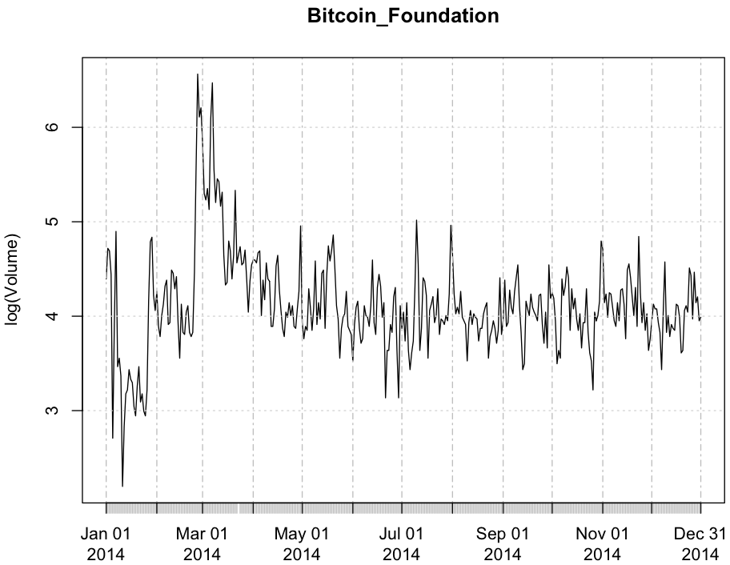

