## Using R and xts

~~~
> library(xts)

> Bitcoin <- as.xts(read.zoo("/work/R/example/Wikipedia/Bitcoin/Bitcoin-2015-daily.csv", sep=",", header=T))

> dim(Bitcoin)
[1] 365   1

> colnames(Bitcoin) <- c("Volume")

> head(Bitcoin)

           Volume
2015-01-01   7238
2015-01-02  10130
2015-01-03   9417
2015-01-04   9552
2015-01-05  12212
2015-01-06  16097

> plot(x=log(Bitcoin), ylab = "log(Volume)", main = "Bitcoin")
~~~
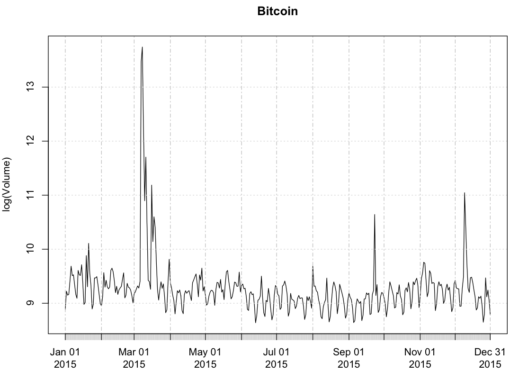

~~~
> Cryptocurrency <- as.xts(read.zoo("/work/R/example/Wikipedia/Bitcoin/Cryptocurrency-2015-daily.csv", sep=",", header=T))

> dim(Cryptocurrency)
[1] 364   1

> colnames(Cryptocurrency) <- c("Volume")

> head(Cryptocurrency)

           Volume
2015-01-01    570
2015-01-02    796
2015-01-03    706
2015-01-04    744
2015-01-05   1000
2015-01-06   1090

> plot(x=log(Cryptocurrency), ylab = "log(Volume)", main = "Cryptocurrency")
~~~
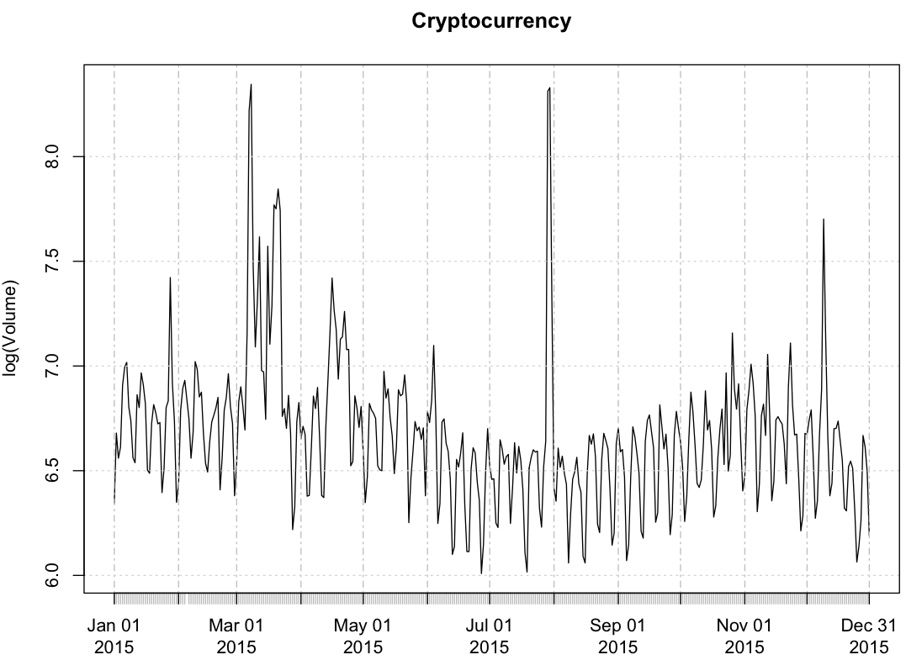

~~~
> BlockchainDB <- as.xts(read.zoo("/work/R/example/Wikipedia/Bitcoin/Block_chain_database-2015-daily.csv", sep=",", header=T))

> dim(BlockchainDB)
[1] 215   1

> colnames(BlockchainDB) <- c("Volume")

> head(BlockchainDB)

           Volume
2015-05-30     24
2015-05-31     32
2015-06-01     67
2015-06-02     74
2015-06-03     89
2015-06-04    404

> plot(x=BlockchainDB, ylab = "Volume", main = "Block_chain_(database)")
~~~
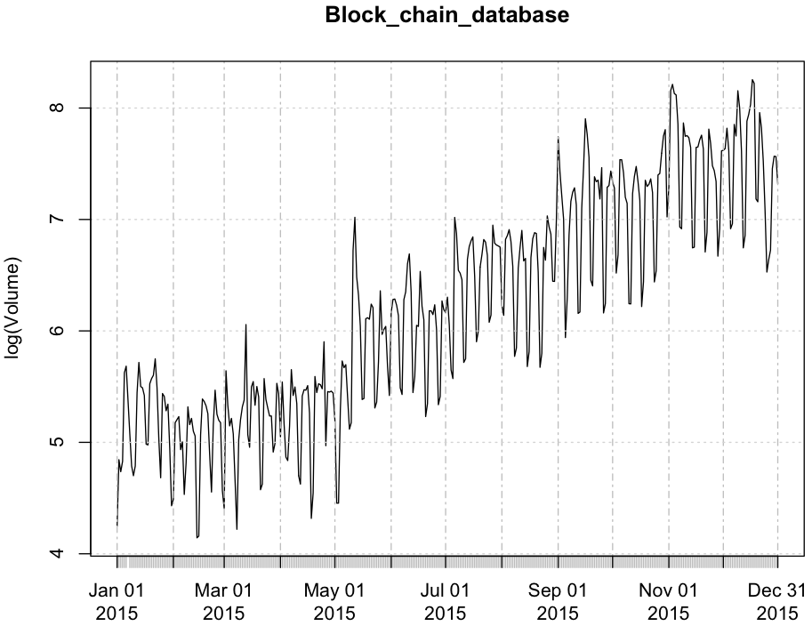

~~~
> History_of_Bitcoin <- as.xts(read.zoo("/work/R/example/Wikipedia/Bitcoin/History_of_Bitcoin-2015-daily.csv", sep=",", header=T))

> dim(History_of_Bitcoin)
[1] 364   1

> colnames(History_of_Bitcoin) <- c("Volume")

> head(History_of_Bitcoin)

           Volume
2015-01-01    279
2015-01-02    344
2015-01-03    302
2015-01-04    866
2015-01-05    373
2015-01-06    397

> plot(x=log(History_of_Bitcoin), ylab = "log(Volume)", main = "History_of_Bitcoin")
~~~
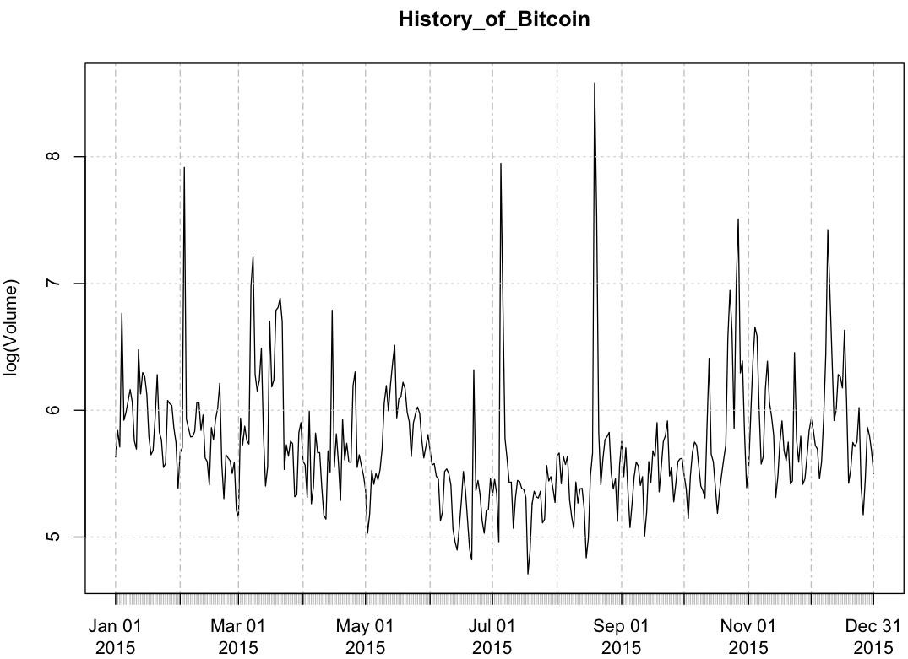

~~~
> Digital_currency <- as.xts(read.zoo("/work/R/example/Wikipedia/Bitcoin/Digital_currency-2015-daily.csv", sep=",", header=T))

> dim(Digital_currency)
[1] 364   1

> colnames(Digital_currency) <- c("Volume")

> head(Digital_currency)

           Volume
2015-01-01    199
2015-01-02    330
2015-01-03    243
2015-01-04    211
2015-01-05    304
2015-01-06    322

> plot(x=log(Digital_currency), ylab = "log(Volume)", main = "Digital_currency")
~~~
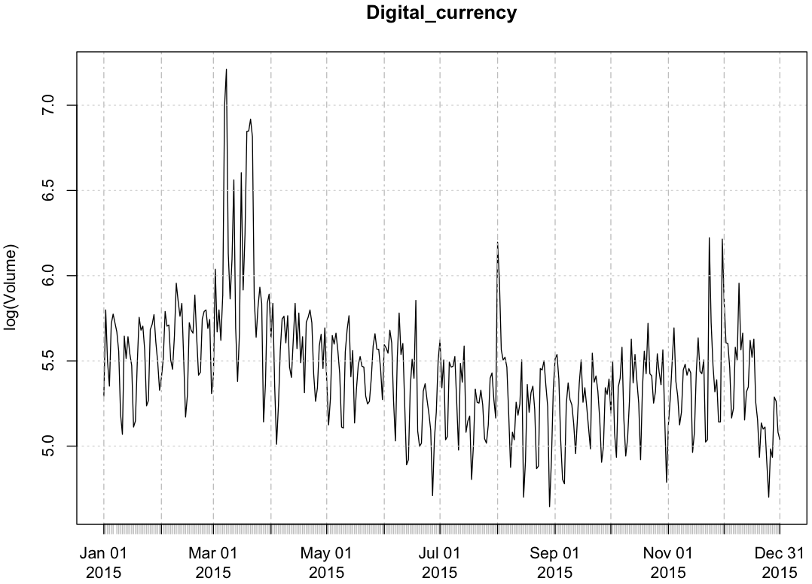

~~~
> Blockchain_info <- as.xts(read.zoo("/work/R/example/Wikipedia/Bitcoin/Blockchain_info-2015-daily.csv", sep=",", header=T))

> dim(Blockchain_info)
[1] 364   1

> colnames(Blockchain_info) <- c("Volume")

> head(Blockchain_info)

           Volume
2015-01-01    115
2015-01-02    180
2015-01-03    161
2015-01-04    158
2015-01-05    154
2015-01-06    189

> plot(x=log(Blockchain_info), ylab = "log(Volume)", main = "Blockchain_info")
~~~

~~~
> Coinbase <- as.xts(read.zoo("/work/R/example/Wikipedia/Bitcoin/Coinbase-2015-daily.csv", sep=",", header=T))

> dim(Coinbase)
[1] 364   1

> colnames(Coinbase) <- c("Volume")

> head(Coinbase)

           Volume
2015-01-01    199
2015-01-02    330
2015-01-03    243
2015-01-04    211
2015-01-05    304
2015-01-06    322

> plot(x=log(Coinbase), ylab = "log(Volume)", main = "Coinbase")
~~~
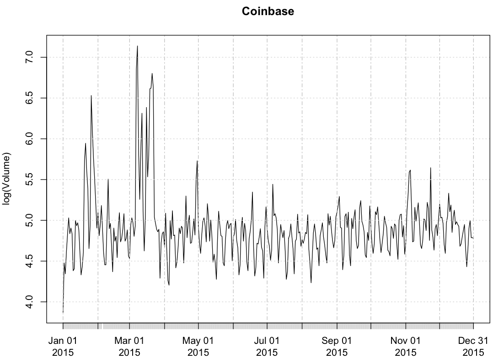

~~~
> Bitcoin_ATM <- as.xts(read.zoo("/work/R/example/Wikipedia/Bitcoin/Bitcoin_ATM-2015-daily.csv", sep=",", header=T))

> dim(Bitcoin_ATM)
[1] 364   1

> colnames(Bitcoin_ATM) <- c("Volume")

> head(Bitcoin_ATM)

           Volume
2015-01-01     41
2015-01-02    124
2015-01-03     78
2015-01-04     55
2015-01-05     82
2015-01-06    109

> plot(x=log(Bitcoin_ATM), ylab = "log(Volume)", main = "Bitcoin_ATM")
~~~
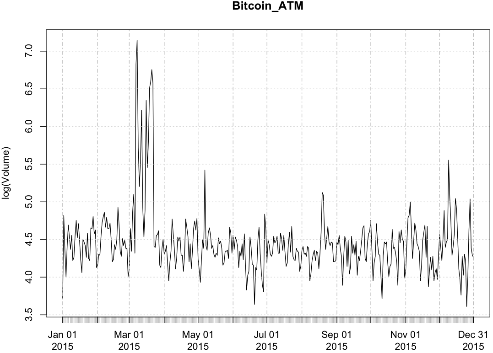

~~~
> BitPay <- as.xts(read.zoo("/work/R/example/Wikipedia/Bitcoin/BitPay-2015-daily.csv", sep=",", header=T))

> dim(BitPay)
[1] 364   1

> colnames(BitPay) <- c("Volume")

> head(BitPay)

           Volume
2015-01-01    118
2015-01-02    110
2015-01-03     73
2015-01-04     97
2015-01-05    102
2015-01-06    110

> plot(x=log(BitPay), ylab = "log(Volume)", main = "BitPay")
~~~
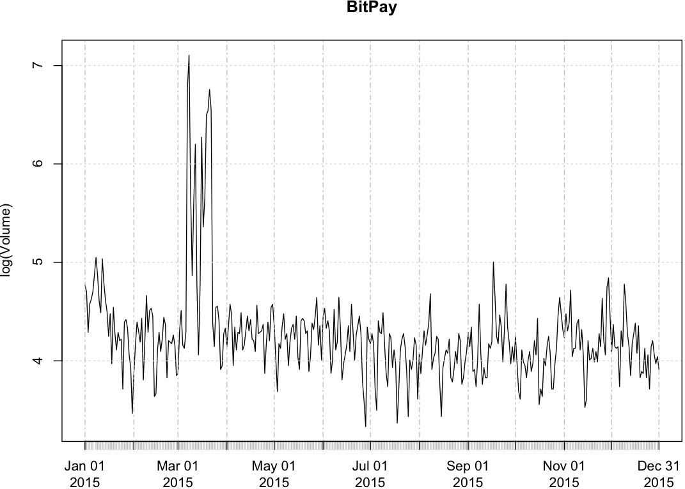

~~~
> Legality_of_Bitcoin_by_country <- as.xts(read.zoo("/work/R/example/Wikipedia/Bitcoin/Legality_of_Bitcoin_by_country-2015-daily.csv", sep=",", header=T))

> dim(Legality_of_Bitcoin_by_country)
[1] 364   1

> colnames(Legality_of_Bitcoin_by_country) <- c("Volume")

> head(Legality_of_Bitcoin_by_country)

           Volume
2015-01-01    160
2015-01-02    269
2015-01-03    227
2015-01-04    238
2015-01-05    377
2015-01-06    353

> plot(x=log(Legality_of_Bitcoin_by_country), ylab = "log(Volume)", main = "Legality_of_Bitcoin_by_country")
~~~
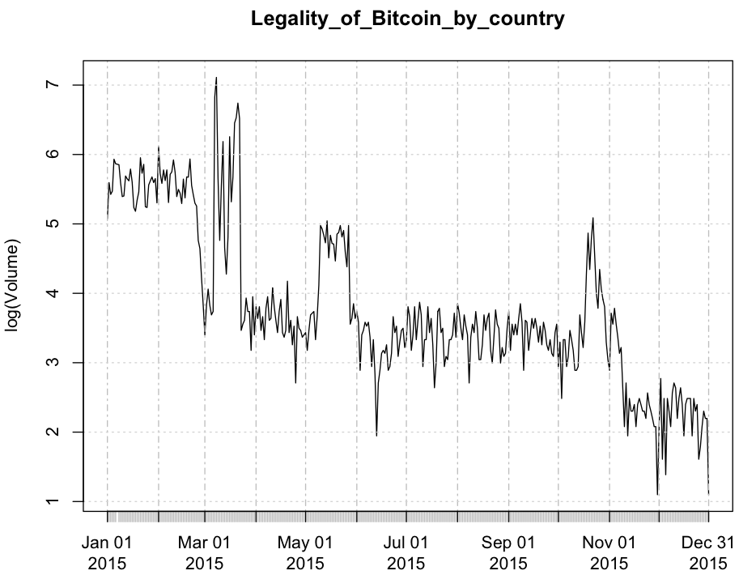

~~~
> Bitcoin_Foundation <- as.xts(read.zoo("/work/R/example/Wikipedia/Bitcoin/Bitcoin_Foundation-2015-daily.csv", sep=",", header=T))

> dim(Bitcoin_Foundation)
[1] 364   1

> colnames(Bitcoin_Foundation) <- c("Volume")

> head(Bitcoin_Foundation)

           Volume
2015-01-01     41
2015-01-02     74
2015-01-03     64
2015-01-04     46
2015-01-05     71
2015-01-06     84

> plot(x=log(Bitcoin_Foundation), ylab = "log(Volume)", main = "Bitcoin_Foundation")
~~~
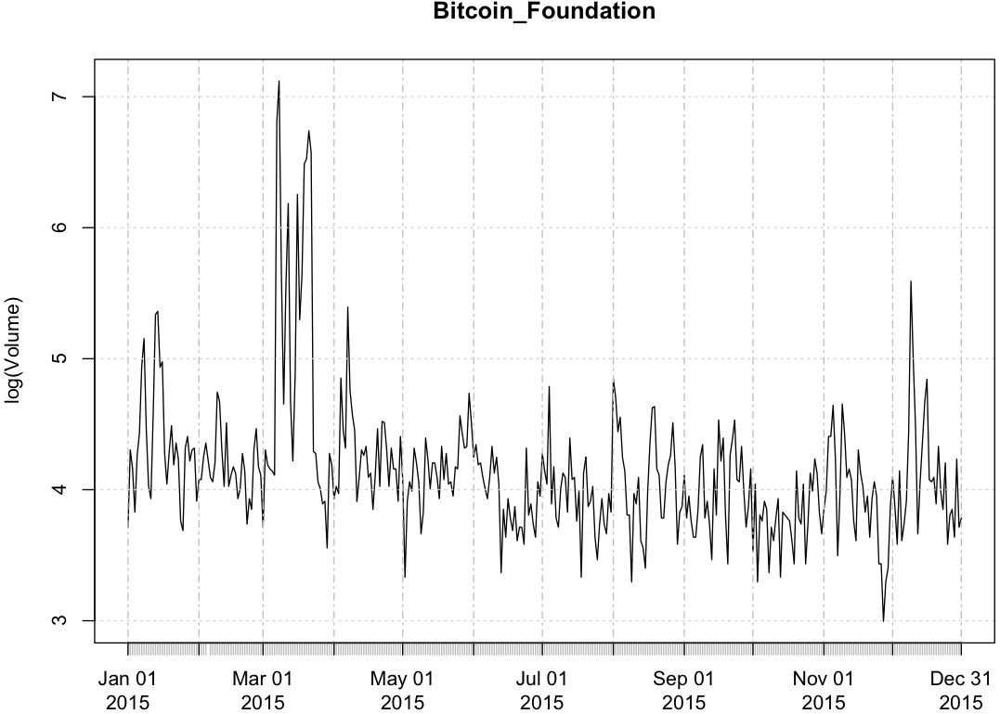

~~~
> Bitcoin_protocol <- as.xts(read.zoo("/work/R/example/Wikipedia/Bitcoin/Bitcoin_protocol-2015-daily.csv", sep=",", header=T))

> dim(Bitcoin_protocol)
[1] 364   1

> colnames(Bitcoin_protocol) <- c("Volume")

> head(Bitcoin_protocol)

           Volume
2015-01-01     36
2015-01-02     45
2015-01-03     51
2015-01-04     34
2015-01-05     56
2015-01-06     50

> plot(x=log(Bitcoin_protocol), ylab = "log(Volume)", main = "Bitcoin_protocol")
~~~
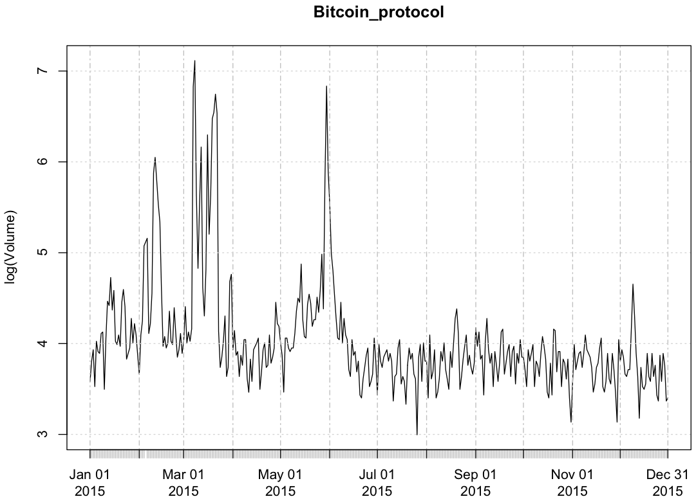

~~~
> Digital_currency_exchanger <- as.xts(read.zoo("/work/R/example/Wikipedia/Bitcoin/Digital_currency_exchanger-2015-daily.csv", sep=",", header=T))

> dim(Digital_currency_exchanger)
[1] 364   1

> colnames(Digital_currency_exchanger) <- c("Volume")

> head(Digital_currency_exchanger)

           Volume
2015-01-01     47
2015-01-02     54
2015-01-03     58
2015-01-04     39
2015-01-05     47
2015-01-06     93

> plot(x=log(Digital_currency_exchanger), ylab = "log(Volume)", main = "Digital_currency_exchanger")
~~~
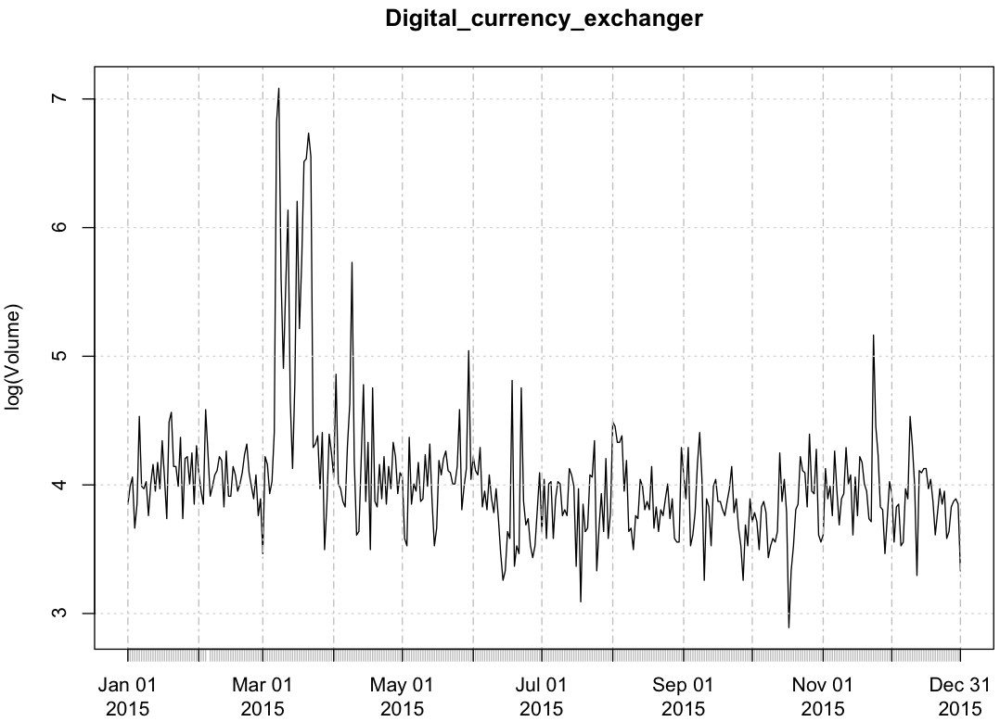

~~~
> Bitstamp <- as.xts(read.zoo("/work/R/example/Wikipedia/Bitcoin/Bitstamp-2015-daily.csv", sep=",", header=T))

> dim(Bitstamp)
[1] 364   1

> colnames(Bitstamp) <- c("Volume")

> head(Bitstamp)

           Volume
2015-01-01     65
2015-01-02     61
2015-01-03     38
2015-01-04     42
2015-01-05    647
2015-01-06    695
2015-01-06    110

> plot(x=log(Bitstamp), ylab = "log(Volume)", main = "Bitstamp")
~~~
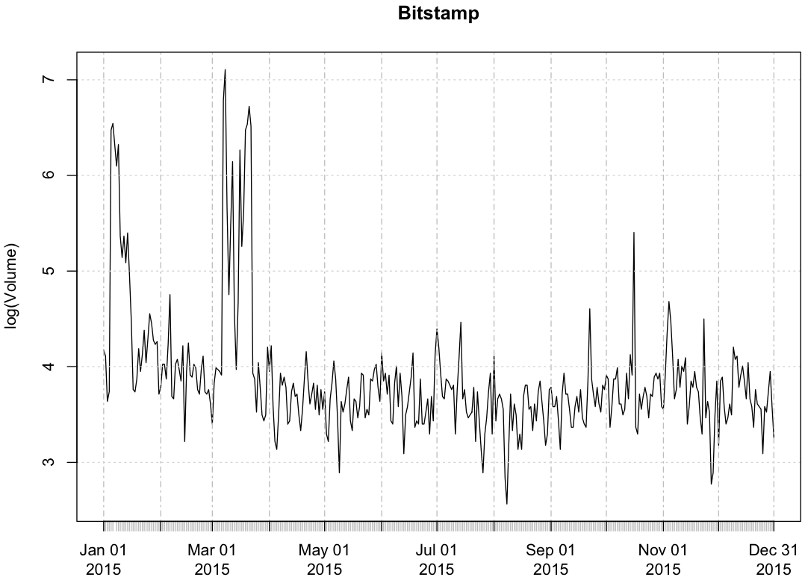

~~~
> Bitcoin_mining <- as.xts(read.zoo("/work/R/example/Wikipedia/Bitcoin/Bitcoin_mining-2015-daily.csv", sep=",", header=T))

> dim(Bitcoin_mining)
[1] 364   1

> colnames(Bitcoin_mining) <- c("Volume")

> head(Bitcoin_mining)

           Volume
2015-01-01     32
2015-01-02     49
2015-01-03     46
2015-01-04     59
2015-01-05     55
2015-01-06     72

> plot(x=log(Bitcoin_mining), ylab = "log(Volume)", main = "Bitcoin_mining")
~~~
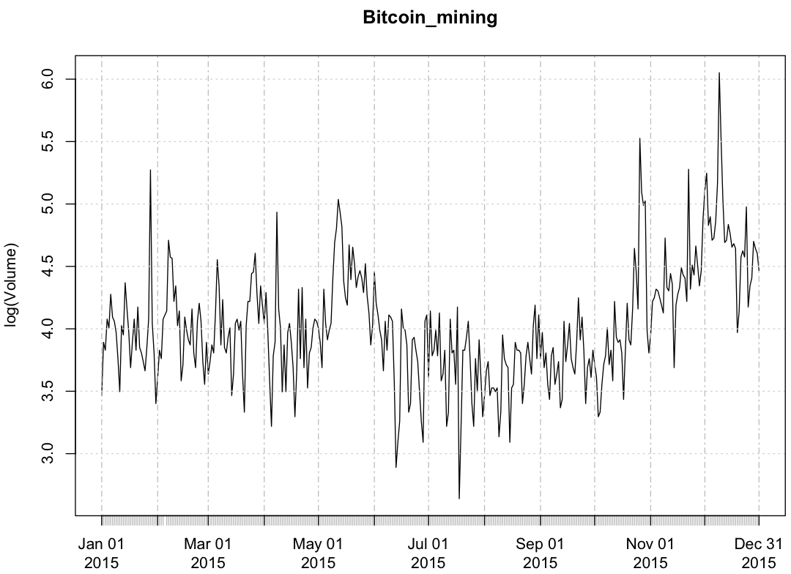

~~~
> Bitcoin_faucet <- as.xts(read.zoo("/work/R/example/Wikipedia/Bitcoin/Bitcoin_faucet-2015-daily.csv", sep=",", header=T))

> dim(Bitcoin_faucet)
[1] 364   1

> colnames(Bitcoin_faucet) <- c("Volume")

> head(Bitcoin_faucet)

           Volume
2015-01-01     16
2015-01-02     27
2015-01-03     35
2015-01-04     27
2015-01-05     21
2015-01-06     42

> plot(x=log(Bitcoin_faucet), ylab = "log(Volume)", main = "Bitcoin_faucet")
~~~
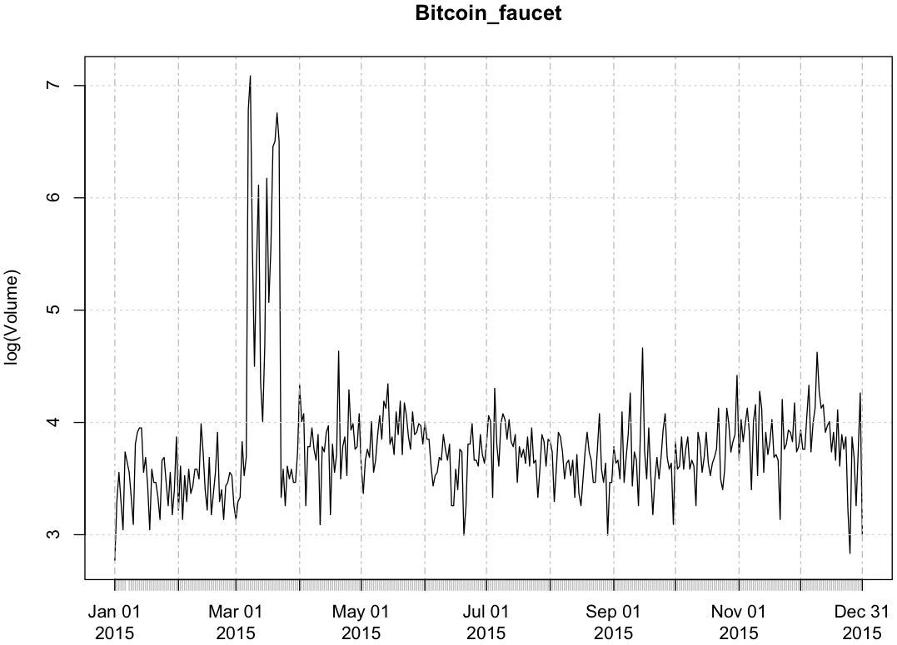

~~~
> Bitcoin_Fog <- as.xts(read.zoo("/work/R/example/Wikipedia/Bitcoin/Bitcoin_Fog-2015-daily.csv", sep=",", header=T))

> dim(Bitcoin_Fog)
[1] 317   1

> colnames(Bitcoin_Fog) <- c("Volume")

> head(Bitcoin_Fog)

           Volume
2015-01-01      3
2015-01-03      1
2015-01-04      1
2015-01-05      1
2015-01-06      1
2015-01-07      1

> plot(x=Bitcoin_Fog, ylab = "Volume", main = "Bitcoin_Fog")
~~~
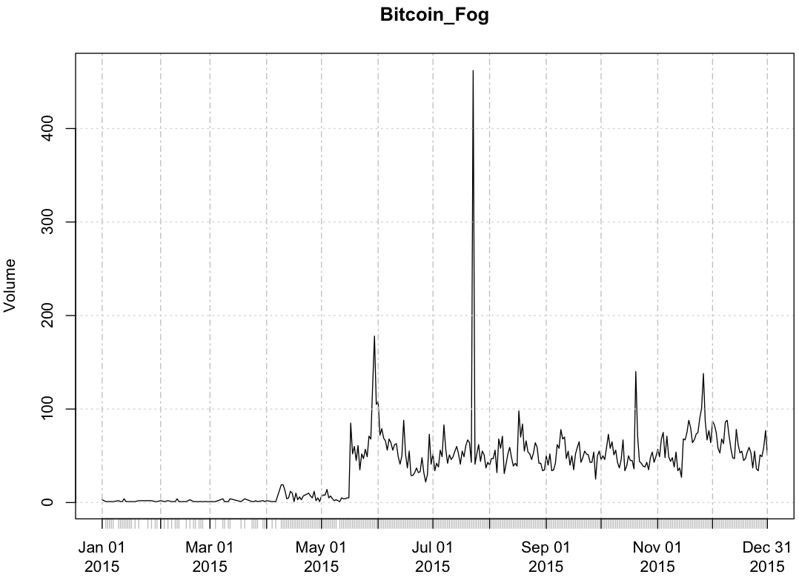

~~~
> Cryptocurrency_tumbler <- as.xts(read.zoo("/work/R/example/Wikipedia/Bitcoin/Cryptocurrency_tumbler-2015-daily.csv", sep=",", header=T))

> dim(Cryptocurrency_tumbler)
[1] 228   1

> colnames(Cryptocurrency_tumbler) <- c("Volume")

> head(Cryptocurrency_tumbler)

           Volume
2015-05-17    150
2015-05-18     29
2015-05-19     34
2015-05-20     22
2015-05-21     14
2015-05-22     19

> plot(x=log(Cryptocurrency_tumbler), ylab = "log(Volume)", main = "Cryptocurrency_tumbler")
~~~
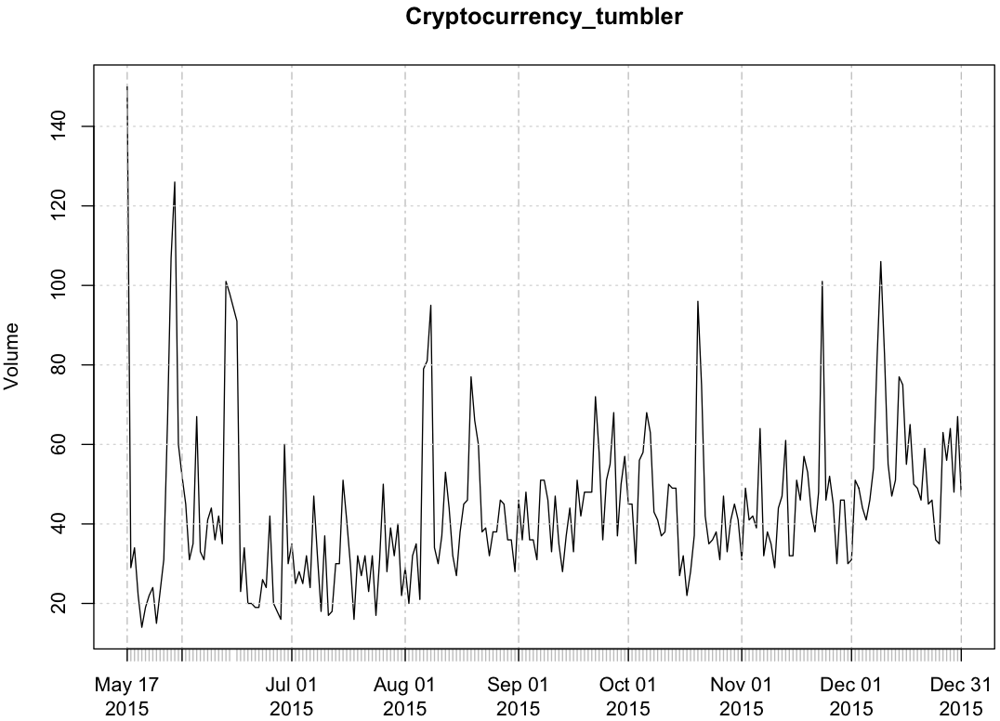
